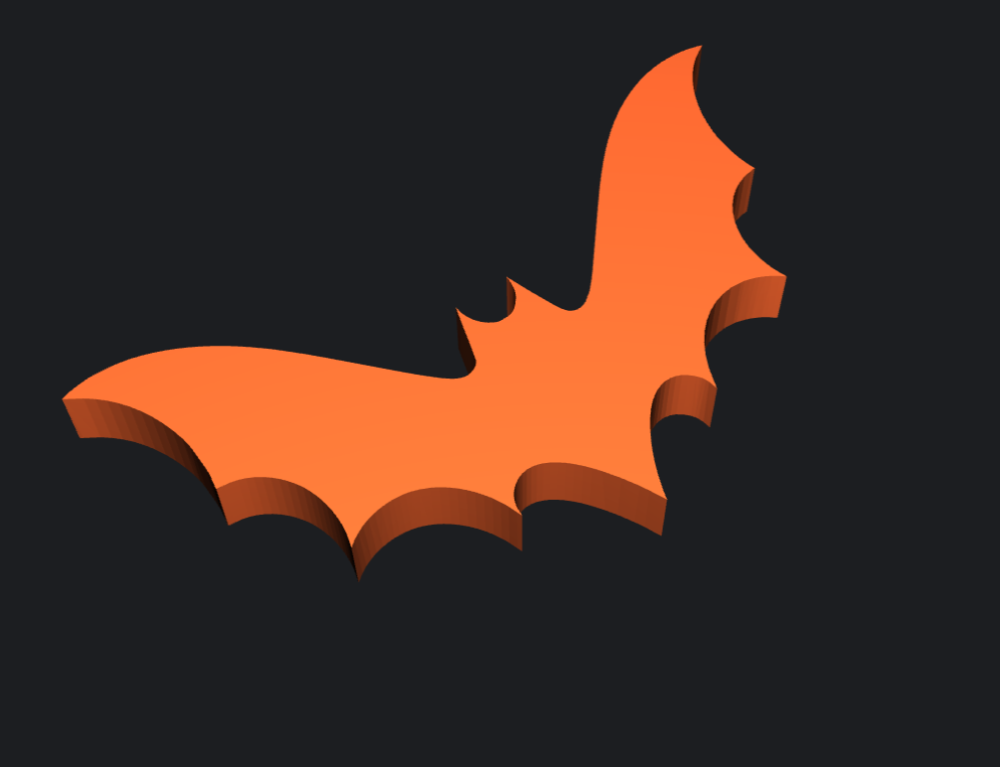
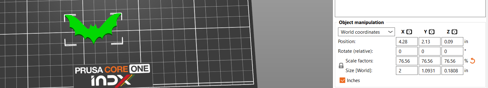
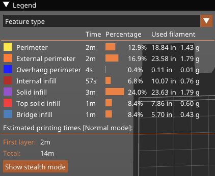
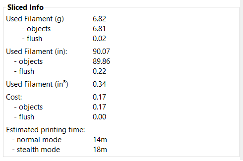
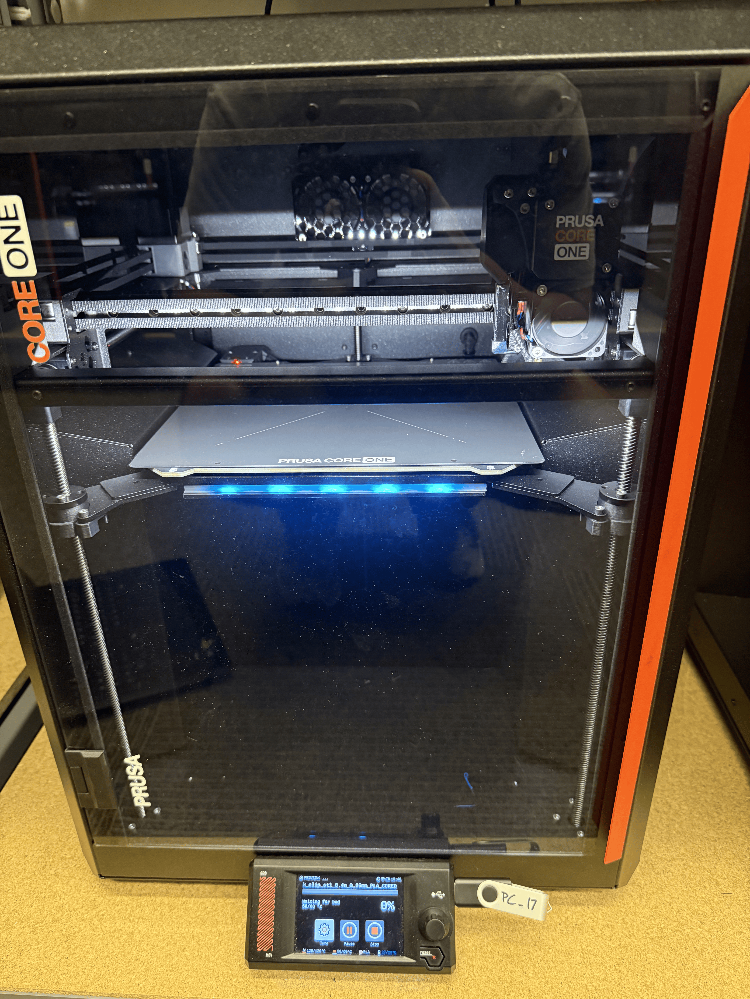
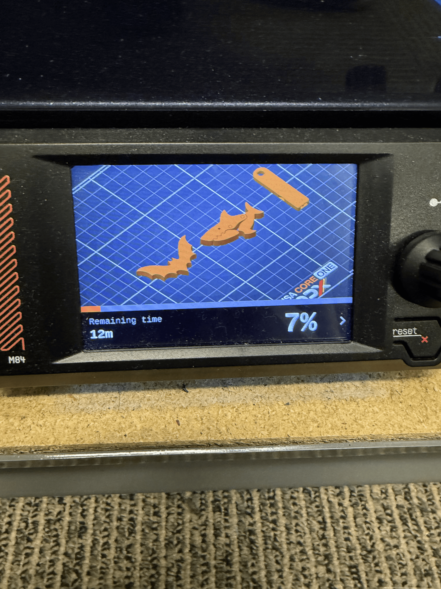
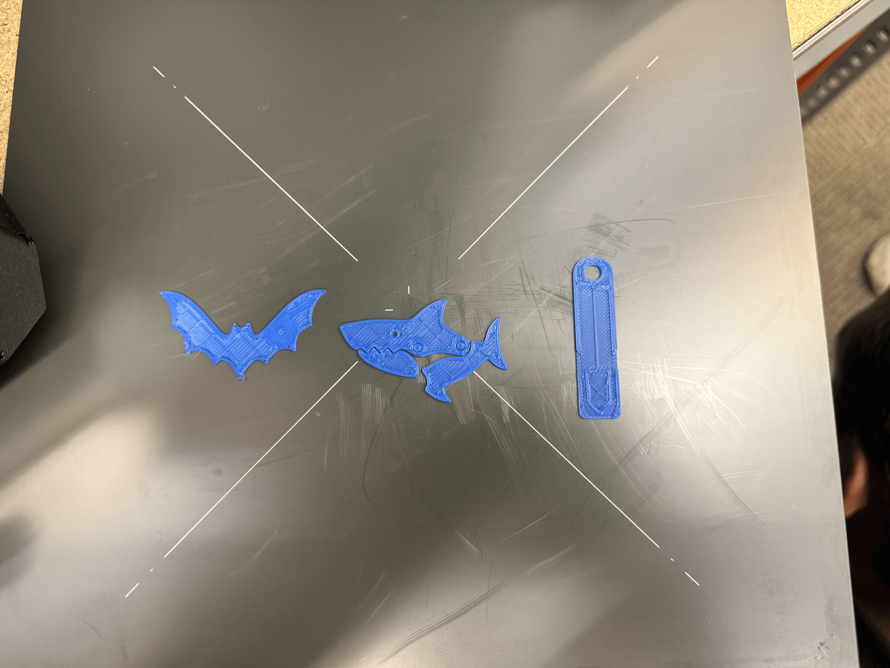
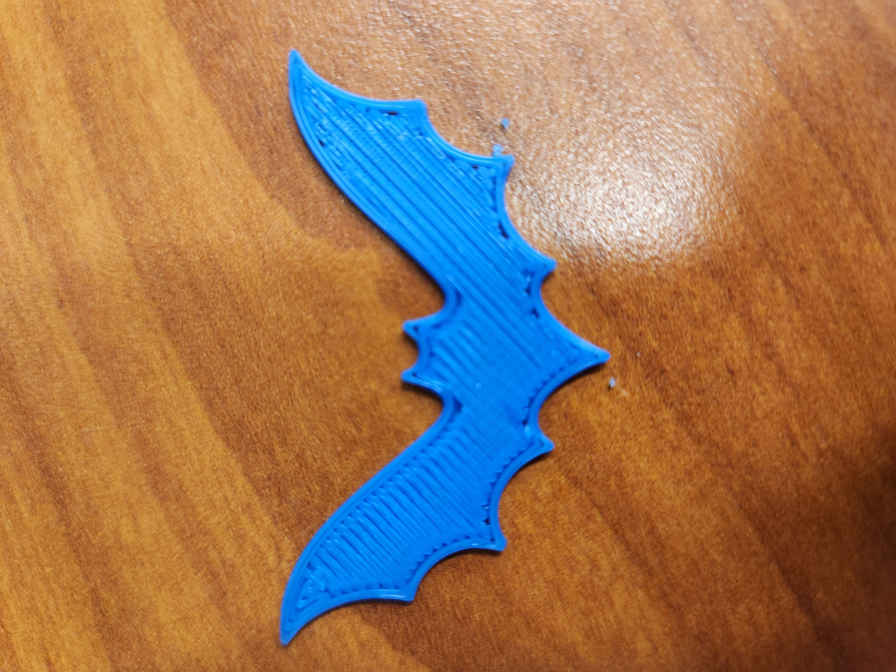

# L2 - Print Something Small

## DfAM Research
DfAM stands for Design for Additive Manufacturing, and it has a few rules. The rule I decided to research was about the 45 degree rule. This rule says that whenever an overhang is over 45 degrees vertically, you need to add some type of support structure. There are exceptions around this rule, but it is the general rule.

**Sources:**  
[https://www.getleo.ai/blog/dfm-for-additive-manufacturing-design-rules-2026](https://www.getleo.ai/blog/dfm-for-additive-manufacturing-design-rules-2026)  
[https://www.3dmag.com/3d-wikipedia/3d-printing-overhang-support-angles-materials/](https://www.3dmag.com/3d-wikipedia/3d-printing-overhang-support-angles-materials/)  

# FDM Research
FDM stands for Fused Deposition Modeling, and it also has considerations to keep in mind. What I found is that parts made with FDM will always have visible layer lines present on the product. The visibility can be reduced by making the height of each layer shorter, but it'll still show. Doing this technique will also make the print take longer and use slightly more material.

My research partner, Jack, added that to get around the 45 degree rule, you can super cool the nose of the 3D printer to cool the material fast enough to prevent sagging. This makes it so that you don't have to put supports for every single surface over 45 degrees.

**Source:**  
[https://forgelabs.com/design-guides/fdm](https://forgelabs.com/design-guides/fdm)  

## **Download**

For this project, I worked in a group of 3. My 2 teammates were Andrew Yang and Ethan King. We all did separate models, but they are all on one G-code file.

For my 3D model, download batWhistleTCF.stl from [https://www.printables.com/model/1451165-halloween-bat-whistle-and-key-chain/files](https://www.printables.com/model/1451165-halloween-bat-whistle-and-key-chain/files). I originally wanted to 3D print a desk clip, but it had overhands and holes in it that couldn't be 3D printed without supports. Ethan suggested doing the bat whistle, and I have nothing against bats, so I chose it. I also thought it would be a cool item to show off as my first 3D print.   

  

  

## **Preprocessor**

When I opened the file, I noticed that the object is slightly bigger than what we were expecting for our quick 3D prints, so I scaled the length of the bat whistle to 2.0 inches, automatically scaling the other sides. This led to the scale of the object being 76.56%.  

  

  

After the modifications were made to match the requirements, we clicked "Slice now" and used the default slicer settings.  

<table width="100%">
  <tr>
    <td align="center" width="50%">
      
    </td>
    <td align="center" width="50%">
      
    </td>
  </tr>
</table>

 

After, we clicked Exprot G-code  
Clicked Save  
Moved File to the usb stick  
Ejected usb stick  

## **Print**

We used PLA to print our 3D designs,and we used the PC-17 3D printer.  
Once you are at your 3D printer, put the usb stick into the slot.
When the usb stick is plugged in, there will be a popup with the G-code file from the usb stick. Select it and hit print. 
Click [HERE](print_process.mp4) to watch a video of the 3D printer making my bat whistle, Andrews whistle, and Ethan's shark chip bag holder. The image below shows the start of our models being 3D printed.  

  

  

<table style="width:100%;">
  <tr>
    <td style="width:50%; vertical-align:top; text-align:center;">
      
    </td>
    <td style="width:50%; vertical-align:top;">
      This shows what our finished print should look like, the percentage it is currently at, and the time remaining. In this specific picture, it shows that our print is 7% done, and there is 12 minutes remaining on the print.
    </td>
  </tr>

  <tr>
    <td style="width:50%; vertical-align:top; text-align:center;">
      
    </td>
    <td style="width:50%; vertical-align:top;">
      Image showing what all of our 3D print models look together. The left 3D model is the bat whistle, the middle 3D model is the shark chip bag clip, and the right is the whistle
    </td>
  </tr>

  <tr>
    <td style="width:50%; vertical-align:top; text-align:center;">
      
    </td>
    <td style="width:50%; vertical-align:top;">
      This is a closer look at my individual print. You can see how the nozzle went across my 3D print. The outline is very clear with a zig-zag pattern for the filling. There isn't a way to show elevation because the print is relatively flat. 
    </td>
  </tr>
</table>
 

## **Lessons Learned**

- There are a lot of different free 3D printable models you can use. Some are better than others, but it's amazing what you can find
- How important the filament type is. My group and I didn't have issues with filament, because we made sure to pick the correct 3D printer for PLA, but I heard that it messes up your print significantly
- Overhang and hole rules for supports and 3D prints. I have seen supports on a lot of 3D models before, but I never knew the actual reason behind it.
- To make sure you have all of the pictures you need. I lost the original file for my 3D print, so I spent almost 30 minutes trying to find it again on printables.com.
- Make sure your documentation is clear. My group and I didn't get any pictures of us starting the 3D printer, but it would have been a good addition to the portfolio.
- How to make your prints take less time with filament settings
- The amount of time I spent on this assignment was around 2 hours and 30 minutes. 
