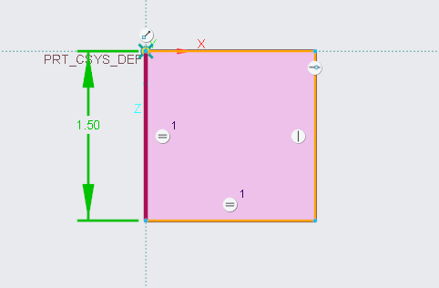
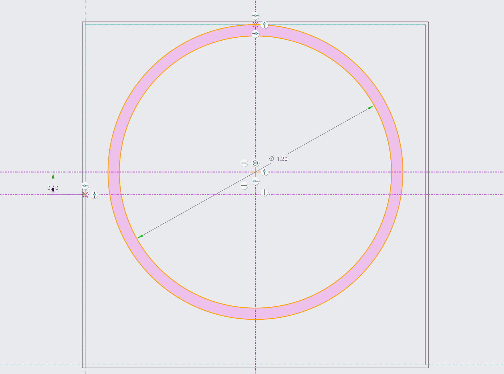
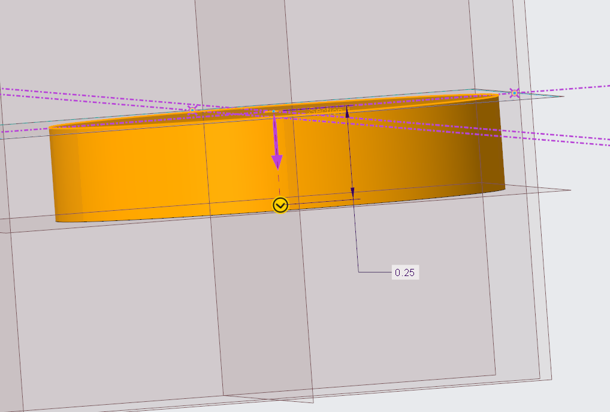
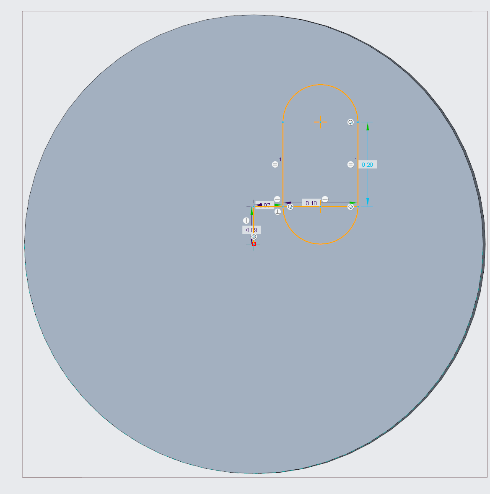
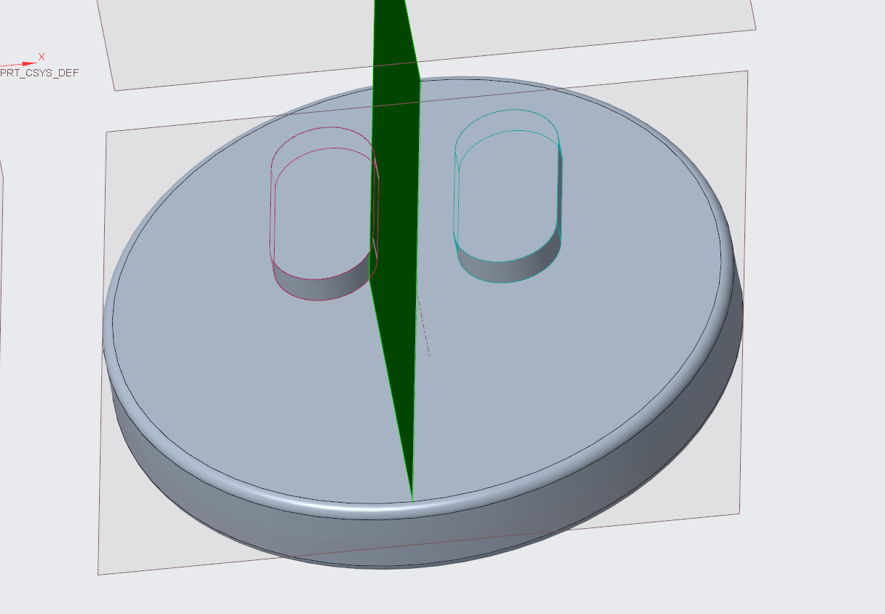

# A3 – Design Something Small

## Design

I couldn't land on an object I wanted to 3D print initially, but I decided to do the game character Kirby because I like games and I thought it would be fun designing something that I liked. I also thought that designing Kirby inside of Creo would teach me how to use the tools again. I haven't 3D modeled in about a year, so there was a slight learning curve. 

<table style="width:100%;">
  <tr>
    <td style="width:60%;">
      
    </td>
    <td style="width:40%; vertical-align:top;">
      

        Started by sketching the constraints of the 3D print (1.5 in x 1.5 in x 0.5 in). It would give me a visual boundary rather than guessing.
      

    </td>
  </tr>
  <tr>
    <td style="width:60%;">
      
    </td>
    <td style="width:40%; vertical-align:top;">
      

        I created a centerline in the constraints box and then offset that centerline by .10 inches. I used that offset line to draw a circle from the center point of the centerline to the edge of the constraints box. I then offset that circle by 0.05 inches. I deleted the outer circle to create the main outline for Kirby's body.
      

    </td>
  </tr>
    <tr>
    <td style="width:60%;">
      
    </td>
    <td style="width:40%; vertical-align:top;">
      

        I extruded the outline of Kirby's body to half of the height constraints because I was thinking of adding depth to his eyes, mouth, hands, and feet since one side is going to be flat to make it easier to 3D print.
      

    </td>
  </tr>
    </tr>
    <tr>
    <td style="width:60%;">
      
    </td>
    <td style="width:40%; vertical-align:top;">
      

        My first idea for the eyes was to create two ellipses on the top of the main body and then round of the edges to make it look less blocky.
      

    </td>
  </tr>
    </tr>
    <tr>
    <td style="width:60%;">
      
    </td>
    <td style="width:40%; vertical-align:top;">
      

        I then mirrored this idea to the other side just to see what it looked like. I ended up not liking it because it didn't look very uniform. They looked like separate objects put together, and I didn't like that look
      

    </td>
  </tr>
</table>

