# L3 – Design Something Small

## Design

I couldn't land on an object I wanted to 3D print initially, but I decided to do the game character Kirby because I like games and I thought it would be fun designing something that I liked. I also thought that designing Kirby inside of Creo would teach me how to use the tools again. I haven't 3D modeled in about a year, so there was a slight learning curve. 

<table style="width:100%;">
  <tr>
    <td style="width:60%;">
      
    </td>
    <td style="width:40%; padding:28px; text-align:center; vertical-align:middle;"">
      

        Started by sketching the constraints of the 3D print (1.5 in x 1.5 in x 0.5 in). It would give me a visual boundary rather than guessing.
      

    </td>
  </tr>
  <tr>
    <td style="width:60%;">
      
    </td>
    <td style="width:40%; padding:28px; text-align:center; vertical-align:middle;"">
      

        I created a centerline in the constraints box and then offset that centerline by .10 inches. I used that offset line to draw a circle from the center point of the centerline to the edge of the constraints box. I then offset that circle by 0.05 inches. I deleted the outer circle to create the main outline for Kirby's body.
      

    </td>
  </tr>
    <tr>
    <td style="width:60%;">
      
    </td>
    <td style="width:40%; padding:28px; text-align:center; vertical-align:middle;"">
      

        I extruded the outline of Kirby's body to half of the height constraints because I was thinking of adding depth to his eyes, mouth, hands, and feet since one side is going to be flat to make it easier to 3D print.
      

    </td>
  </tr>    <tr>
    <td style="width:60%;">
      
    </td>
    <td style="width:40%; padding:28px; text-align:center; vertical-align:middle;"">
      

        To finish the main body, I rounded the edges of the side I wanted to create the details on. I didn't have a specific measurement for the round, I just kept adding more until I thought it looked good. 
      

    </td>
  </tr>
    <tr>
    <td style="width:60%;">
      
    </td>
    <td style="width:40%; padding:28px; text-align:center; vertical-align:middle;"">
      

        My first idea for the eyes was to create two ellipses on the top of the main body and then round of the edges to make it look less blocky.
      

    </td>
  </tr>
    <tr>
    <td style="width:60%;">
      
    </td>
    <td style="width:40%; padding:28px; text-align:center; vertical-align:middle;"">
      

        I then mirrored this idea to the other side just to see what it looked like. I ended up not liking it because it didn't look very uniform. They looked like separate objects put together, and I didn't like that look.
      

    </td>
  </tr>
  </tr>
    <tr>
    <td style="width:60%;">
      
    </td>
    <td style="width:40%; padding:28px; text-align:center; vertical-align:middle;"">
      

        My other idea was to create an ellipse in the same position as my previous eyes, but revolve it around a centerline. My thought was that it would make a more football like shape which resembles eyes. I thought that it turned out much better than the previous design. To finish off the eye I rounded the edges of the eye to the body to create a more seamless transition.
      

    </td>
  </tr>
    <tr>
    <td style="width:60%;">
      
    </td>
    <td style="width:40%; padding:28px; text-align:center; vertical-align:middle;"">
      

        Once one of the eyes were completed, I just mirrored it across a centerline going through the middle of the body to keep the dimensions the exact same on both sides. 
      

    </td>
  </tr>
    </tr>
    <tr>
    <td style="width:60%;">
      
    </td>
    <td style="width:40%; padding:28px; text-align:center; vertical-align:middle;"">
      

        I decided to make the mouth next so I would get a better feeling of where the project was going. I didn't want to make a super symmetrical mouth, because I thought it would look weird, so I used the spline tool to create similar shapes on both sides while maintaining the look I wanted. 
      

    </td>
  </tr>
      <tr>
    <td style="width:60%;">
      
    </td>
    <td style="width:40%; padding:28px; text-align:center; vertical-align:middle;"">
      

        I decided to extrude the mouth downwards to create more depth to the 3D model. There was no specific measurement I had in mind for this, I just kept taking away material until I thought it looked good.
      

    </td>
  </tr>
      <tr>
    <td style="width:60%;">
      
    </td>
    <td style="width:40%; padding:28px; text-align:center; vertical-align:middle;"">
      

        To make the blush under Kirby's eyes, I created a datum plane where I wanted them to line up. Doing this allows me to use the same technique I used for the eyes. Similar to previous dimensions, I didn't have exact dimensions in mind while making it, but it ended up being .78 inches from the bottom of the constraints box.
      

    </td>
  </tr>
  <tr>
    <td style="width:60%;">
      
    </td>
    <td style="width:40%; padding:28px; text-align:center; vertical-align:middle;"">
      

        I used the same sketch and revolve technique for the blush as I did for the eyes. The length of the ellipse was .20 inches with .08 inches between the two peaks.
      

    </td>
  </tr>
  <tr>
    <td style="width:60%;">
      
    </td>
    <td style="width:40%; padding:28px; text-align:center; vertical-align:middle;"">
      

        Once the blush was sketched and revolved, I mirrored it across the same middle datum plane I used for the eyes to keep the dimensions the same on both sides of the object.
      

    </td>
  </tr>
  <tr>
    <td style="width:60%;">
      
    </td>
    <td style="width:40%; padding:28px; text-align:center; vertical-align:middle;"">
      

        To make the arms and feet, I created another datum plane on the bottom of the main body so that I could sketch inside of the body and outside of the body. It makes it easier to create different shapes for the arms and feet.
      

    </td>
  </tr>
    <tr>
    <td style="width:60%;">
      
    </td>
    <td style="width:40%; padding:28px; text-align:center; vertical-align:middle;"">
      

        Making the arms, I used a similar technique as I used for the mouth. I used the spline tool from the non rounded part of the body to create a circular looking hand. I then used an arc to connect the two end points of the spline since the body was still a perfect circle. I wanted to make him look like he was waving, so that is why the left hand is high up on the body. 
      

    </td>
  </tr>
    <tr>
    <td style="width:60%;">
      
    </td>
    <td style="width:40%; padding:28px; text-align:center; vertical-align:middle;"">
      

        I extruded the arm to a slightly shorter height than the main body because Kirby has really small arms in his games. I thought that it would make it look more like the character.
      

    </td>
  </tr>
    <tr>
    <td style="width:60%;">
      
    </td>
    <td style="width:40%; padding:28px; text-align:center; vertical-align:middle;"">
      

        Keeping the rounding consistent, I rounded Kirby's arm the same amount for when I rounded his body. I thought it would make the whole design look more uniform.
      

    </td>
  </tr>
    <tr>
    <td style="width:60%;">
      
    </td>
    <td style="width:40%; padding:28px; text-align:center; vertical-align:middle;"">
      

        I repeated this process for the right arm, but I put it a little lower to try and give him that waving look.
      

    </td>
  </tr>
    <tr>
    <td style="width:60%;">
      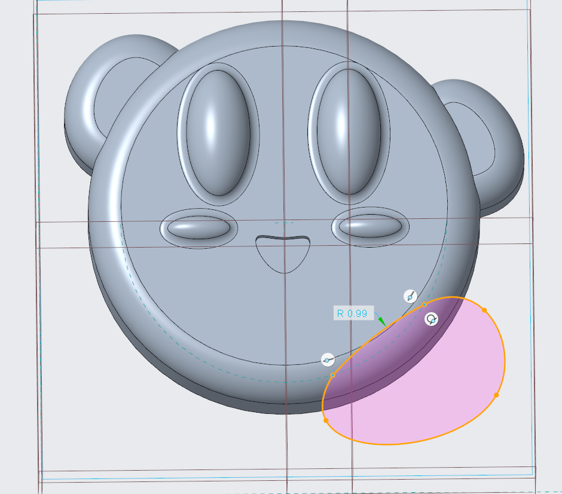
    </td>
    <td style="width:40%; padding:28px; text-align:center; vertical-align:middle;"">
      

        I used the same spline technique for the feet as well. I couldn't use an arc for the feet like I did for the arms because Creo was acting funny every time I tried. I am assuming it's because the shape of the feet is much stranger than the arms, which causes confusion when using the arc tool. 
      

    </td>
  </tr>
    <tr>
    <td style="width:60%;">
      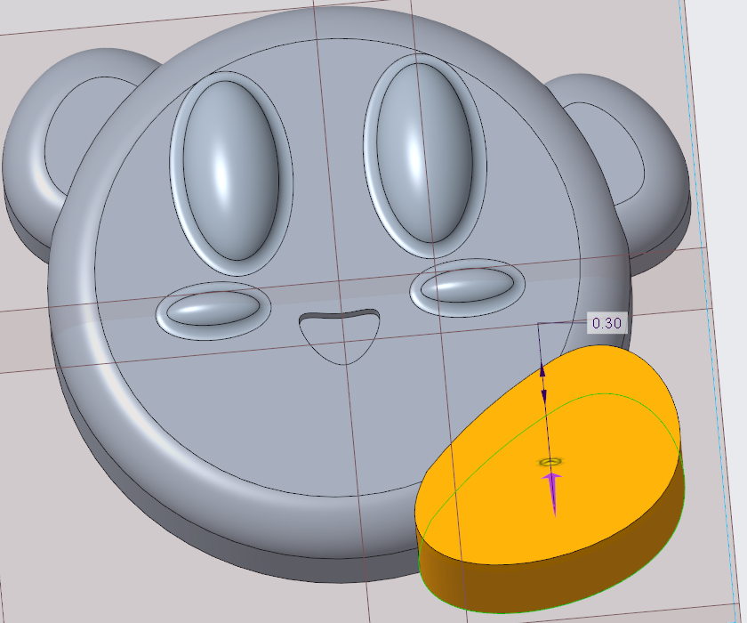
    </td>
    <td style="width:40%; padding:28px; text-align:center; vertical-align:middle;"">
      

        I extruded his feet slightly bigger than the main body because Kirby has massive feet in all of his games. The reason why I picked 0.05 inches was because that is how much shorter I made the arms from the body. I was trying to stay consistent with those measurements.
      

    </td>
  </tr>
    <tr>
    <td style="width:60%;">
      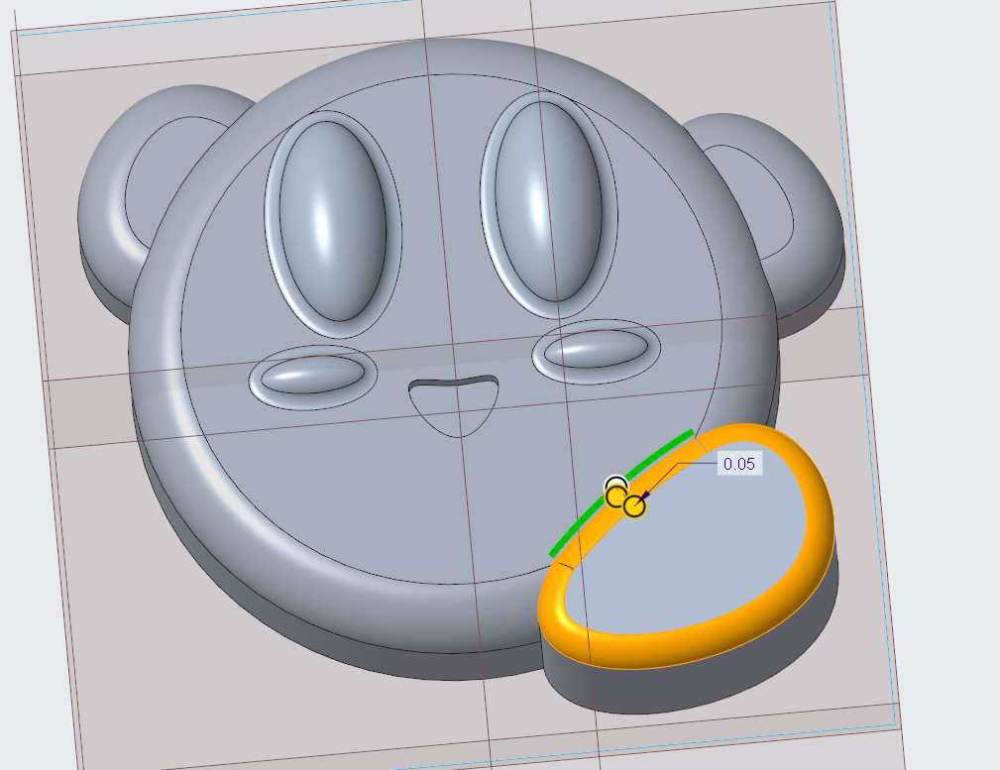
    </td>
    <td style="width:40%; padding:28px; text-align:center; vertical-align:middle;"">
      

        The rounding isn't the same on the feet as the body and arms because the feet interacted differently with the body than the arms did. Since the feet interact with the rounding on the body, I was only able to round the feet until it met with the rounding from the body. That is why the rounding for the feet is only 0.05 inches rather than 0.09 inches.
      

    </td>
  </tr>
    <tr>
    <td style="width:60%;">
      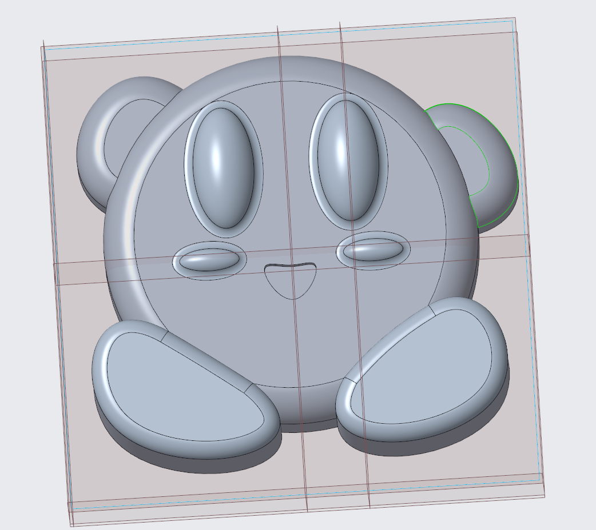
    </td>
    <td style="width:40%; padding:28px; text-align:center; vertical-align:middle;"">
      

        I followed the same process for the right foot, and Kirby was ready to be 3D printed.
      

    </td>
  </tr>
      <tr>
    <td style="width:60%;">
      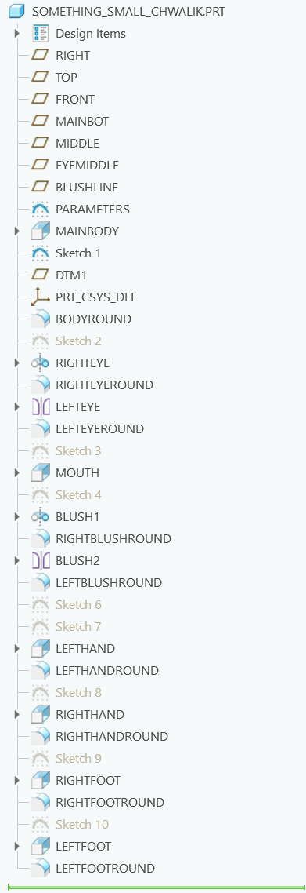
    </td>
    <td style="width:40%; padding:28px; text-align:center; vertical-align:middle;"">
      

        Here is the model tree of the fully 3D modeled object.
      

    </td>
  </tr>
</table> 

## Research

 
<table style="width:100%;">
  <tr>
    <td style="width:60%;">
      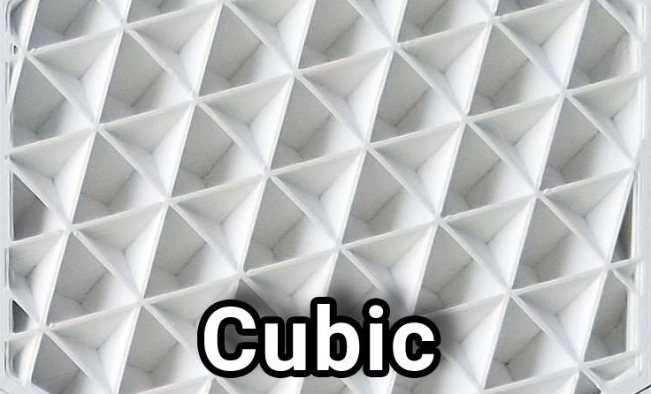
    </td>
    <td style="width:40%; padding:28px; text-align:center; vertical-align:middle;"">
      

        The geometry for cubic infill is a structure of tilted cubes. This causes the structure inside to be air-filled cube pockets that provides the same stiffness in all directions. It distributes the stress applied on the object evenly, making it good for structural components. The air pockets created could lead to cubic infills being good heat insulators or be able to float on water. Cubic infills typically take longer to print than other infills.
      

    </td>
  </tr>
    <tr>
    <td style="width:60%;">
      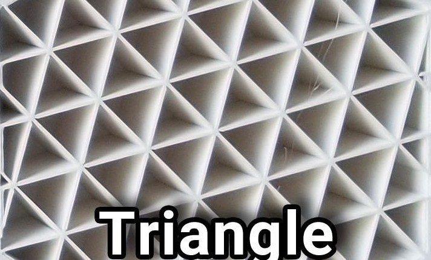
    </td>
    <td style="width:40%; padding:28px; text-align:center; vertical-align:middle;"">
      

        The geometry for triangular infill is a structure with three set paths to create triangle shaped objects. It is very similar to the honeycomb and grid infills. The triangular shapes give good support for tensile strength, meaning that triangular infill would be good for support structures. Triangular infill uses slightly more material and takes longer than normal. 
      

    </td>
  </tr>
    <tr>
    <td style="width:60%;">
      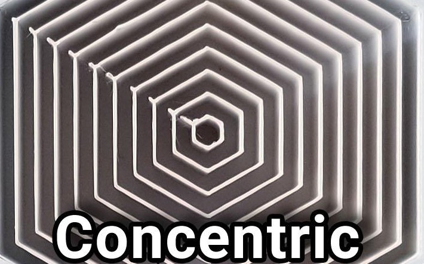
    </td>
    <td style="width:40%; padding:28px; text-align:center; vertical-align:middle;"">
      

        The geometry for concentric infill is a hexagon that is offset repeatedly until it hits the walls of your object. With multiple hexagons, the concentric infill provides great resistance to force coming from above it. However, due to the layers not being connected, it provides little to no resistance in the horizontal direction. This means that concentric infill is really good for flexible parts. Concentric infill uses less material than other infills, but it takes longer than average due to the amount of rings it involves.
      

    </td>
  </tr>
</table> 

The infill pattern matters for structural integrity and printing time. The other factor is the percent of the infill you use. The higher the infill percentage, the denser the infill pattern is. The denser infill creates a physically stronger object, however it takes significantly longer the more infill percentage there is. So, for structural components, you may want to use a higher infill percentage where you may want to use a lower infill percentage for character models.

## Preprocess

To save the amount of printers being used, we paired up with other people in the lab to put our 3D modeled objects on the same G-code file. I decided to pair up with Andrew Yang. He 3D modeled a cable management object.

<table style="width:100%;">
  <tr>
    <td style="width:60%;">
      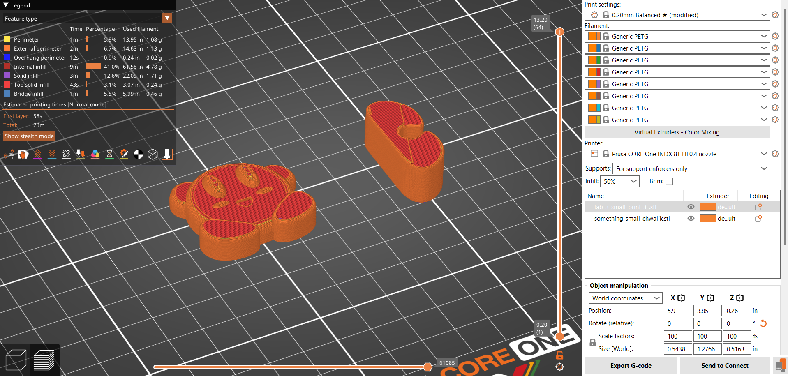
    </td>
    <td style="width:40%; padding:28px; text-align:center; vertical-align:middle;"">
      

        When we imported our obj files into Prusaslicer, they were not flat on the 3D printing bed. This is because when we 3D modeled our parts, we 3D modeled them on the front plane rather than the top plane. To fix 3D model error, we rotate the objects 90 degrees so that they are flat on the 3D printing bed.
      

    </td>
  </tr>
    <tr>
    <td style="width:60%;">
      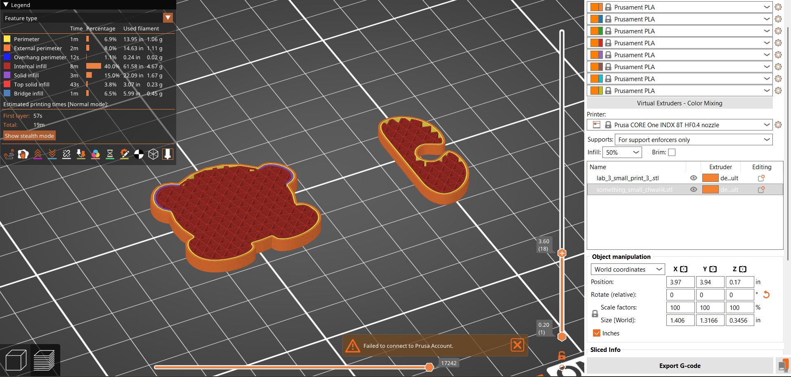
    </td>
    <td style="width:40%; padding:28px; text-align:center; vertical-align:middle;"">
      

        We scaled down the layers so that we could see the type of infill we were using. The default for us was a grid infill, but we changed it to the triangular infill. In doing so, we hoped that our object gained more resilience to breaking in different directions than the grid infill. To help with this goal, we also used 50% infill on our objects. We weren't sure how to change the wall thickness, so the wall thickness is the default. It would have been nice to make the walls thicker, since they increase the structural support of the object, but the default should be plenty fine. 
      

    </td>
  </tr>
    <tr>
    <td style="width:60%;">
      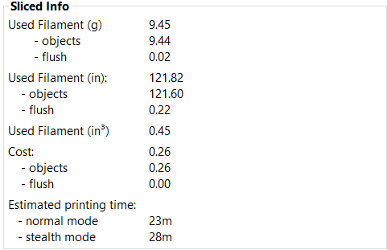
    </td>
    <td style="width:40%; padding:28px; text-align:center; vertical-align:middle;"">
      

        Here is the sliced info for our two objects. Our print will take 23 minutes compared to the second labs 14 minutes. It is also worth noting that lab 2 had 3 prints on it while this lab only has 2 prints. After configuring, we exported the G-code file and saved it to a flash drive.
      

    </td>
  </tr>
</table> 

## Print

Our flash drive was labeled for PC-12, so we went to 3D printer PC-12. Andrew and I made sure to check the type of filament being used before printing anything. We also made sure to check that our filament roll wasn't tangled since one of the other groups had a failed print because of that problem. Our first print still failed though. It failed because in our G-code file, we picked the wrong 3D printer. We quickly fixed the issue and began printing again.

[print_error](print_error.jpg)

<table style="width:100%;">
  <tr>
    <td style="width:60%;">
      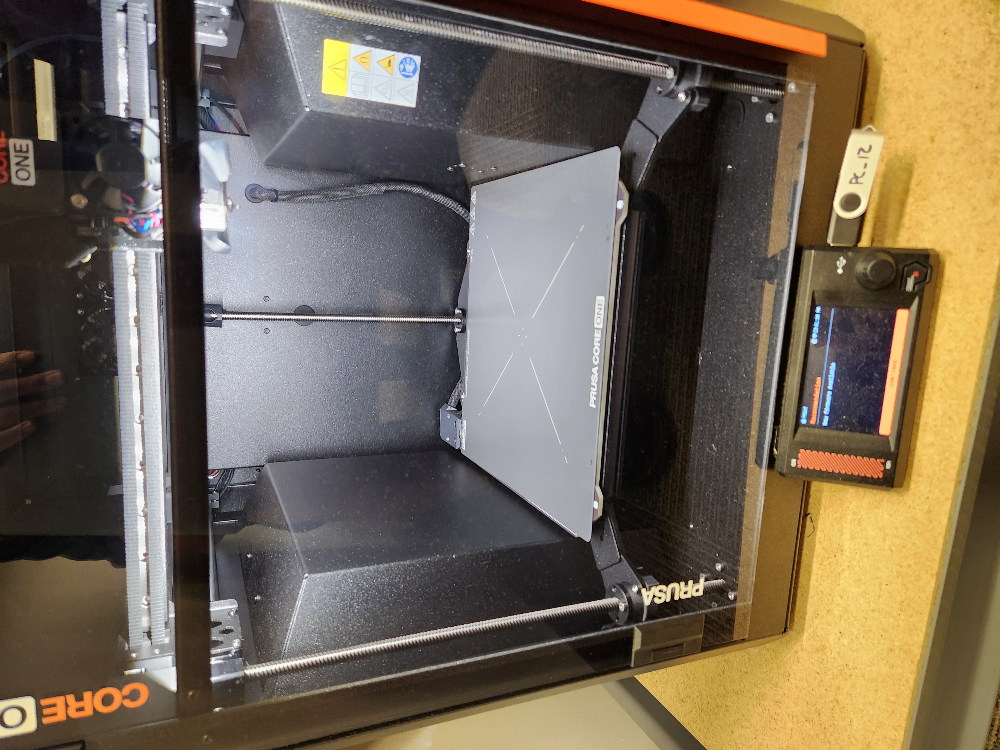
    </td>
    <td style="width:40%; padding:28px; text-align:center; vertical-align:middle;"">
      

        This is an image of our 3D printer heating up the bed and the nozzle.
      

    </td>
  </tr>
    <tr>
    <td style="width:60%;">
      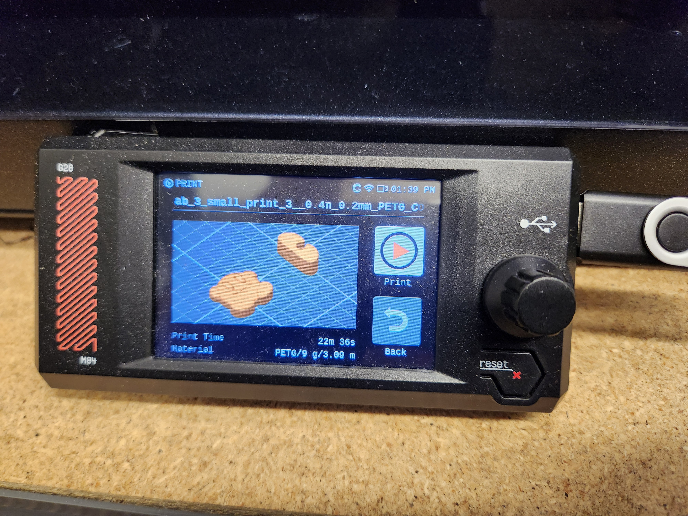
    </td>
    <td style="width:40%; padding:28px; text-align:center; vertical-align:middle;"">
      

        This screen shows what the our objects should look like at the end. It is the initial screen when the print starts.
      

    </td>
  </tr>
    <tr>
    <td style="width:60%;">
      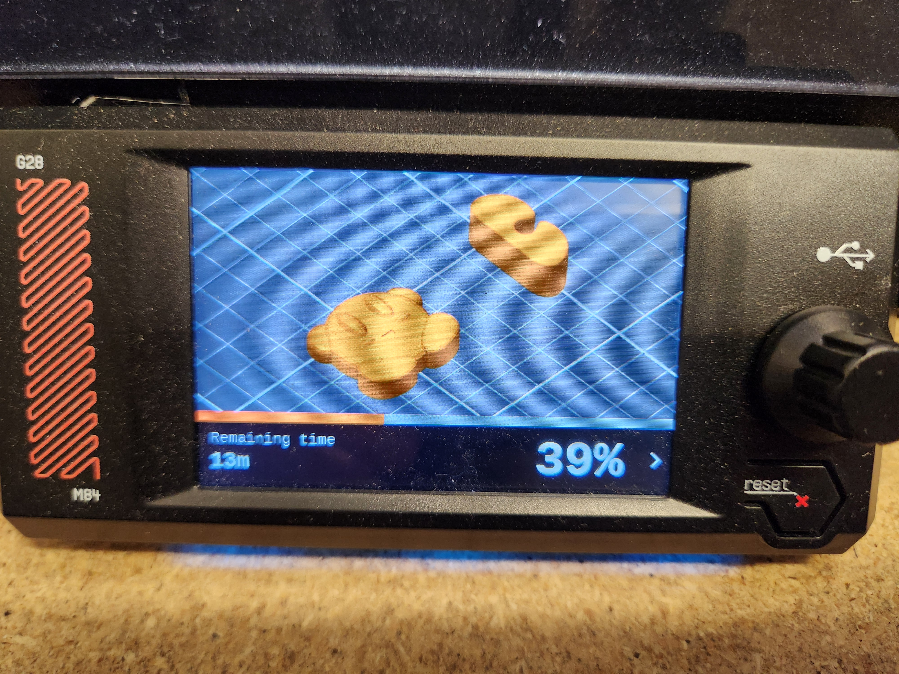
    </td>
    <td style="width:40%; padding:28px; text-align:center; vertical-align:middle;"">
      

        This is an example of the print being 39% complete on the same screen.
      

    </td>
  </tr>
  <tr>
    <td style="width:60%;">
      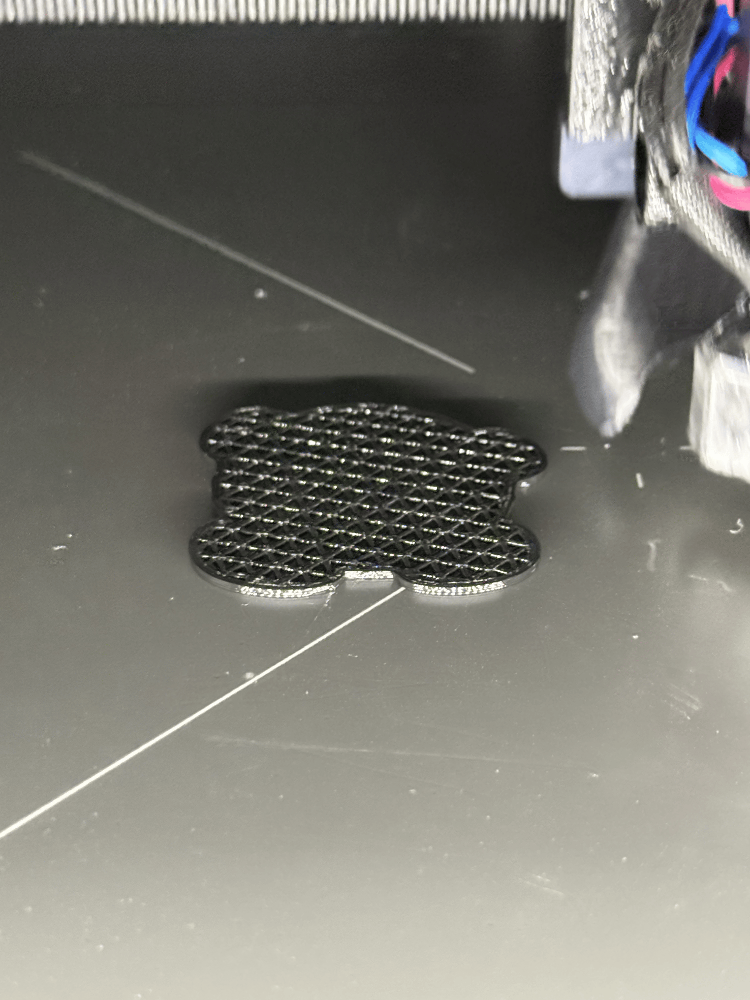
      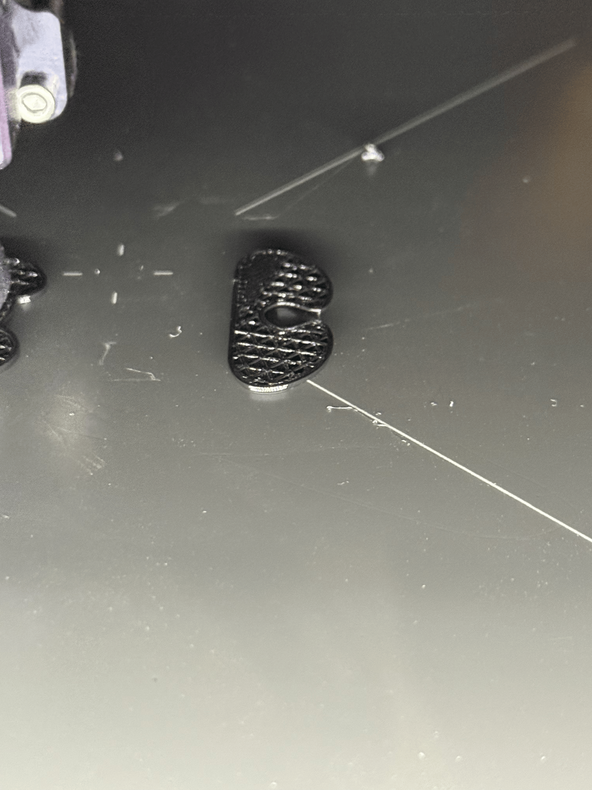
    </td>
    <td style="width:40%; padding:28px; text-align:center; vertical-align:middle;"">
      

        This image shows the infills of both of our items while being 3D printed. I thought it would be cool to see in real time.
      

    </td>
  </tr>
   <tr>
    <td style="width:60%;">
      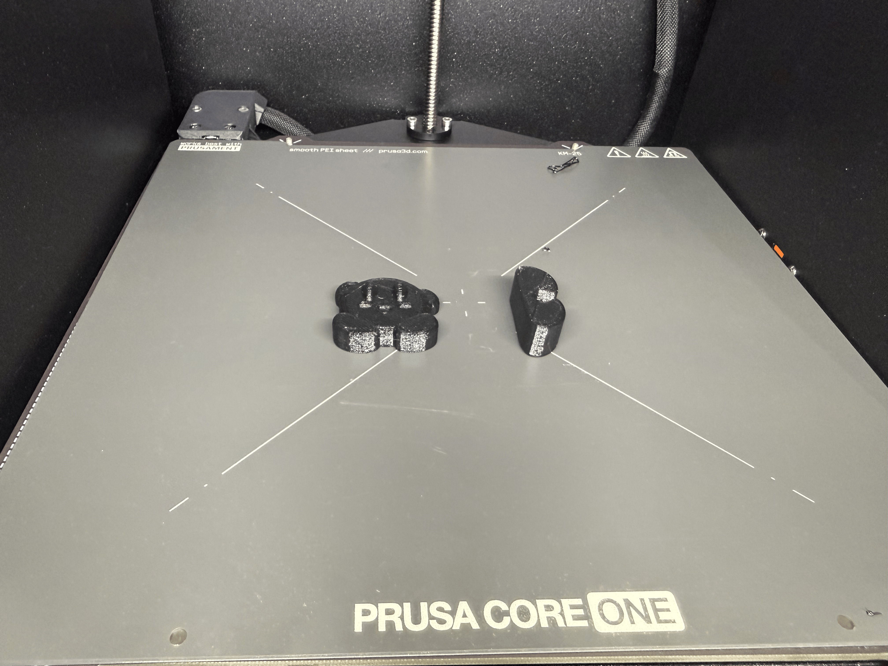
    </td>
    <td style="width:40%; padding:28px; text-align:center; vertical-align:middle;"">
      

        Overall, I am happy with how the entire designing process and 3D print. I think both of our 3D prints came out very well, and I am excited to 3D print more.
      

    </td>
  </tr>
</table> 

Click [HERE](3d_printing_video.mp4) to watch a video of the 3D printing process. You can see how the machine moves in real time. Below is a picture of what my Kirby looks like after 3D modeling and 3D printing. I think he looks pretty good, but the lines aren't as smooth as I thought it would be. I think this is because of the layer height. If I lowered the layer height, I could've made him look more smooth, but the print would've taken longer. Overall, I am extremely happy with how he came out.

[final product](final_product.jpg)

## Resources

- [https://www.creality.com/blog/best-3d-printing-infill-patterns](https://www.creality.com/blog/best-3d-printing-infill-patterns)  
- [https://help.prusa3d.com/article/infill-patterns_177130](https://help.prusa3d.com/article/infill-patterns_177130)  
- [https://blog.prusa3d.com/everything-you-need-to-know-about-infills_43579/](https://blog.prusa3d.com/everything-you-need-to-know-about-infills_43579/)  
- [https://www.reddit.com/r/3Dprinting/comments/pdgbv0/infill_pattern_comparison/](https://www.reddit.com/r/3Dprinting/comments/pdgbv0/infill_pattern_comparison/)  
- [https://www.sovol3d.com/blogs/news/infill-percentage-3d-printing-strength-filament](https://www.sovol3d.com/blogs/news/infill-percentage-3d-printing-strength-filament_) 
- [https://www.sovol3d.com/blogs/news/wall-thickness-vs-wall-count-3d-printing-differences](https://www.sovol3d.com/blogs/news/wall-thickness-vs-wall-count-3d-printing-differences) 

