# A3 – Design Something Small

## Design

I couldn't land on an object I wanted to 3D print initially, but I decided to do the game character Kirby because I like games and I thought it would be fun designing something that I liked. I also thought that designing Kirby inside of Creo would teach me how to use the tools again. I haven't 3D modeled in about a year, so there was a slight learning curve. 

<table style="width:100%;">
  <tr>
    <td style="width:60%;">
      
    </td>
    <td style="width:40%; vertical-align:top;">
      

        Started by sketching the constraints of the 3D print (1.5 in x 1.5 in x 0.5 in). It would give me a visual boundary rather than guessing.
      

    </td>
  </tr>
  <tr>
    <td style="width:60%;">
      
    </td>
    <td style="width:40%; vertical-align:top;">
      

        I created a centerline in the constraints box and then offset that centerline by .10 inches. I used that offset line to draw a circle from the center point of the centerline to the edge of the constraints box. I then offset that circle by 0.05 inches. I deleted the outer circle to create the main outline for Kirby's body.
      

    </td>
  </tr>
    <tr>
    <td style="width:60%;">
      
    </td>
    <td style="width:40%; vertical-align:top;">
      

        I extruded the outline of Kirby's body to half of the height constraints because I was thinking of adding depth to his eyes, mouth, hands, and feet since one side is going to be flat to make it easier to 3D print.
      

    </td>
  </tr>    <tr>
    <td style="width:60%;">
      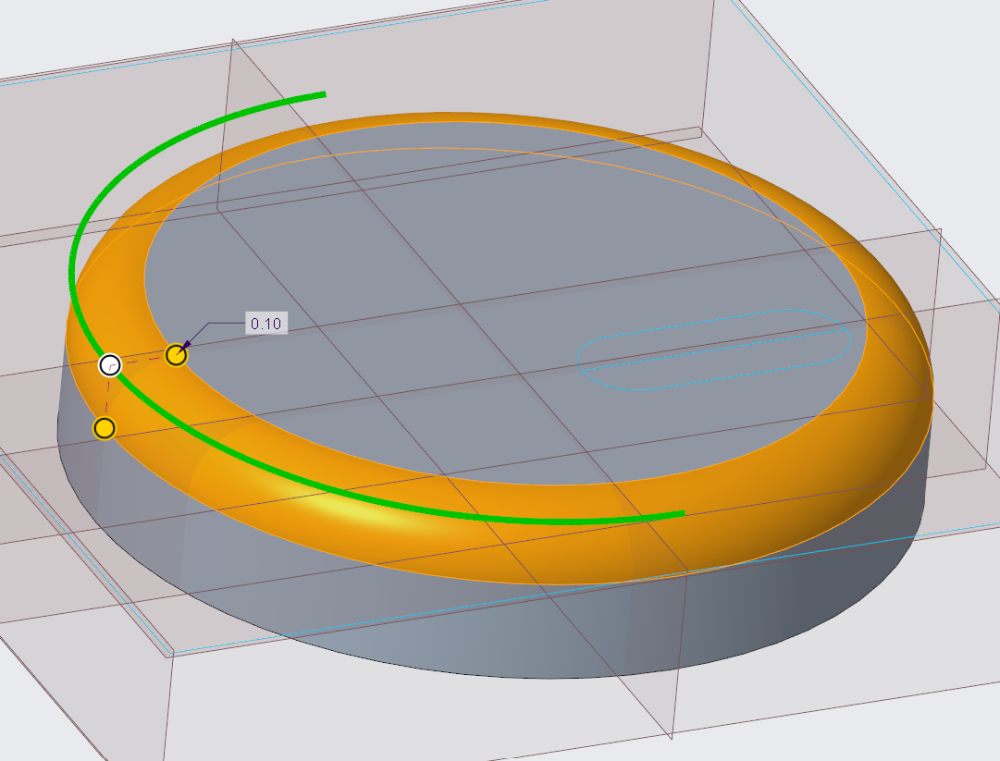
    </td>
    <td style="width:40%; vertical-align:top;">
      

        To finish the main body, I rounded the edges of the side I wanted to create the details on. I didn't have a specific measurement for the round, I just kept adding more until I thought it looked good. 
      

    </td>
  </tr>
    <tr>
    <td style="width:60%;">
      
    </td>
    <td style="width:40%; vertical-align:top;">
      

        My first idea for the eyes was to create two ellipses on the top of the main body and then round of the edges to make it look less blocky.
      

    </td>
  </tr>
    <tr>
    <td style="width:60%;">
      
    </td>
    <td style="width:40%; vertical-align:top;">
      

        I then mirrored this idea to the other side just to see what it looked like. I ended up not liking it because it didn't look very uniform. They looked like separate objects put together, and I didn't like that look
      

    </td>
  </tr>
  </tr>
    <tr>
    <td style="width:60%;">
      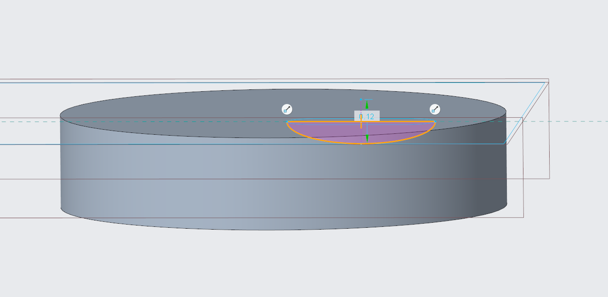
    </td>
    <td style="width:40%; vertical-align:top;">
      

        My other idea was to create an ellipse in the same position as my previous eyes, but revolve it around a centerline. My thought was that it would make a more football like shape which resembles eyes. I thought that it turned out much better than the previous design. To finish off the eye I rounded the edges of the eye to the body to create a more seamless transition.
      

    </td>
  </tr>
    <tr>
    <td style="width:60%;">
      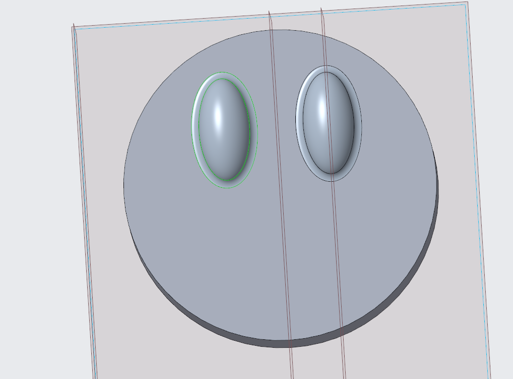
    </td>
    <td style="width:40%; vertical-align:top;">
      

        Once one of the eyes were completed, I just mirrored it across a centerline going through the middle of the body to keep the dimensions the exact same on both sides. 
      

    </td>
  </tr>
    </tr>
    <tr>
    <td style="width:60%;">
      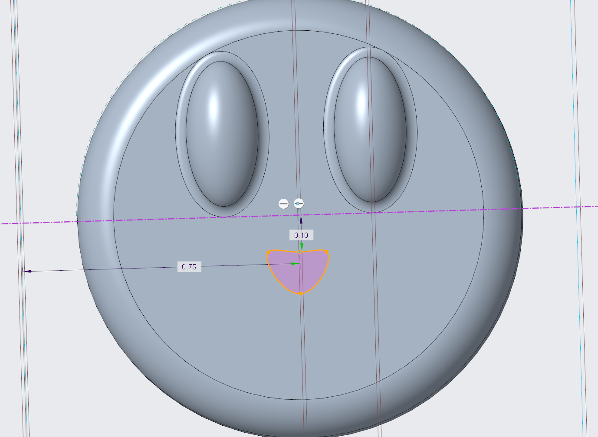
    </td>
    <td style="width:40%; vertical-align:top;">
      

        I decided to make the mouth next so I would get a better feeling of where the project was going. I didn't want to make a super symmetrical mouth, because I thought it would look weird, so I used the spline tool to create similar shapes on both sides while maintaining the look I wanted. 
      

    </td>
  </tr>
      <tr>
    <td style="width:60%;">
      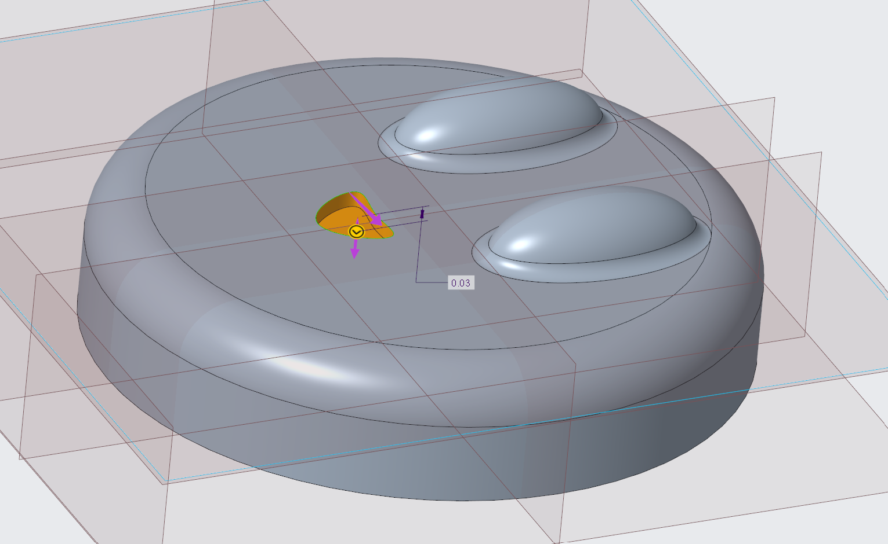
    </td>
    <td style="width:40%; vertical-align:top;">
      

        I decided to extrude the mouth downwards to create more depth to the 3D model. There was no specific measurement I had in mind for this, I just kept taking away material until I thought it looked good.
      

    </td>
  </tr>
      <tr>
    <td style="width:60%;">
      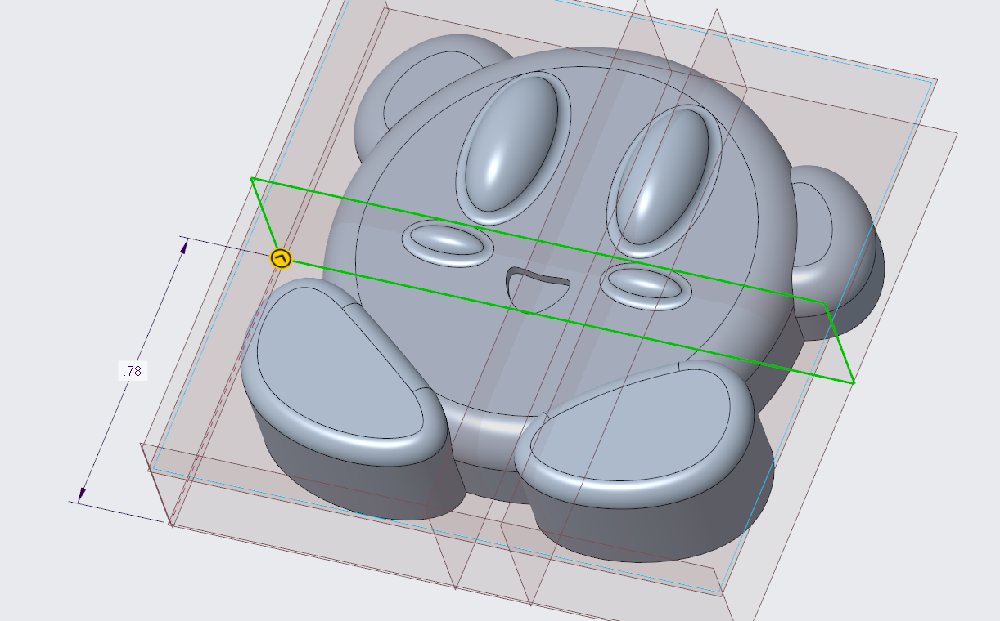
    </td>
    <td style="width:40%; vertical-align:top;">
      

        To make the blush under Kirby's eyes, I created a datum plane where I wanted them to line up. Doing this allows me to use the same technique I used for the eyes. Similar to previous dimensions, I didn't have exact dimensions in mind while making it, but it ended up being .78 inches from the bottom of the constraints box.
      

    </td>
  </tr>
  <tr>
    <td style="width:60%;">
      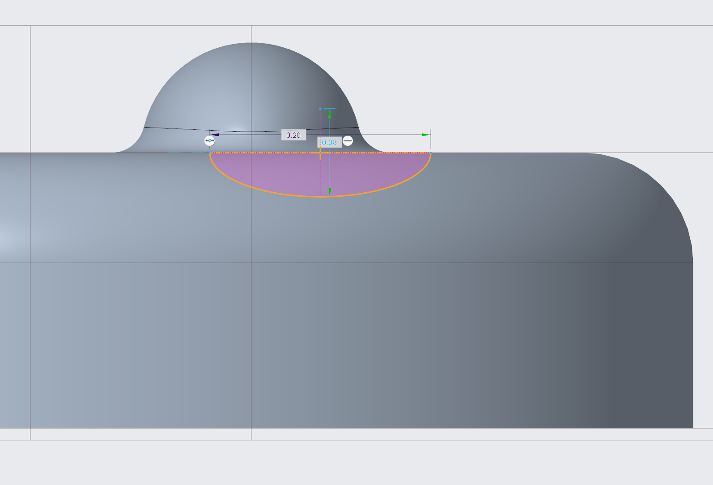
    </td>
    <td style="width:40%; vertical-align:top;">
      

        I used the same sketch and revolve technique for the blush as I did for the eyes. The length of the ellipse was .20 inches with .08 inches between the two peaks.
      

    </td>
  </tr>
  <tr>
    <td style="width:60%;">
      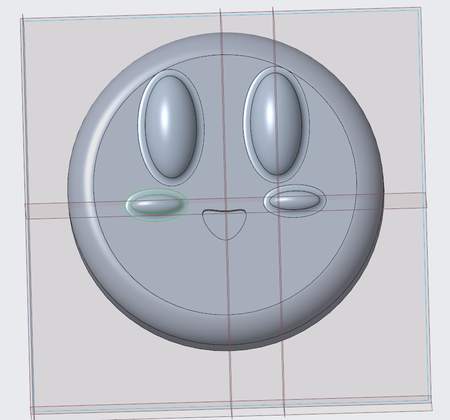
    </td>
    <td style="width:40%; vertical-align:top;">
      

        Once the blush was sketched and revolved, I mirrored it across the same middle datum plane I used for the eyes to keep the dimensions the same on both sides of the object.
      

    </td>
  </tr>
  <tr>
    <td style="width:60%;">
      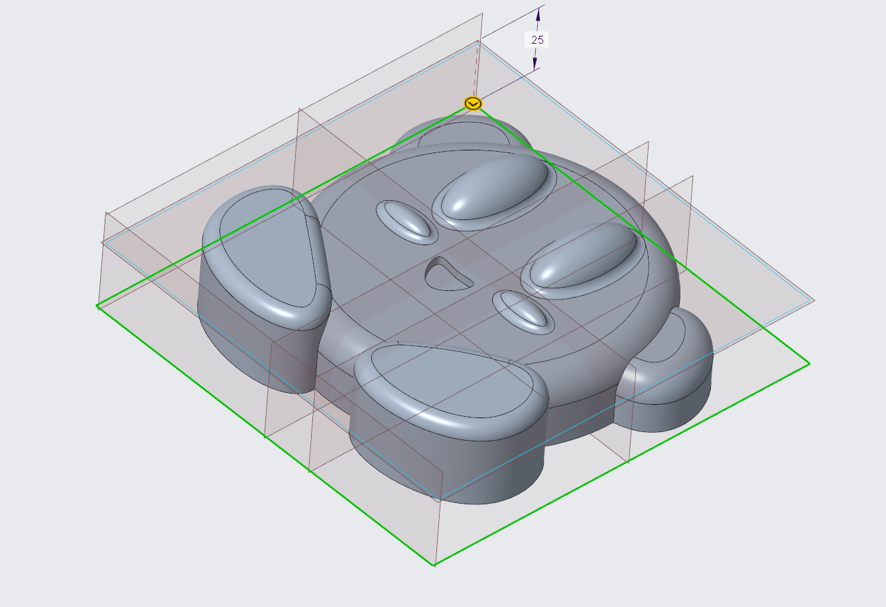
    </td>
    <td style="width:40%; vertical-align:top;">
      

        To make the arms and feet, I created another datum plane on the bottom of the main body so that I could sketch inside of the body and outside of the body. It makes it easier to create different shapes for the arms and feet.
      

    </td>
  </tr>
    <tr>
    <td style="width:60%;">
      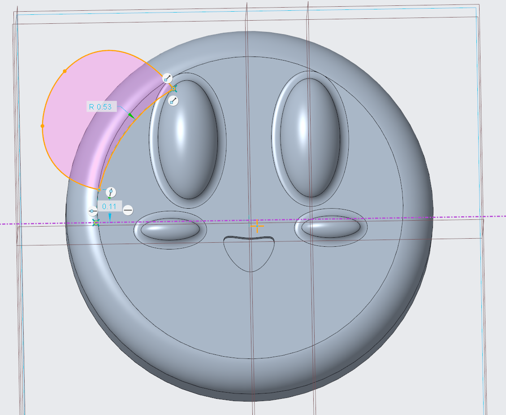
    </td>
    <td style="width:40%; vertical-align:top;">
      

        Making the arms, I used a similar technique as I used for the mouth. I used the spline tool from the non rounded part of the body to create a circular looking hand. I then used an arc to connect the two end points of the spline since the body was still a perfect circle. I wanted to make him look like he was waving, so that is why the left hand is high up on the body. 
      

    </td>
  </tr>
    <tr>
    <td style="width:60%;">
      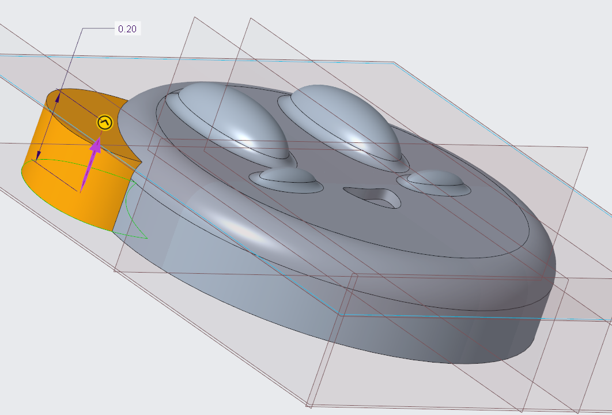
    </td>
    <td style="width:40%; vertical-align:top;">
      

        I extruded the arm to a slightly shorter height than the main body because Kirby has really small arms in his games. I thought that it would make it look more like the character.
      

    </td>
  </tr>
    <tr>
    <td style="width:60%;">
      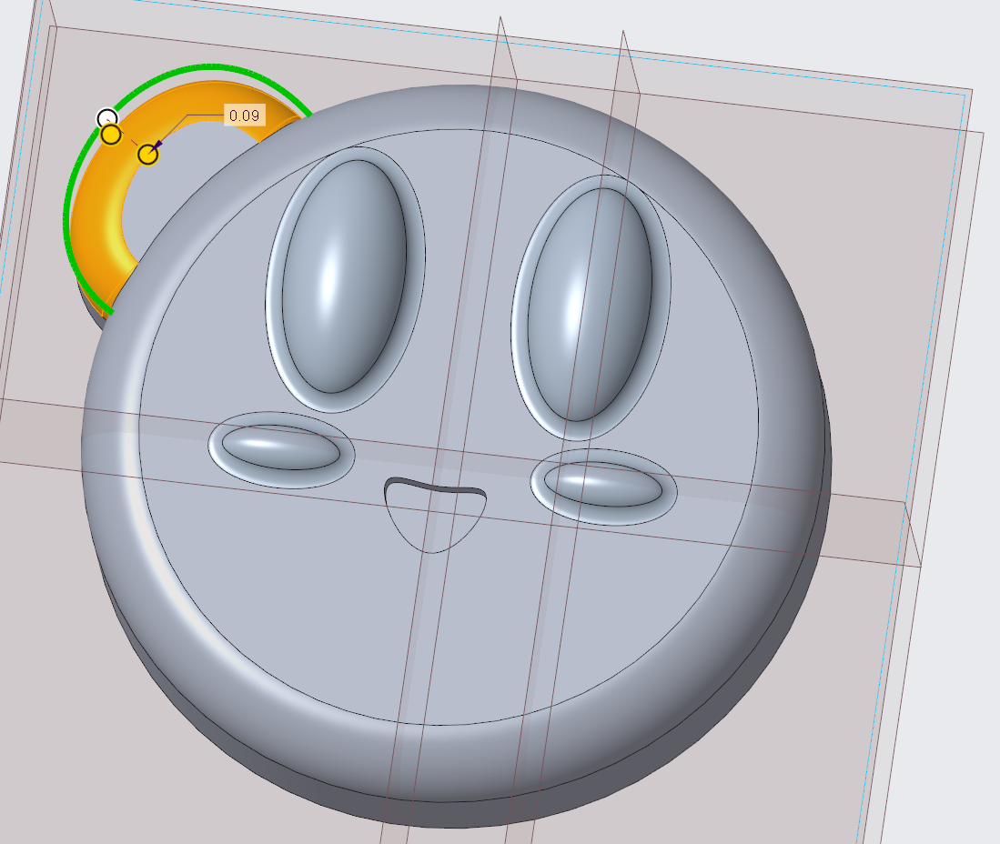
    </td>
    <td style="width:40%; vertical-align:top;">
      

        Keeping the rounding consistent, I rounded Kirby's arm the same amount for when I rounded his body. I thought it would make the whole design look more uniform.
      

    </td>
  </tr>
    <tr>
    <td style="width:60%;">
      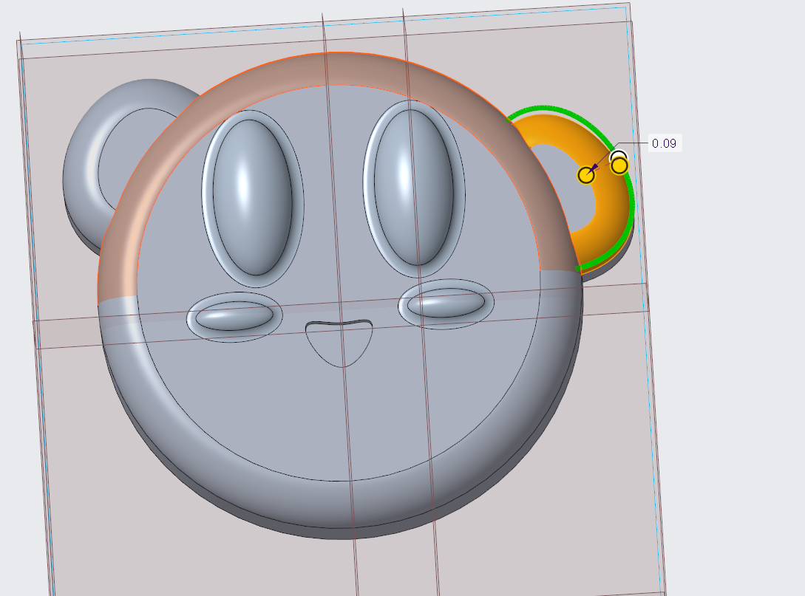
    </td>
    <td style="width:40%; vertical-align:top;">
      

        I repeated this process for the right arm, but I put it a little lower to try and give him that waving look.
      

    </td>
  </tr>
</table>

