# L4 - Benchmark a parameter

## Parameter

The goal of Lab 4 is to show how some 3D printers can outperform or underperform different 3D printing design rules. An example of this is the overhang design rule. The general rule is to not print any 3D artifact over 45 degrees from the vertical axis. To test an individual 3D printing machine, it can print an artifact that has 1 less degree (44) or 1 more degree (46) to see how it performs. If the print isn't smooth at 44 degrees, that means the 3D printer underperforms for that specific test, and the designer should keep that in mind while designing different parts. The same thing can be said if the 3D printer outperforms the general rule. 

That was just an example though. Below is a graph of all of the different 3D printing design rules. The graph gives a little information about each design rule and then the parameters for each rule. Since I am going to be using the Prusa Core One 3D printer, I am looking at the "Fused deposition modeling" requirements. '

    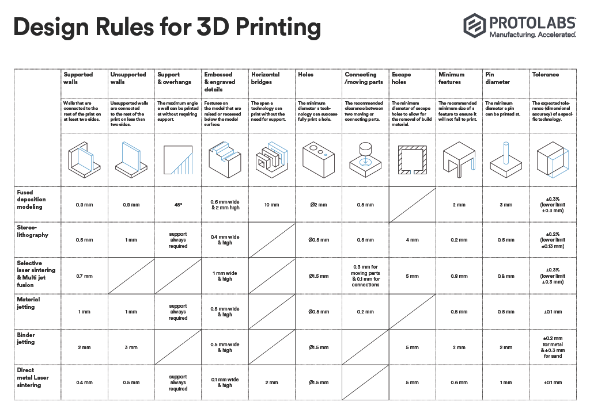

I decided to test the horizontal bridges parameter. I chose the horizontal bridges parameter because I have tried to avoid any type of gaps or overhangs in my current designs. That is why they are all flat to the ground with small bumps or rounds on top of them. If I can test the limit of the Prusa Core One for horizontal bridges, I think it would give me more freedom when designing without supports for 3D models. 

## Designing

I am going to show 2 different designs. The first design was my first plan when going about this project. It unfortunately didn't turn out the way I wanted it to due to all of the bridges being the same height, making it hard to view the error, and there not being a big enough deviation from the 10mm rule. My second design is my revised plan, which fixes the issues of the first design. I will provide CAD files and STL files for both of the designs if you want to look into what I am talking about a little deeper.

### Design 1

Looking at the "3D Printing Design Rules", the rule for FDM is 10mm. For my testing, I will change the measurement by +/- 1mm. I will continue to do this until I have five different horizontal bridges on my 3D printing file. My final design will show horizontal bridges in measurements of 8mm, 9mm, 10mm, 11mm, and 12mm. Each horizontal bridge will have a 4mm gap between itself and the next horizontal bridge. With the wide range of measurements, it should give me a good idea of the capabilities of the Prusa Core One for this 3D design rule.

To eliminate risk of other failures unrelated to the design rule I picked, I decided to make the supports for the bridge a 5mm x 5mm square. I think this will provide enough support to keep the failure isolated towards the bridge design. The thickness of the actual bridge gap will be 2mm.

#### 3D Modeling

<table style="width:100%;">
  <tr>
    <td style="width:60%; text-align: center; vertical-align:middle;">
      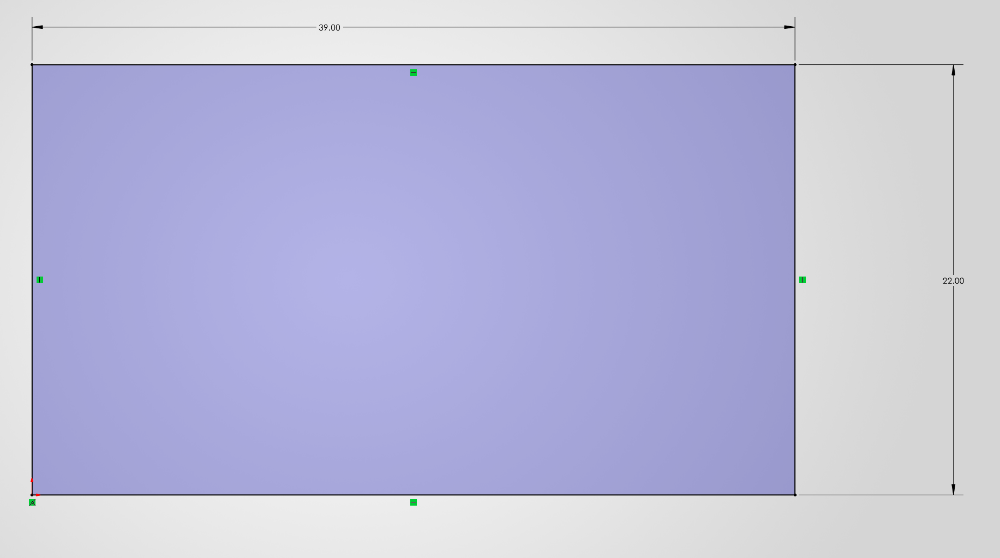
        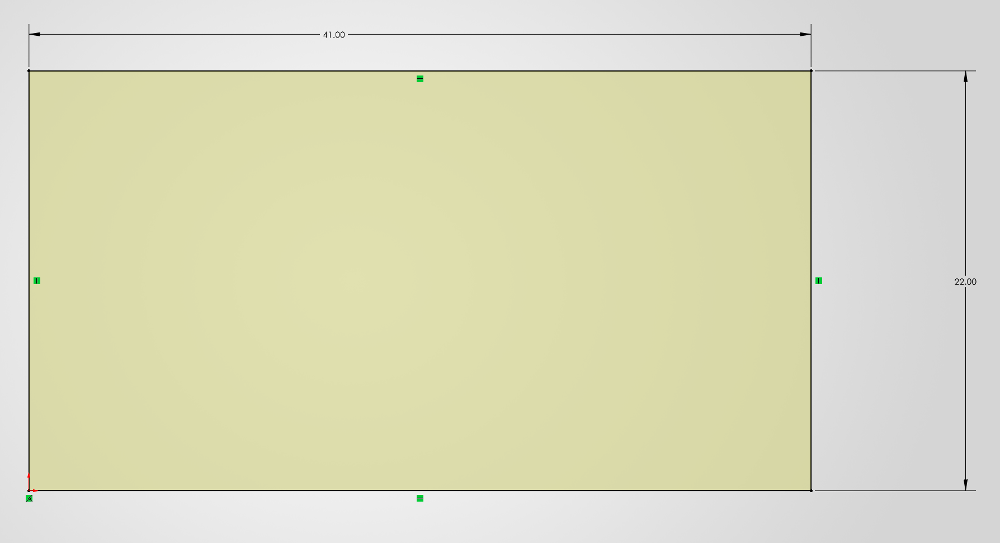
    </td>
    <td style="width:40%; padding:28px; vertical-align:middle;"">
      

        To start 3D modeling, I created a small base layer to put all of the bridge gaps on top of. I hope this will minimize printing errors, and properly show the results of the test. When I originally did this, I tried adding all of the length values in my head, and I got the incorrect dimensions. So, I had to adjust the length of my base layer from 39mm to 41mm. The bottom image shows the correct dimensions for what I am testing.
      

    </td>
  </tr>
    <tr>
    <td style="width:60%; text-align: center; vertical-align:middle;">
      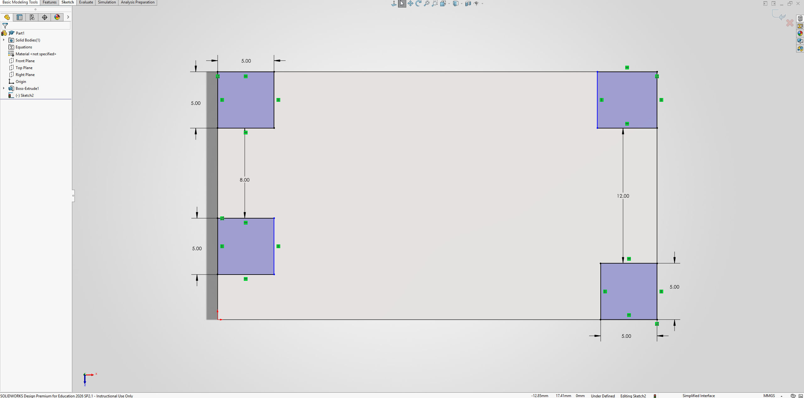
    </td>
    <td style="width:40%; padding:28px; vertical-align:middle;"">
      

        Once the base of my design was established, I could move onto the legs of the bridge gaps. To design the legs, I created a 5mm x 5mm box on the top left and top right corner of my base. Those represented my two extreme values. I then created another 5mm x 5mm box 8mm away from the top left and 12mm from the top right. Those dimensions are the bridge gap dimensions. 
      

    </td>
  </tr>
    <tr>
    <td style="width:60%; text-align: center; vertical-align:middle;">
      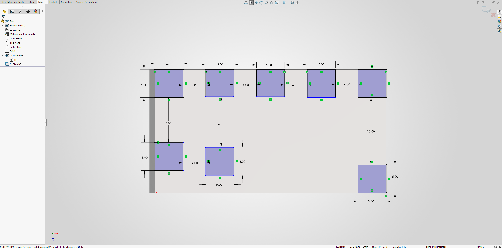
    </td>
    <td style="width:40%; padding:28px; vertical-align:middle;"">
      

        Now that I have the two leg ends of my design, I can work on offsetting those points to get the rest of the bridge gaps. Since all of my bridge gaps had the same starting position, I was able to create the 5mm x 5mm boxes along the top 4mm apart from each other. After doing so, the space on the top part of my base plate was all used up because the base plate was designed for 5mm x 5mm legs that were 4mm apart from each other. Since all of the starting positions for the bridge gaps were in place, I wanted to start on creating that bridge gap on the base plate. I was able to accomplish this in the same way I did the first bridge gap and the last bridge gap (creating another 5mm x 5mm box directly across from the starting point and making sure that the starting support leg and the final support leg had the proper bridge gap distance between them).  
      

    </td>
  </tr>
    <tr>
    <td style="width:60%; text-align: center; vertical-align:middle;">
      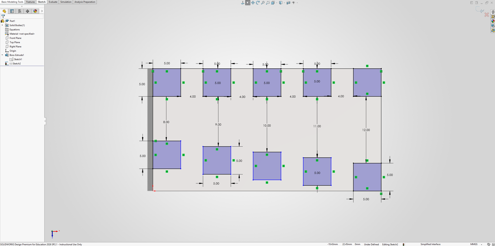
    </td>
    <td style="width:40%; padding:28px; vertical-align:middle;"">
      

        I continued this process for all of my bridge gaps. The end goal for this process is to have the support legs set in place so that I could extrude all of the support legs to the same height, and then actually create the bridge gaps across the leg supports. This is shown in the final sketch for the support legs.
      

    </td>
  </tr>
    <tr>
    <td style="width:60%; text-align: center; vertical-align:middle;">
      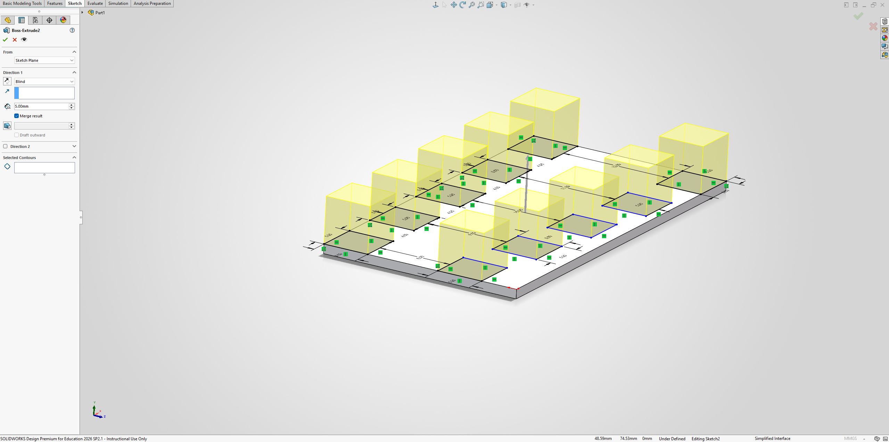
    </td>
    <td style="width:40%; padding:28px; vertical-align:middle;"">
      

        I wasn't really sure what height I wanted to extrude it to, but I wanted the print to not take so long, so I decided to extrude all of the support legs by 5mm. I thought that it would be a big enough gap to tell if the 3D print failed while maintaining a low print time. 
      

    </td>
  </tr>
    <tr>
    <td style="width:60%; text-align: center; vertical-align:middle;">
      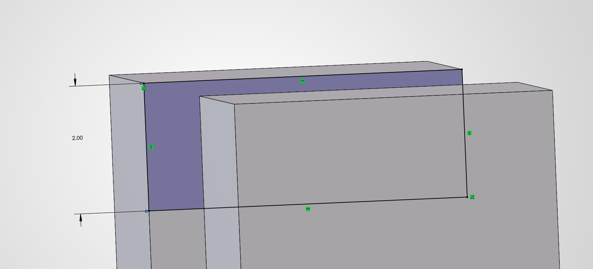
    </td>
    <td style="width:40%; padding:28px; vertical-align:middle;"">
      

        My next thought was to create a sketch on the support legs that will be the width and height I wanted my bridge gaps to be. Since they're attached to the support legs, the width will be 5mm, but I decided to go with 2mm for the height. I chose 2mm because I thought with a thinner design, it would show the failure of the different bridge gaps more clearly. I also had to do each of these sketches individually since they will all be extruded to different values, since the lengths of the bridge gaps will vary by 1mm. The picture shown shows the process for the first support leg.
      

    </td>
  </tr>
    <tr>
    <td style="width:60%; text-align: center; vertical-align:middle;">
      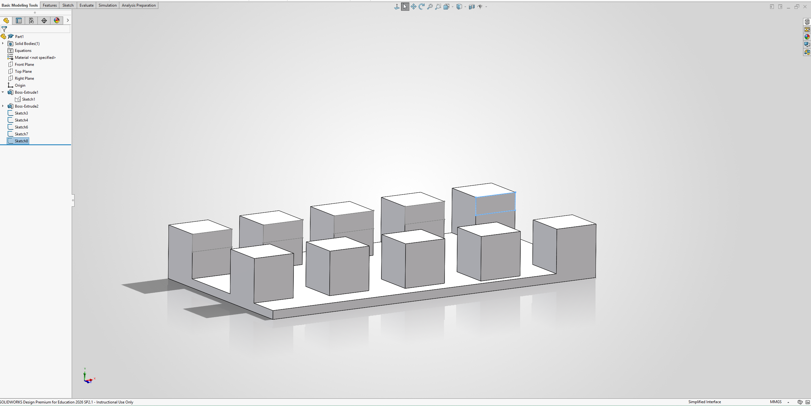
    </td>
    <td style="width:40%; padding:28px; vertical-align:middle;"">
      

        Here are all of the sketches drawn on the different support legs. They all have the same dimensions, but as stated earlier, they will be extruded to different values due to the different bridge gap lengths.
      

    </td>
  </tr>
    <tr>
    <td style="width:60%; text-align: center; vertical-align:middle;">
      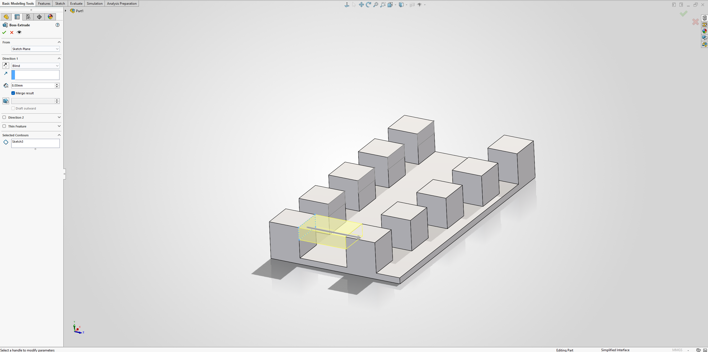
    </td>
    <td style="width:40%; padding:28px; vertical-align:middle;"">
      

        With all of the bridge gap sketches in place, I started extruding them. The first bridge gap will be extruded by 8mm, since that was the length I have been designing this artifact for. The rest of the gaps will be extruded by exactly 1mm greater until I reach the 12mm I wanted to test. 
      

    </td>
  </tr>
    <tr>
    <td style="width:60%; text-align: center; vertical-align:middle;">
      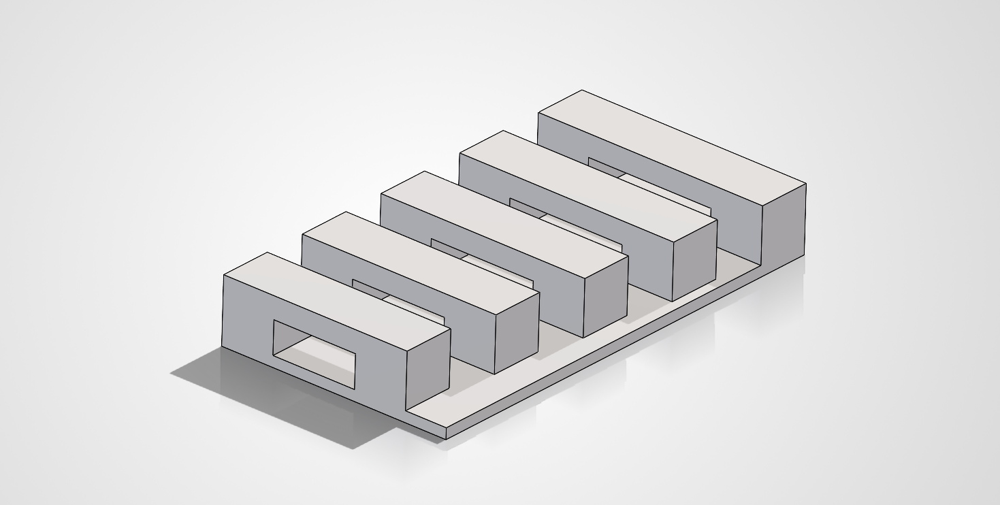
    </td>
    <td style="width:40%; padding:28px; vertical-align:middle;"">
      

        Once all of the bridge gaps were extruded, I had my finished product. I was pretty happy with it, since that is what I was picturing when I first started designing the artifact.
      

    </td>
  </tr>
</table>

#### Preprocessing

I moved onto PrusaSlicer after saving my CAD model as an stl file. When I imported my model, it came in sideways. I am not sure why this keeps happening because I thought I designed my part on the top plate, but it is a simple fix. All I had to do was just rotate the design by 90 degrees, and the design should be flat on the bed. I didn't have to scale my design at all because I designed it for the dimensions it is at currently, and I didn't have to add any supports because nothing that I wasn't testing exceeded the FEM design rules.

    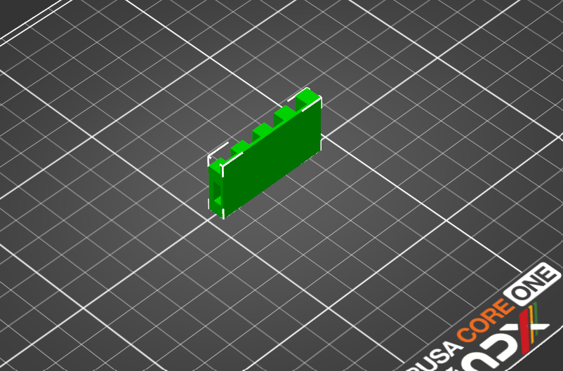

    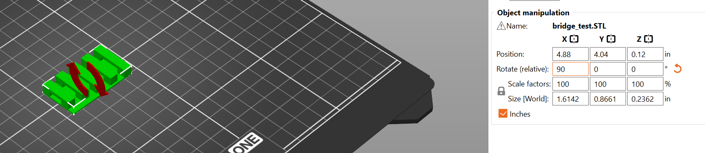

Once my orientation was fixed, I was thinking about what infill type and infill percentage I wanted to use. I think that the structural capabilities of my artifact doesn't really matter, so I kept the default options PrusaSlicer gave (infill percentage = 15% and infill type = grid). I thought that the infill percentage was plenty for what I was working with and the grid infill gives okay structure while printing quickly. I had first pick of what 3D printer I wanted to use, so I chose PC-15. The filament inside of PC-15 was PETG, so I made sure that my model was using the correct filament. Below shows a picture of my artifact with my partners, Andrew, with all of the specifications.

<table style="width:100%;">
  <tr>
    <td style="width:60%; text-align: center; vertical-align:middle;">
      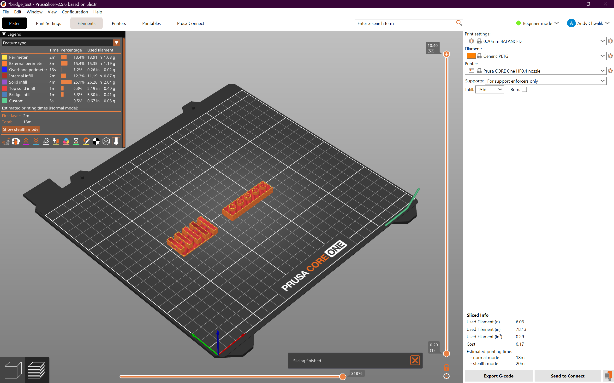
    </td>
    <td style="width:40%; text-align: center; vertical-align:middle;">
      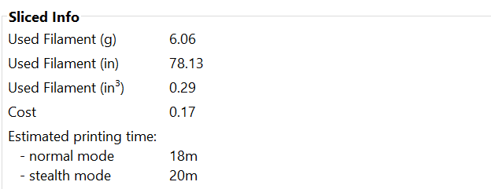
    </td>
  </tr>
</table>

#### 3D Printing

I noticed that this design wasn't as good as I initially thought it was after 3D printing was completed. The 3D printing step went really well, and I will go more in depth of what exactly I did to 3D print in design 2, but the resulting product isn't what I hoped for. It is extremely hard to see if something failed due to all of the support legs being the same height, and going to just 2mm above the recommended bridge gap didn't really show any difference from the 8mm bridge gap. I had to bend the design, using pliers, just to see what happened in the middle.

<table style="width:100%;">
  <tr>
    <td style="width:60%; text-align: center; vertical-align:middle;">
      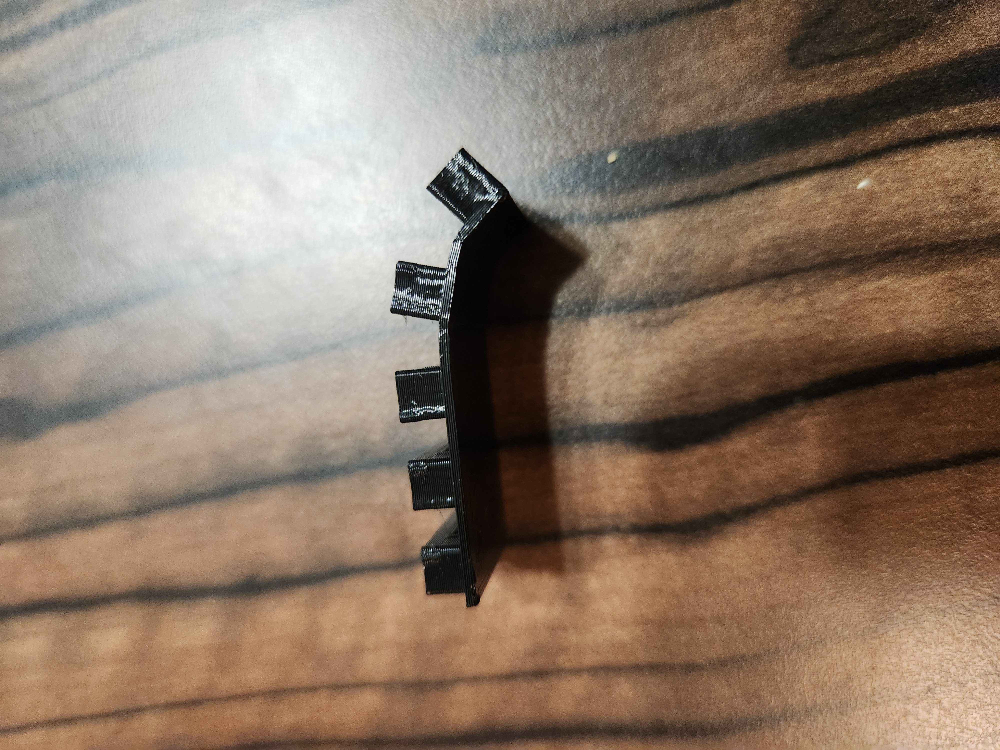
    </td>
    <td style="width:40%; padding:28px; vertical-align:middle;">
        

      Here is the design printed out from the side. As I said, I bent the back of the design so that I could get a better look at the individual bridge gaps.
        

    </td>
  </tr>
    <tr>
    <td style="width:60%; text-align: center; vertical-align:middle;">
      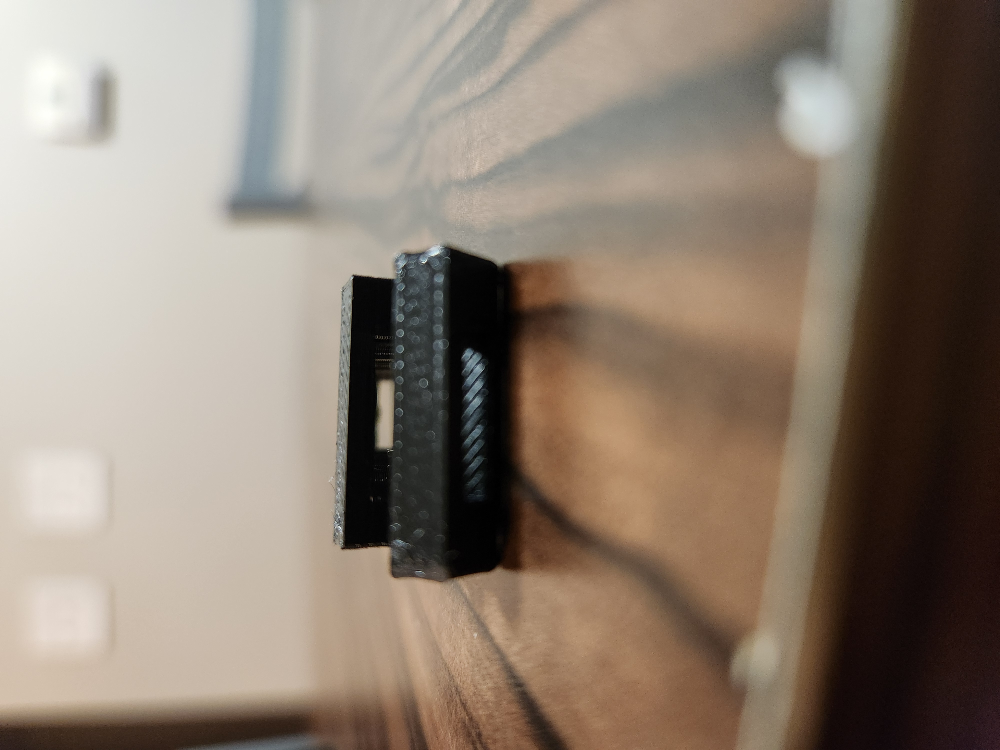
    </td>
    <td style="width:40%; padding:28px; vertical-align:middle;">
        

      Here is the design from behind the bent part of the design. It was the only way I could get a good look at what was happening in the middle of my artifact.
        

    </td>
  </tr>
    <tr>
    <td style="width:60%; text-align: center; vertical-align:middle;">
      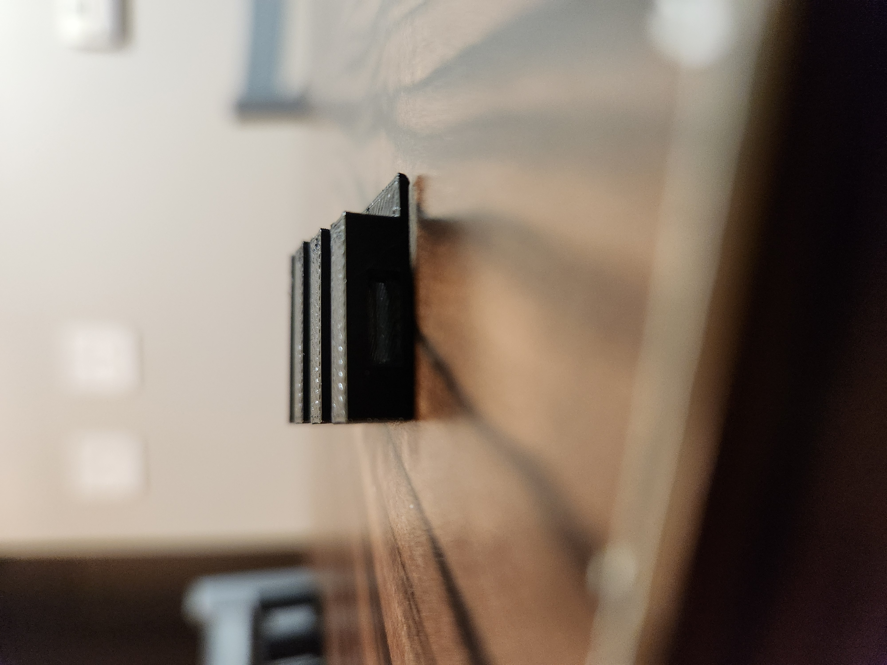
    </td>
    <td style="width:40%; padding:28px; vertical-align:middle;">
        

      Here is the design from the front. As you can see, it is extremely difficult to see anything that is happening. The bridge gaps that are visible, have no errors with them.
        

    </td>
  </tr>
</table>

With all of these issues being present in the 3D print, I didn't feel like it showed enough information for what the goal of the assignment was. That is why I will keep all of the issues with design 1 in mind while designing design 2.

If you are want to get a better understanding of the issues I am talking about, here is the CAD file and STL file to get a better understanding: [CAD file](bridge_test.SLDPRT)    |    [STL file](bridge_test.stl)

### Design 2

I was disappointed that my original design didn't work, but it gave me good insight on what I needed to fix. The major flaw with my first design is that it was hard to view any failures after the printing was complete. To fix this, I decided to make three changes: I increased the distance between the support legs from 4mm to 10mm, I made a cutout at the bottom of the base, and I varied the height of the support legs instead of making them all the same height. I increased the distance by more than double so it was much easier to view in-between the different bridge gaps. I made the cutout at the bottom so I can view the bridge gaps from below to see if there are failures occurring that I can't see from above or the side of the artifact. I made the support legs at varied heights to better identify between the different bridge gaps and see the failures more clearly. All of these changes combined should provide a better end product that I can analyze.

The other major flaw with the first design is there wasn't a major difference between 8mm and 12mm. They both didn't have any visible flaws to me, but that could also be affected by the spacing and lack of vision. I took extra caution, because I didn't want to redesign my artifact again, and I increased the number of bridge gaps from 5 to 8. What I mean by this is that there will be 8 bridge gaps, all varying in lengths from 8mm-15mm. The goal for this change is to show a bigger failure point as I go up in dimensions. I was thinking the extra 3mm will be more difficult to print, leading to more visible failures.

Adding all of these extra features will definitely increase my print time, but now that I have access to the printing lab, I am less concerned about the print time. It is also more important that my design works rather than the printing time.

#### 3D modeling

<table style="width:100%;">
  <tr>
    <td style="width:60%; text-align: center; vertical-align:middle;">
      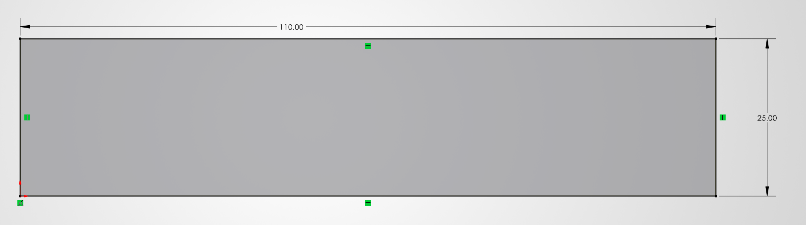
    </td>
    <td style="width:40%; padding:28px; vertical-align:middle;"">
      

        I created my base by adding all of the spaces between the support legs as well as the length of the support legs. There are 7 total spaces, so it would be 70mm + (5mm * 8). Doing the calculations gave the length of my base 110mm. To find the width of the base, I just added the width of two support legs with the biggest bridge gap that will be in my design. I got the equation (5mm * 2) + 15mm. Doing the calculations gave the width of my base to be 20mm. I extrude the plate by 1mm, same as design 1.
      

    </td>
  </tr>
  <tr>
    <td style="width:60%; text-align: center; vertical-align:middle;">
      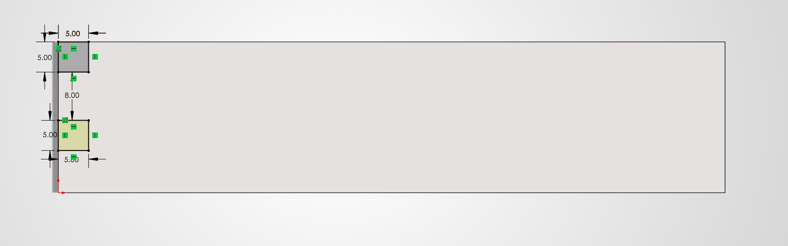
    </td>
    <td style="width:40%; padding:28px; vertical-align:middle;">
      

        I moved onto designing the support legs. Unlike design 1, the support legs will be different heights, so I have to do a separate sketch for each individual support leg. To layout the support legs, I made a 5mm x 5mm box at the top of the base plate, and then I made another 5mm x 5mm box directly below at the distance of the bridge gap. In the picture shown, I was modeling the first bridge gap, so the two support legs will be 8mm apart. The next bridge gap will be 9mm apart, continuing all the way up to the 15mm bridge gap.
      

    </td>
  </tr>
  <tr>
    <td style="width:60%; text-align: center; vertical-align:middle;">
      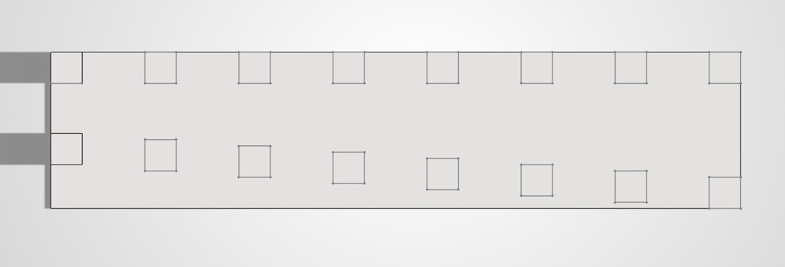
    </td>
    <td style="width:40%; padding:28px; vertical-align:middle;"">
      

        Here are all of the sketches laid out on the base plate. I extruded the first support legs in this image because I was fiddling around with what height I wanted to increment by.
      

    </td>
  </tr>
  <tr>
    <td style="width:60%; text-align: center; vertical-align:middle;">
      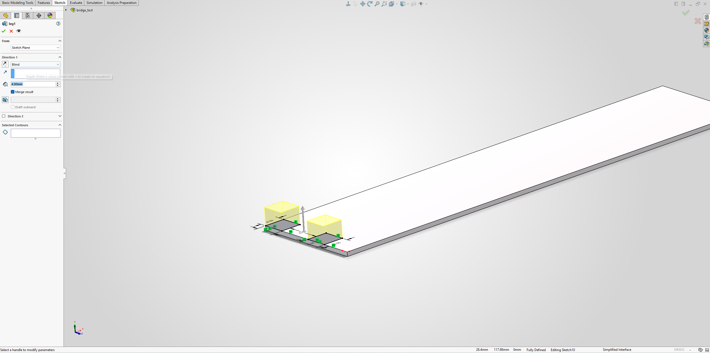
    </td>
    <td style="width:40%; padding:28px; vertical-align:middle;"">
      

        The height I decided on was 4mm for the first bridge gap and then increment the height of each of the following support legs by 2mm. I did this since the thickness of the bridge gap is 2mm, so I should be able to see the top of each bridge gap with the new height. 
      

    </td>
  </tr>
  <tr>
    <td style="width:60%; text-align: center; vertical-align:middle;">
      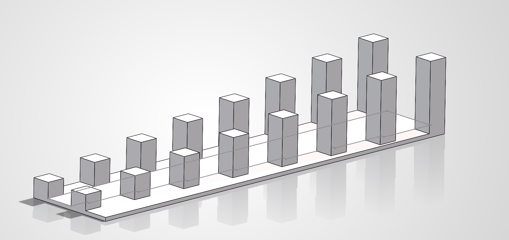
    </td>
    <td style="width:40%; padding:28px; vertical-align:middle;"">
      

        The picture shown is all of the support legs extruded in the way I explained before. It is easier to see what I am picturing with it visually showing in the CAD model. If you look closer at the image, you can see there is another sketch present. I didn't mention this sketch because I tried to create the base cutout early, however the extrusion was very weird, so I decided to hold off until I completed the bridge gaps first.
      

    </td>
  </tr>
  <tr>
    <td style="width:60%; text-align: center; vertical-align:middle;">
      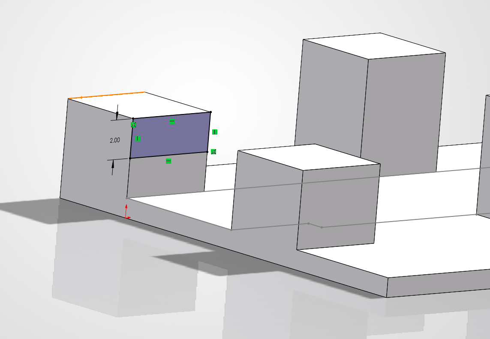
    </td>
    <td style="width:40%; padding:28px; vertical-align:middle;"">
      

        Once I extruded all of the support legs, it was time to create the sketches for the bridge gaps. I kept the same thickness of the bridge gaps, since the thickness didn't seem to affect the print from design 1. Each bridge gap will be extruded to a different value, so I had to make separate sketches for each bridge gap. The image shows the sketch for the first bridge gap.
      

    </td>
  </tr>
  <tr>
    <td style="width:60%; text-align: center; vertical-align:middle;">
      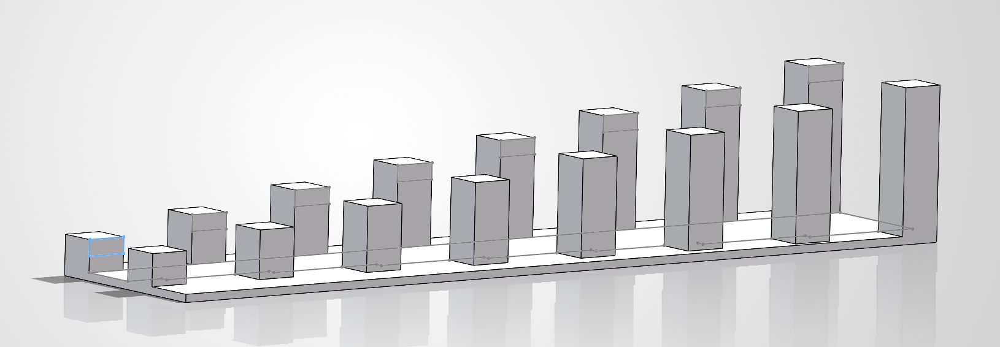
    </td>
    <td style="width:40%; padding:28px; vertical-align:middle;"">
      

        Here are all of the sketches on their respective support legs. All of the sketches have the exact same dimensions, they're just going to be extruded to different lengths as mentioned before.
      

    </td>
  </tr>
  <tr>
    <td style="width:60%; text-align: center; vertical-align:middle;">
      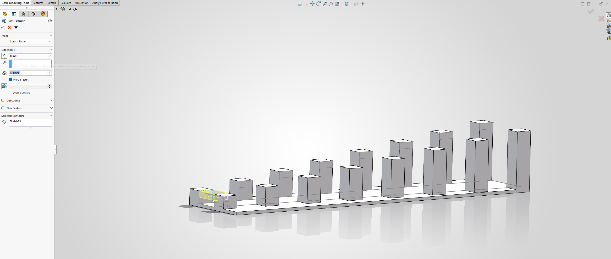
    </td>
    <td style="width:40%; padding:28px; vertical-align:middle;"">
      

        I started to extrude each of the bridge gap sketches. Their length depended on how long the gap was supposed to be. The image shown is the first one, so the length will be 8mm. I will increase the extrusion by 1mm for each bridge gap after so everything connects together.
      

    </td>
  </tr>
  <tr>
    <td style="width:60%; text-align: center; vertical-align:middle;">
      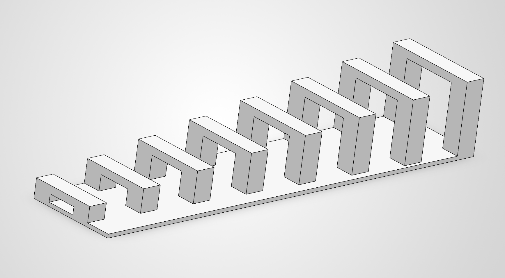
    </td>
    <td style="width:40%; padding:28px; vertical-align:middle;"">
      

        Here are all of the bridge gaps extruded. The design changes are very noticeable now, and I think it will provide a better result than design 1. 
      

    </td>
  </tr>
  <tr>
    <td style="width:60%; text-align: center; vertical-align:middle;">
      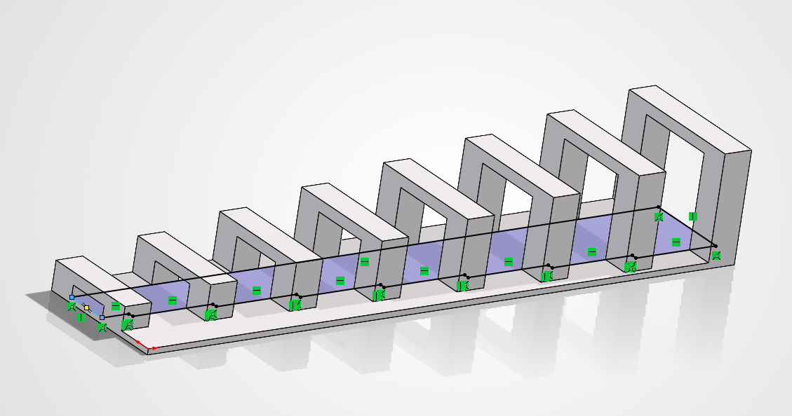
    </td>
    <td style="width:40%; padding:28px; vertical-align:middle;"">
      

        To make a cutout of the base plate, so I can see under the bridge gaps, I created a sketch outlining where the support legs are. Doing this will keep all of the bridge gaps connected, while giving me access to see under my design. 
      

    </td>
  </tr>
  <tr>
    <td style="width:60%; text-align: center; vertical-align:middle;">
      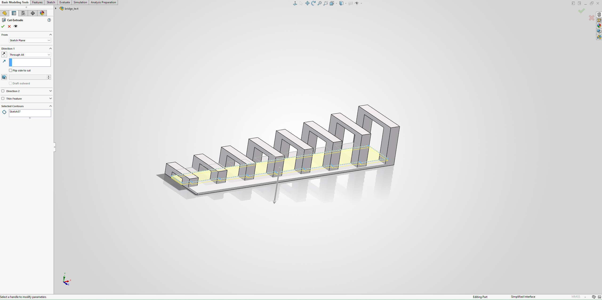
    </td>
    <td style="width:40%; padding:28px; vertical-align:middle;"">
      

        Finalizing the cutout, all I had to do was apply an extrusion to remove material from the base plate. When choosing how to remove the material, I selected "through all" rather than "blind" so if it were to get machined, there would be no wasted movements with the machine.
      

    </td>
  </tr>
    <tr>
    <td style="width:60%; text-align: center; vertical-align:middle;">
      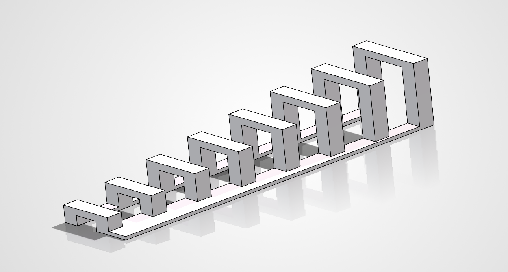
    </td>
    <td style="width:40%; padding:28px; vertical-align:middle;"">
      

        Going through this whole process, gave me this final design. I think it looks a lot better than my first design, and I have confidence that it will better show the objective of this assignment.
      

    </td>
  </tr>
</table>

#### Preprocessing

I saved my CAD model as an stl file, and moved onto Prusaslicer. Similar to design 1, the model was imported in sideways. It was probably imported sideways because I did all of my CAD modifications on the same file for design 1. Since design 1 was put in sideways, that means design 2 would be imported sideways. It is not that big of a deal though because I just rotated my artifact 90 degrees. I didn't have to scale my design at all because the dimensions I put into the design are pretty delicate, and I think it would mess up the whole test. There are no supports, besides the support legs I made through CAD, because that would defeat the purpose of the test.

    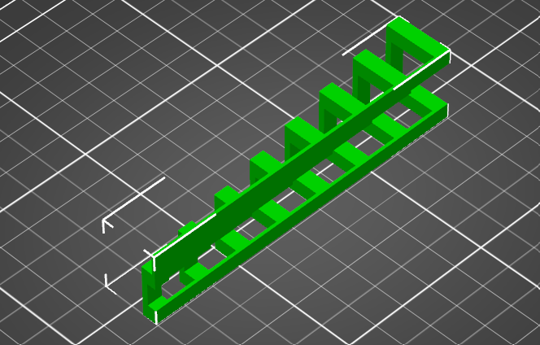

    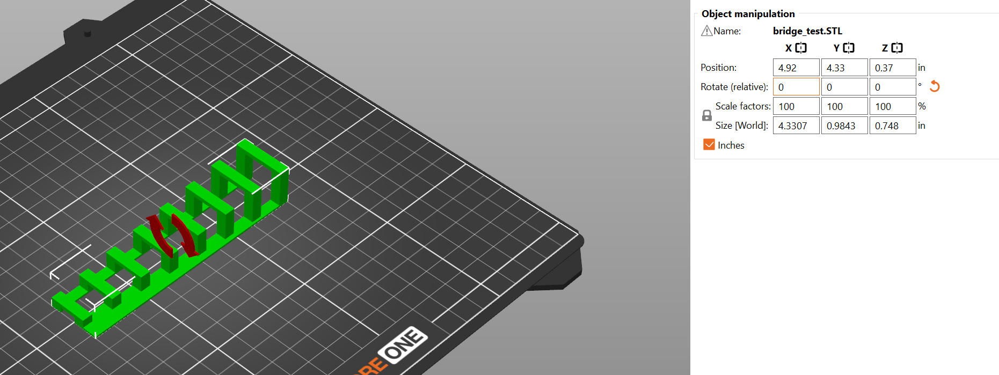

<table style="width:100%;">
  <tr>
    <td style="width:60%; text-align: center; vertical-align:middle;">
      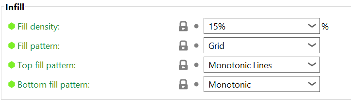
    </td>
    <td style="width:40%; padding:28px; vertical-align:middle;"">
      

        Me and Andrew are still printing together because he also had an error occur with his artifact. We decided to use the same filament settings, infill type = grid and infill percent = 15%, because the 3D printing process went smoothly the first time, it was just the end products that didn't deliver on the goal of the project
      

    </td>
  </tr>
  <tr>
    <td style="width:60%; text-align: center; vertical-align:middle;">
      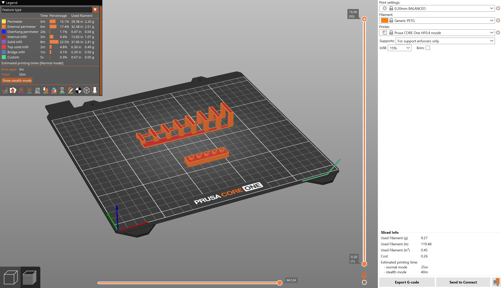
    </td>
    <td style="width:40%; padding:28px; vertical-align:middle;"">
      

        We also tried to keep the settings of our 3D print as similar as possible to design 1 for the same reasons as why we kept the same infill. Since we are 3D printing on a later day, we ere able to use the same 3D printer (PC-15), so we didn't have change the filament from PETG.
      

    </td>
  </tr>
  <tr>
    <td style="width:60%; text-align: center; vertical-align:middle;">
      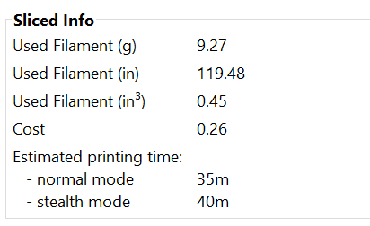
    </td>
    <td style="width:40%; padding:28px; vertical-align:middle;"">
      

        Here is the sliced info of our file. The printing time is much higher than last time, almost twice as long, but we are both okay with the longer printing times if our product is better than our first print.
      

    </td>
  </tr>
</table>

#### 3D Printing

Andrew and I were able to get the same 3D printer as last time, PC-15, so we exported the g-code file from Prusaslicer onto the USB labeled PC-15 and plugged it into the 3D printer. When I plugged in the USB, our file popped up onto the little screen at the bottom of the 3D printer

<table style="width:100%;">
  <tr>
    <td style="width:60%; text-align: center; vertical-align:middle;">
      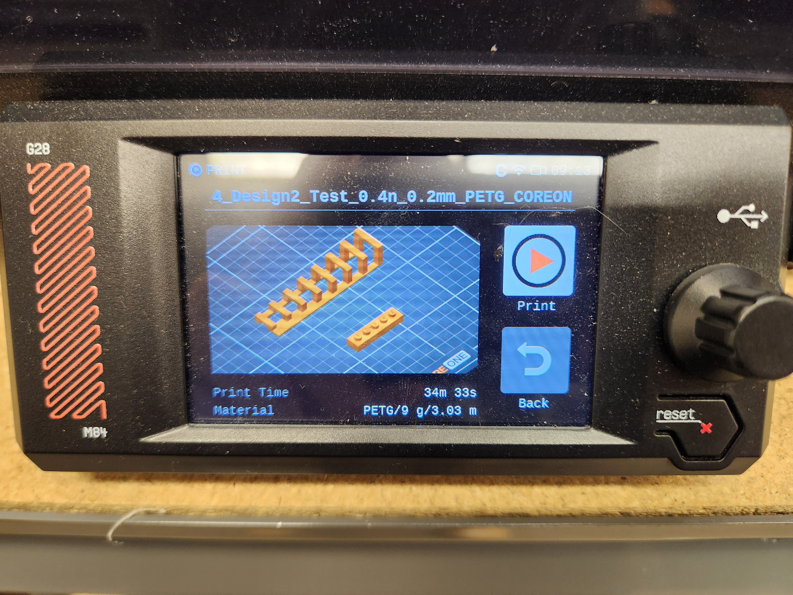
    </td>
    <td style="width:40%; padding:28px; vertical-align:middle;"">
      

        Here is the popup screen. It shows the parts print time and the type of material that is on the file. I am assuming that material is on there to make sure the user is using the correct filament, but that is just a guess.
      

    </td>
  </tr>
  <tr>
    <td style="width:60%; text-align: center; vertical-align:middle;">
      
    </td>
    <td style="width:40%; padding:28px; vertical-align:middle;"">
      

        When I pressed print, a percentage bar came up with some settings and the options of stopping or pausing the print. In this picture, the 3D printer was heating up. The nozzle and the bed need to heat up before the printer can print so that filament melts properly.
      

    </td>
  </tr>
  <tr>
    <td style="width:60%; text-align: center; vertical-align:middle;">
      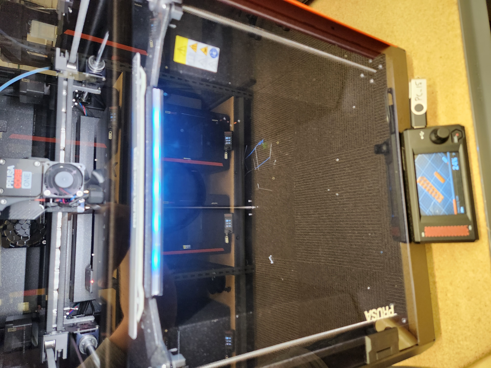
        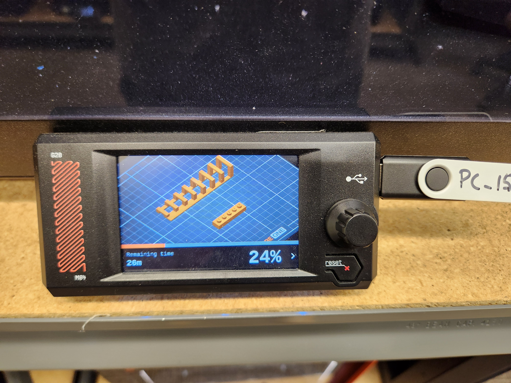
    </td>
    <td style="width:40%; padding:28px; vertical-align:middle;"">
      

        This is what the 3D printer looks like at 24% completed. The bed is raised near the top of the machine, and it moves down as the print gets taller. I think this is if someone decided to print a larger object
      

    </td>
  </tr>
</table>

I was able to get a video of our artifacts being printed at about 60% completion. The video shows a full layer being 3D printed. Since my part has a lot of spaced out support legs, it makes it a much more time consuming process than if everything was connected together. 

  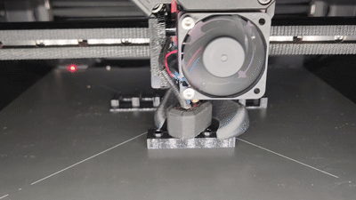

<table style="width:100%;">
  <tr>
    <td style="width:60%; text-align: center; vertical-align:middle;">
      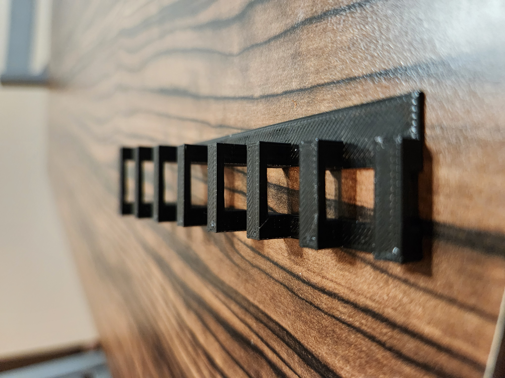
    </td>
    <td style="width:40%; padding:28px; vertical-align:middle;"">
      

        Here is what my artifact looked like after the 3D print was fully completed. I think the changes definitely helped with analyzing the bridge gap test. The varying height makes it much more noticeable to see issues than previously, and the hole in the bottom gives me easy access to see problems under the bridge gaps.
      

    </td>
  </tr>
    <tr>
    <td style="width:60%; text-align: center; vertical-align:middle;">
      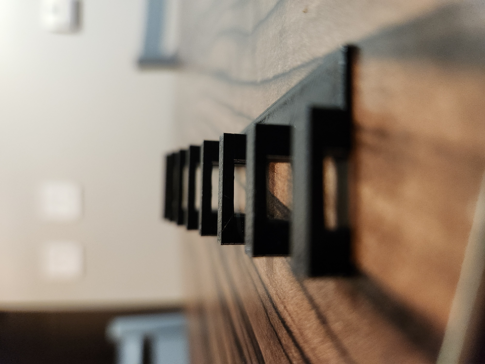
    </td>
    <td style="width:40%; padding:28px; vertical-align:middle;"">
      

        This is a more clear picture of the height difference between the different bridge gaps. Unfortunately my camera focused on the bridge gap that follows the original rule, 10mm, so it is kind of hard to see the differences. 
      

    </td>
  </tr>
    <tr>
    <td style="width:60%; text-align: center; vertical-align:middle;">
      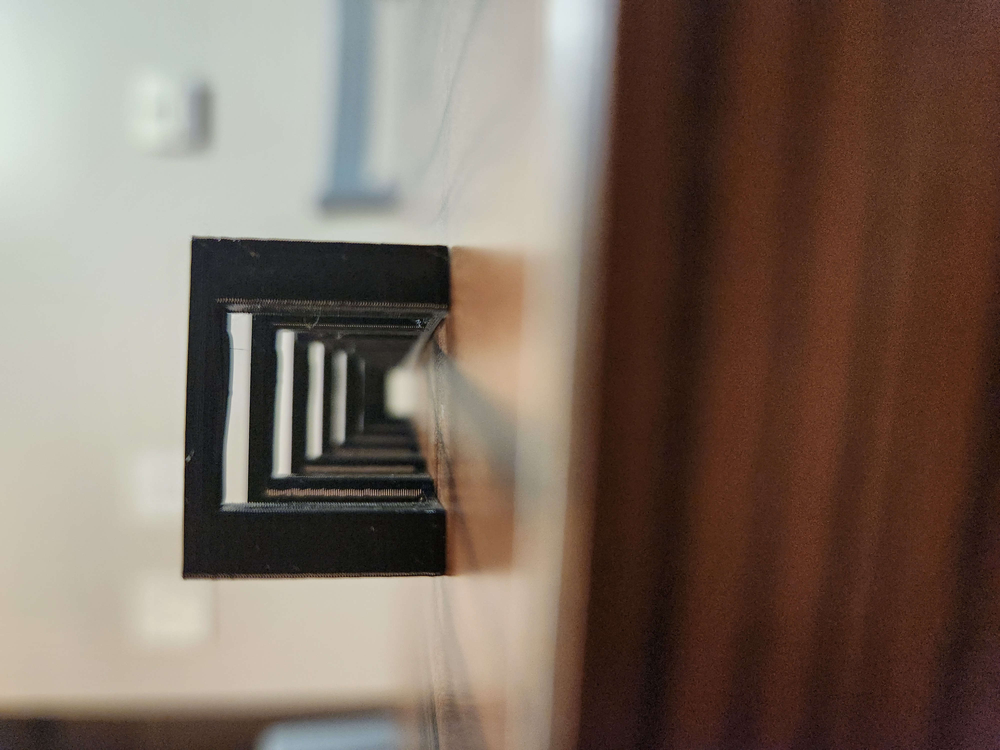
    </td>
    <td style="width:40%; padding:28px; vertical-align:middle;"">
      

        Due to the lack of visibility from the front, because of the blurriness, here is a picture of the back. Looking at the longest bridge gaps, it is more noticeable that there is a little bit of failure occurring. In the middle to right side, there is a little bit of material sagging down. This effect is even present on the third longest bridge 
      

    </td>
  </tr>
    <tr>
    <td style="width:60%; text-align: center; vertical-align:middle;">
      
    </td>
    <td style="width:40%; padding:28px; vertical-align:middle;"">
      

        Here is the bottom view of my artifact. I couldn't see as much failure as I wanted to from this angle, but I think it still made it more convenient to look around the object. 
      

    </td>
  </tr>
</table>
