# L5 - Design a Snap Fit

## Objective

The goal for Lab 5 was to create two separate parts that are able to connect with each other through a snap fit. What this means is you can slide the part into the other, have it lock in place, and then detach the parts by putting pressure on the connection point. An example would be any type of buckle on backpacks or a battery cover on remotes.

Snap fits use the property of elastic deformation in order to connect and disconnect. The pressure bends part of the connection, so you are able to slide the parts together. To lock them in place, there is a lip to stop the parts from coming out. To unlock them, you use the same elastic deformation properties to bend the locking material away, so that they can detach from each other.

  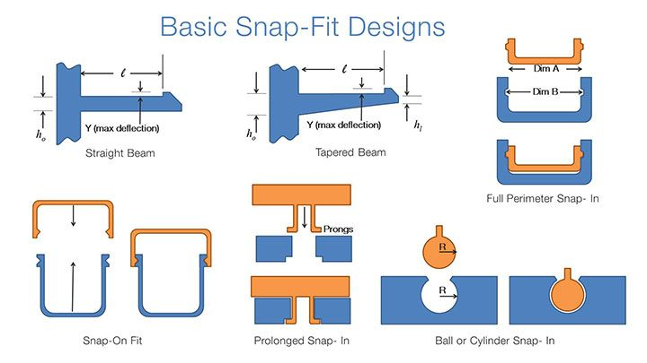
   
  <em>Here are some different types of snap fits and a visual representation if it is hard to picture through words.</em>

## Analyze

Before I think of possible snap fits, I want to make sure I have all of the variables for my design. I looked up the mechanical properties for PLA on Google, and I found a pdf from [Ultimaker](https://um-support-files.ultimaker.com/materials/2.85mm/tds/PLA/Ultimaker-PLA-TDS-v5.00.pdf). The young's modulus displayed found that PLA was around 3.25 GPa with a variance of 101 MPa. The listed yield strength is around 52.50 MPa with a variance of 0.9 MPa. Comparing this to other sites, it looks like the young's modulus ranges from 2.5GPa-3.5GPa and the yield strength ranges from 40MPa to 60MPa. For my project, I decided to use the middle of both of both of those: 3.0GPa, or 435000 psi, for young's modulus and 50GPa, or 7250psi, for yield strength. There had to be a transverse load of 0.25lbf - 5lbf, and there had to be an axial load of 5lbf - 10 lbf. The transverse load is the load required to unlock the objects from each other, and the axial load is the laod required to push the parts together. Everything had to be designed with a safety factor of 3.5.

Similar to my last project, I made two different designs. This wasn't on purpose, but I noticed at the end that my project was probably way too big and unnecessary for the assignment. I used the same math and process of development for both, but I will show the entire process for both designs. The second design is my final design, where there are some modifications at the end due to careless mistakes.

### Design 1

My first thought for a snap clip was a simple cantilever snap fit, similar to a buckle. I didn't want to make a buckle exactly, so I tried to think of different designs I wanted to do. My first thought was to make a box to hold all of the 3D prints we will be making throughout the semester. It will have a the snap fit as the latch for the box, so I can open and close it similar to how you open and close a chest.

This box was supposed to hold all of my 3D prints, so I was thinking I had to make it pretty big in dimensions. I already knew the young's modulus, yield strength, safety factor, and material I would be using; but, I had to choose my transverse load, axial load, base, width, and maximum deflection. Similar to my decisions for young's modulus and yield strength, I chose the middle points for the transverse load (2.5lbf) and axial load (7.5lbf). The maximum deflection was a little bit more difficult for me to decide.

For me to decide on my maximum deflection, I had to gauge how big I wanted my latch to be. In other words, I needed to decide on my base and width of my snap fit. I was working with inches, and I tried to use easy to manufacture measurements. I made the width of my clip 0.25in and the base of my clip 0.50in to try and adhere to the easy to manufacture measurements. The next measurement down was 1/8in, so that's what I decided to make my maximum deflection.

#### Paper Calculations

    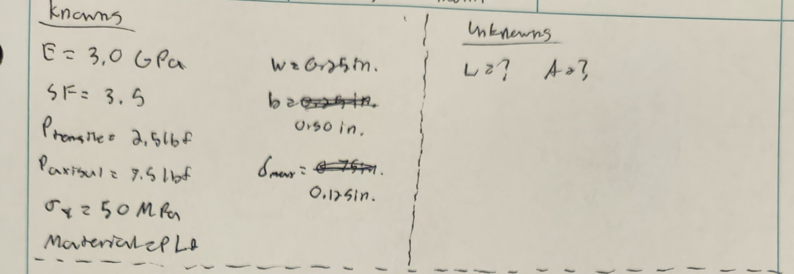

##### Length

Now that I had all of my known values, I started solving for the important mechanical properties of my snap fit: length and bending stress. To get the length of my snap fit, I used the beam equation for the cantilever beam from A03 from the lecture portion of this class. P represents the transverse load, L represents the length, E represents young's modulus, I represents moment of inertia, and δ is the max deflection I want. When I solve for L, and plug in the known values, I get the length of my snap fit to be 3.49in. This is longer than I expected, but I was trusting the process.

    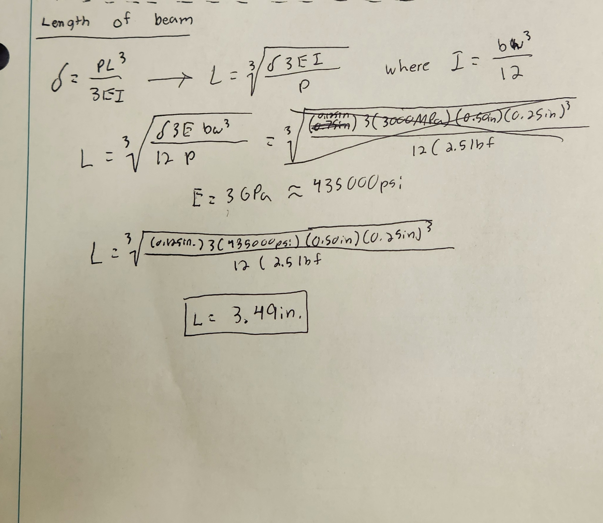

##### Free-Body-Diagram

Once I had the length of my snap fit, I decided to create free-body-diagrams of the clip and what the clip is connected to. The clip has the transverse load acting on it, creating a moment about the clip. There is also the axial force acting on the clip from the connection point. The axial load doesn't affect the moment as it is apart of the axis I was taking the moment from. 

The connection point for the clip was a simple free-body-diagram since the axial force is the only thing that really affected it. The transverse load affected it slightly, but I didn't think it would be severe enough to take any major considerations into.

    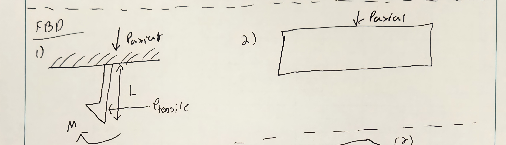

I also drew some isometric pictures to get a general idea of what I was expecting when 3D printing this material. The box would be 6in by 12in, meaning that it is too large for the 3D printer to print, but I didn't know that at the time. It would also take up a lot of material.

    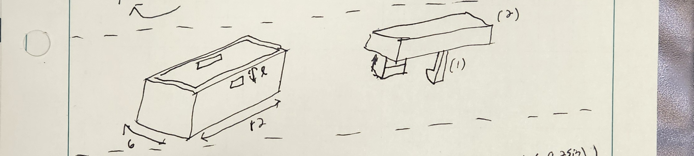

##### Bending and Axial Stress

Now that I had my FBD's down, I could start to calculate the bending stress and the axial stress of my snap fit. To calculate bending stress, I used the same equation I used in A04 for the lecture portion of this class. Since I know more of the variables, I don't have to break it down quite as far as A04, but I am still using it to calculate bending stress.

To make sure that this bending stress won't exceed my safety factor, I had to calculate the allowable stress for my snap fit. To do this I used the simple equation of yield strength/safety factor.

    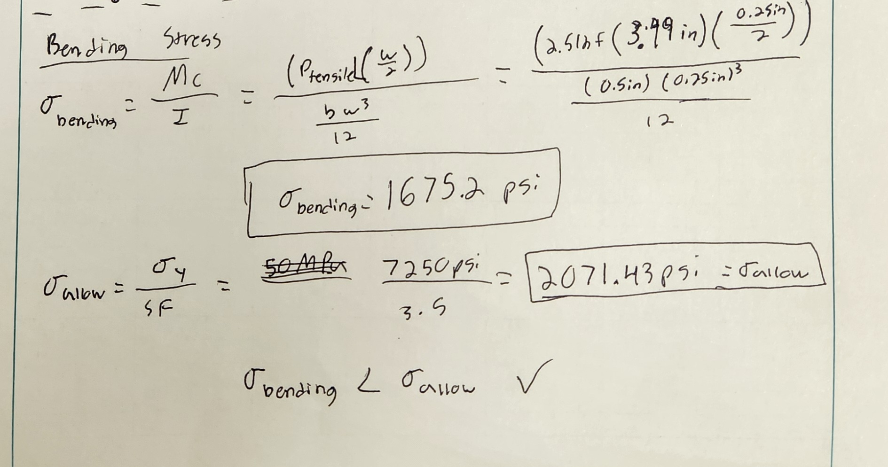

Comparing my calculated bending stress to my allowable stress, my design should be well in the specifications. 

I did the same thing with axial stress, but used the axial load instead of the transverse load from the bending stress calculations. This gave me a super low axial stress. When compared to the allowed stress, I am well under the specifications once again.

    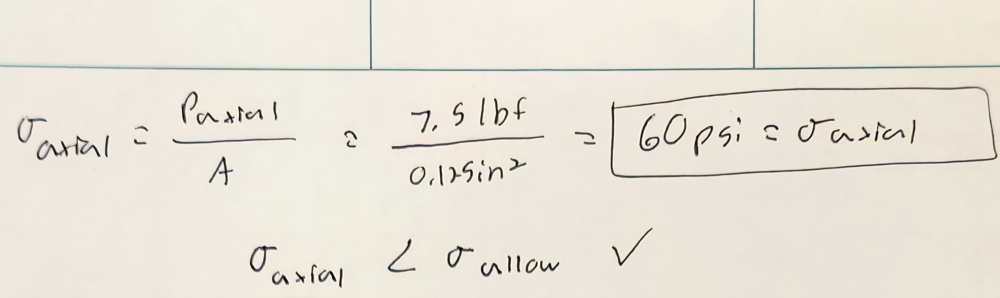

#### CAD Modeling

<table style="width:100%;">
  <tr>
    <td style="width:60%; text-align: center; vertical-align:middle;">
      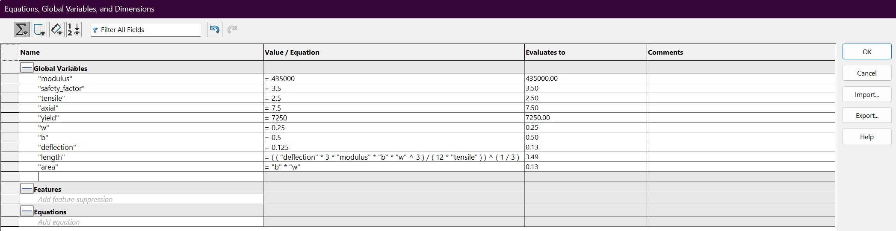
    </td>
    <td style="width:40%; padding:28px; vertical-align:middle;"">
      

        The first thing I did was fill out the global variables and equations that I will be using to design my snap fit. I put in every single known variable that would be useful while designing.
      

    </td>
  </tr>
  <tr>
    <td style="width:60%; text-align: center; vertical-align:middle;">
      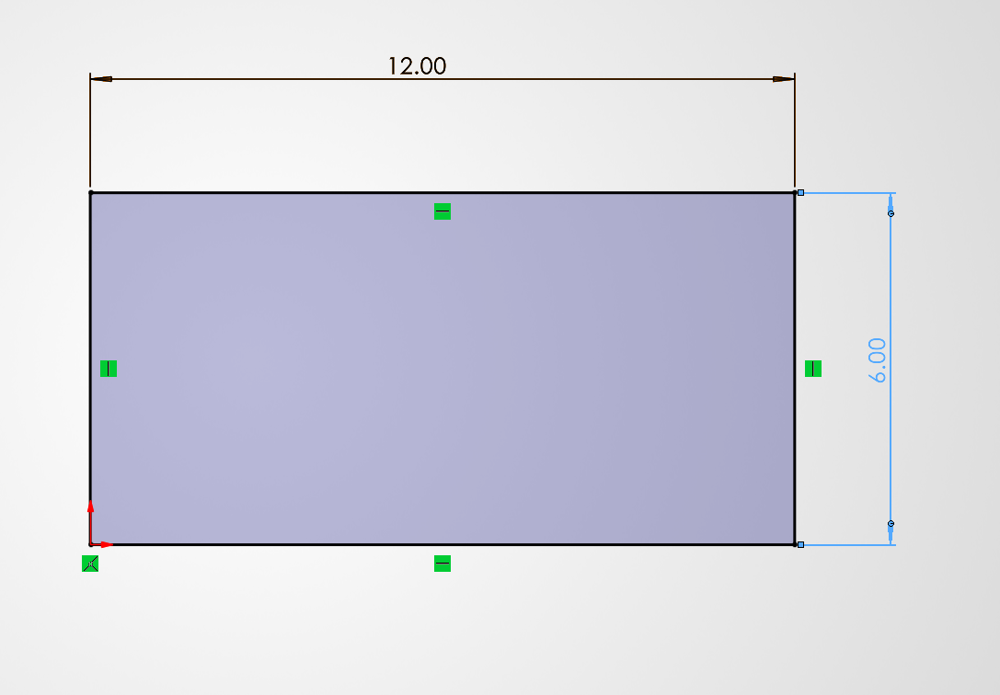
    </td>
    <td style="width:40%; padding:28px; vertical-align:middle;"">
      

        The first thing I did after the equations was make an outline of the box that would be holding all of my 3D designed parts. Based on my drawings, this would be 6in x 12 inq
      

    </td>
  </tr>
  <tr>
    <td style="width:60%; text-align: center; vertical-align:middle;">
      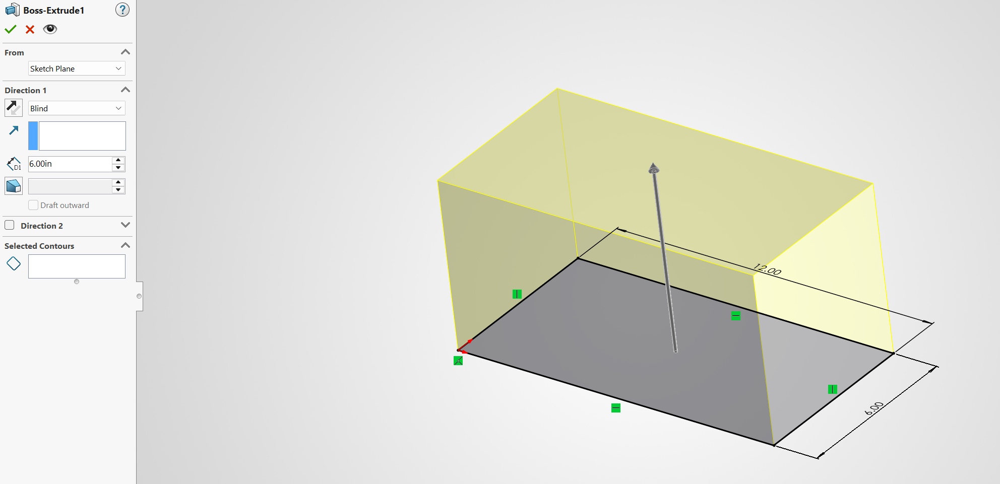
    </td>
    <td style="width:40%; padding:28px; vertical-align:middle;"">
      

        I wasn't sure how tall I should make it, but I ended up making it the same as the width of the box for consistency. I also thought it would've been good for stacking 3D prints on top of each other.
      

    </td>
  </tr>
  <tr>
    <td style="width:60%; text-align: center; vertical-align:middle;">
      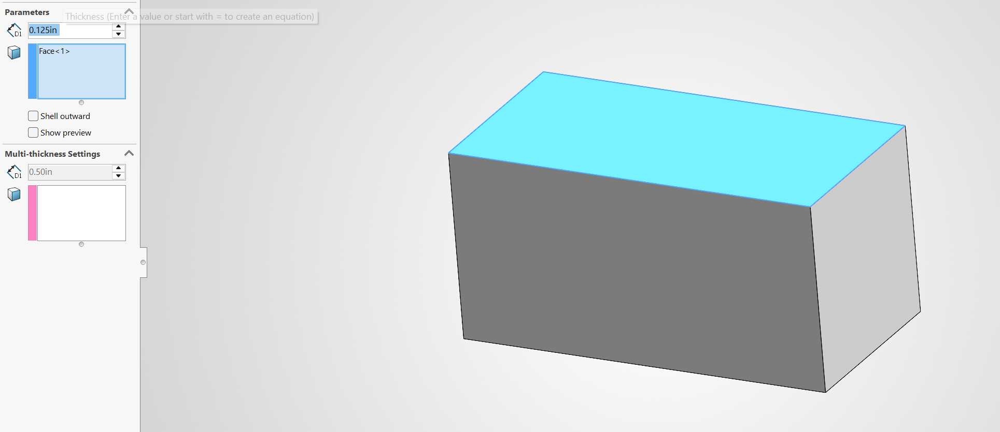
    </td>
    <td style="width:40%; padding:28px; vertical-align:middle;"">
      

        After extruding the basic shape, I used the shell tool to make the box empty. It will allow me to use it for storage and it will save on material. I decided to make the shell 1/8in.
      

    </td>
  </tr>
  <tr>
    <td style="width:60%; text-align: center; vertical-align:middle;">
      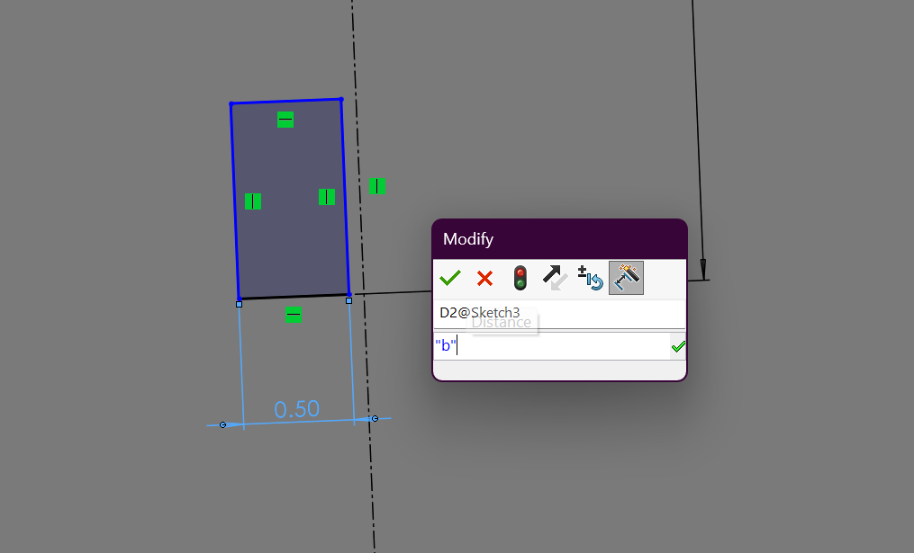
    </td>
    <td style="width:40%; padding:28px; vertical-align:middle;"">
      

        Once I had my hollowed out box, I moved onto the connection point. I knew the length of the snap fit would be 3.49in, so I made sure to make the hole 3.49in from the top of the box. I did this through the global variable I made.
      

    </td>
  </tr>
  <tr>
    <td style="width:60%; text-align: center; vertical-align:middle;">
      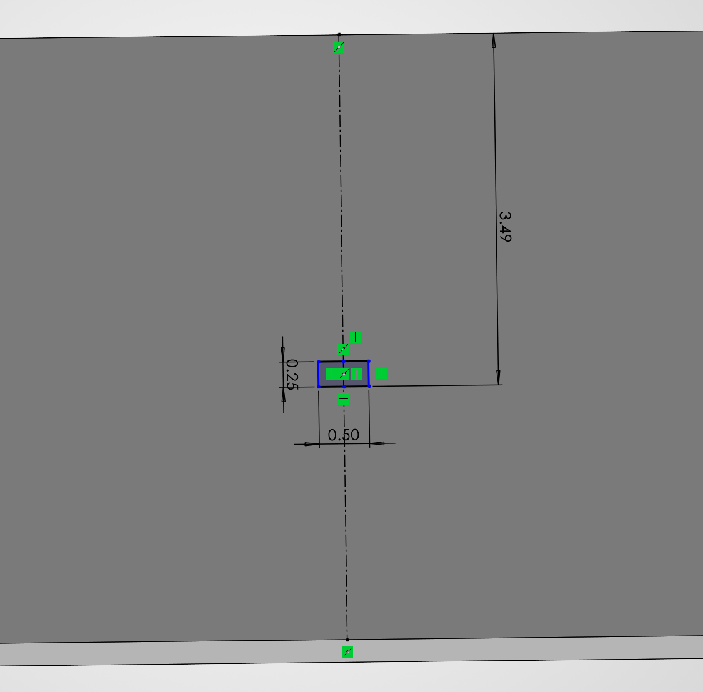
    </td>
    <td style="width:40%; padding:28px; vertical-align:middle;"">
      

        Once I had the length down, I then used the global variables for width and base to create the dimensions for the hole. I also made sure that the hole was centered in the middle of the box, so that it would be easy to line up the snap fit.
      

    </td>
  </tr>
  <tr>
    <td style="width:60%; text-align: center; vertical-align:middle;">
      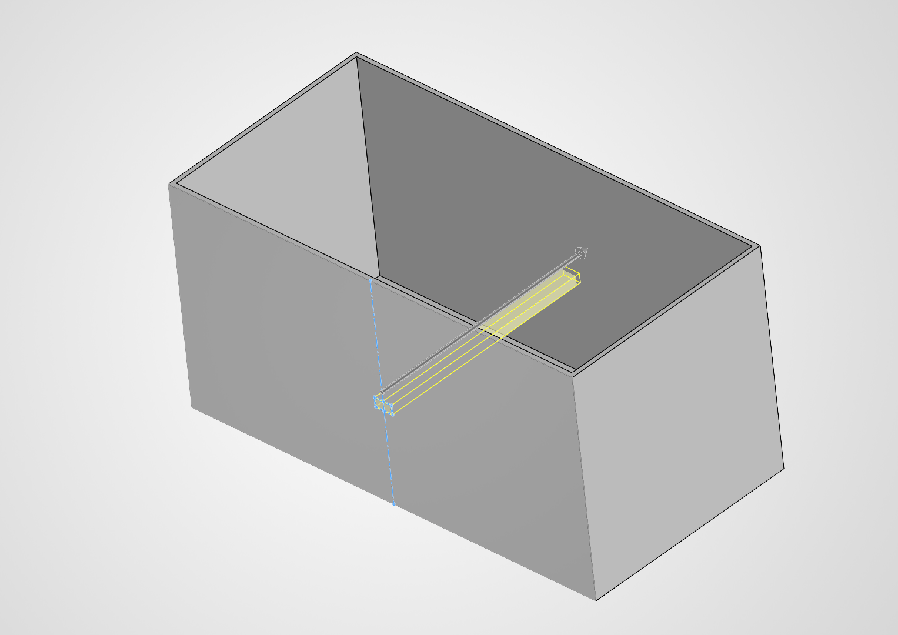
    </td>
    <td style="width:40%; padding:28px; vertical-align:middle;"">
      

        After the hole was dimensioned correctly and centered, I extruded it through the whole object. Doing so finished the design for the main base of the snap fit.
      

    </td>
  </tr>
  <tr>
    <td style="width:60%; text-align: center; vertical-align:middle;">
      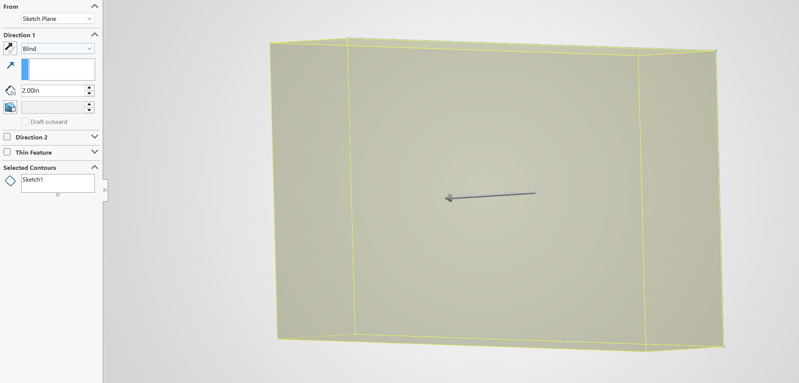
    </td>
    <td style="width:40%; padding:28px; vertical-align:middle;"">
      

        To design the top of the snap fit, I copied the equations and global variables from the first design to this new part file. I then copied the base dimensions of base to the top of the box. I decided to extrude it only 2in to give it a more chest feel to it.
      

    </td>
  </tr>
  <tr>
    <td style="width:60%; text-align: center; vertical-align:middle;">
      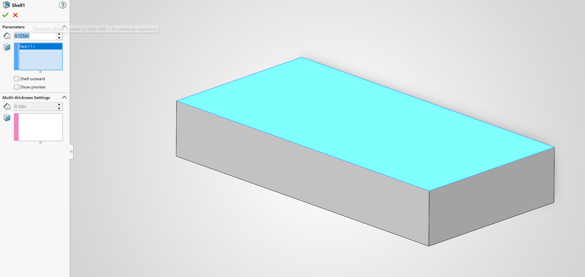
    </td>
    <td style="width:40%; padding:28px; vertical-align:middle;"">
      

        I used the shell tool again to hollow out the top. I made sure that the thickness of the walls were the same as the base of the snap fit.
      

    </td>
  </tr>
  <tr>
    <td style="width:60%; text-align: center; vertical-align:middle;">
      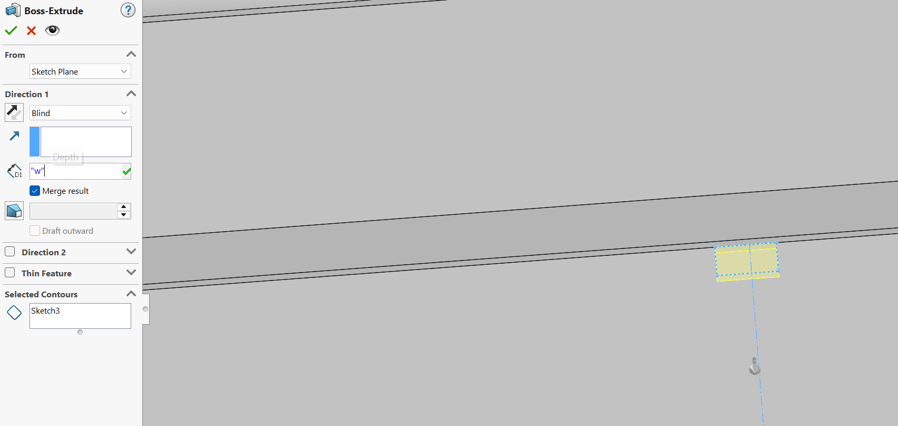
    </td>
    <td style="width:40%; padding:28px; vertical-align:middle;"">
      

        After finishing the hollowed out top, I moved onto actually designing the clips that will connect the two boxes together. To do this, I created a box with the dimensions of the width and base of the clip at the very edge of the hollowed out top.
      

    </td>
  </tr>
  <tr>
    <td style="width:60%; text-align: center; vertical-align:middle;">
      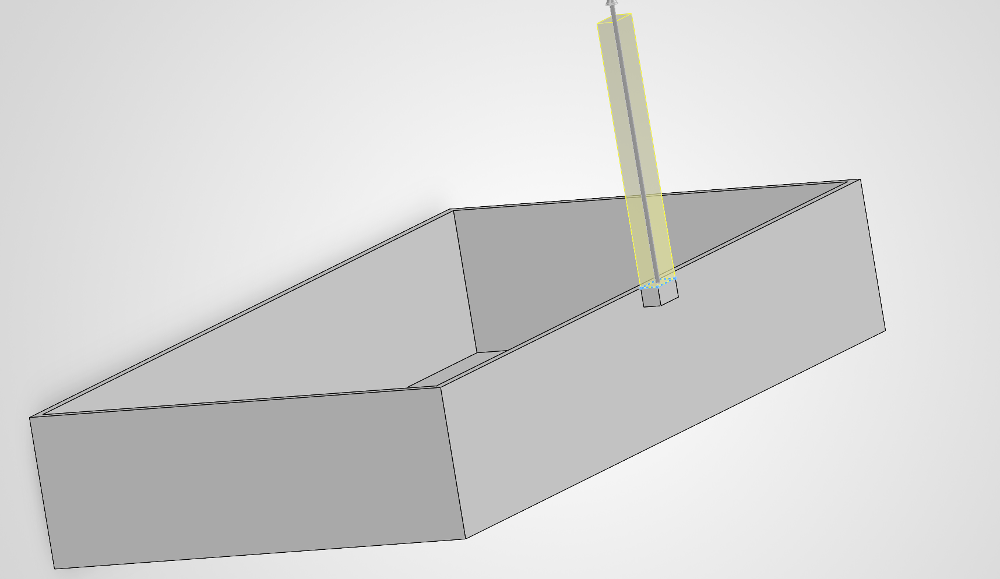
    </td>
    <td style="width:40%; padding:28px; vertical-align:middle;"">
      

        Once this part was extruded, I had the correct dimensions for the clip, and I could extrude this extension to the length I calculated earlier. I used the length global variable for this.
      

    </td>
  </tr>
  <tr>
    <td style="width:60%; text-align: center; vertical-align:middle;">
      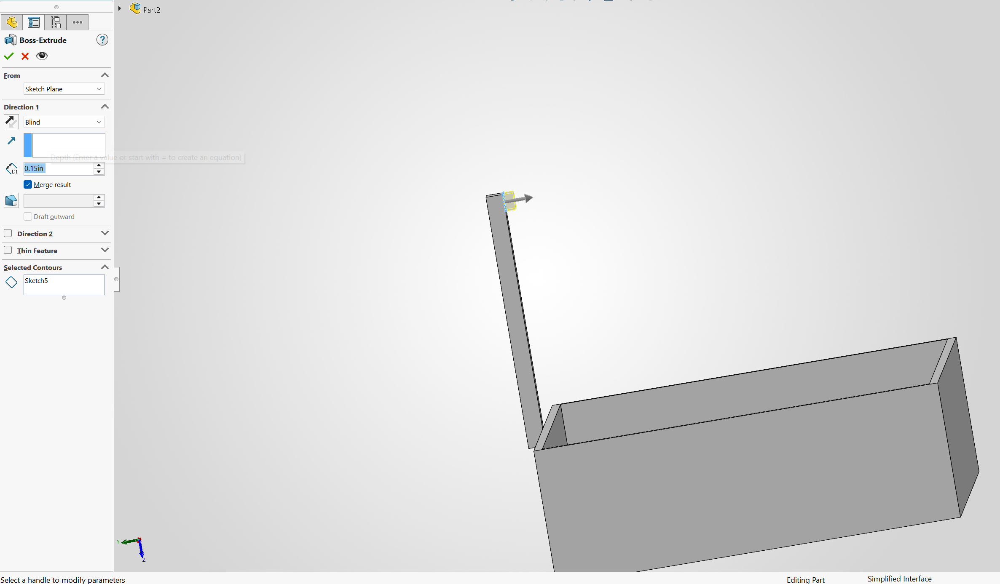
    </td>
    <td style="width:40%; padding:28px; vertical-align:middle;"">
      

        I then started to create a catching mechanism so that the clip snap into place. To do this, I made another box, the dimensions being the base and width, at the very edge of the clip. I then extruded this by 0.15in. I chose 0.15in so that it would be easier to detach once it was snapped together.
      

    </td>
  </tr>
  <tr>
    <td style="width:60%; text-align: center; vertical-align:middle;">
      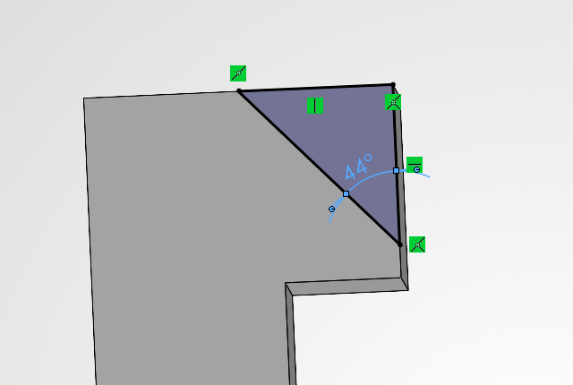
    </td>
    <td style="width:40%; padding:28px; vertical-align:middle;"">
      

        To add some angle to the design, I added a 44 degree angle at the catch point. I am actually not sure what it does, but I see it pretty often on these type of snap fits. 
      

    </td>
  </tr>
  <tr>
    <td style="width:60%; text-align: center; vertical-align:middle;">
      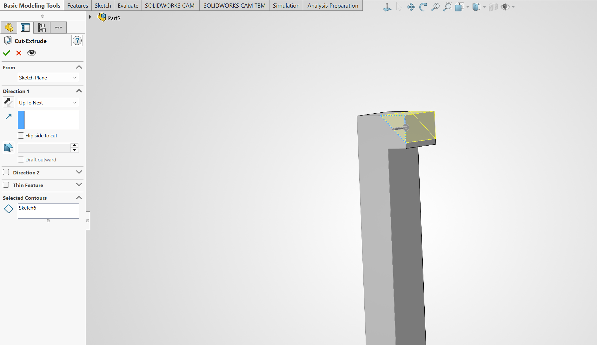
    </td>
    <td style="width:40%; padding:28px; vertical-align:middle;"">
      

        I extruded this angle through the entire catching mechanism.
      

    </td>
  </tr>
  <tr>
    <td style="width:60%; text-align: center; vertical-align:middle;">
      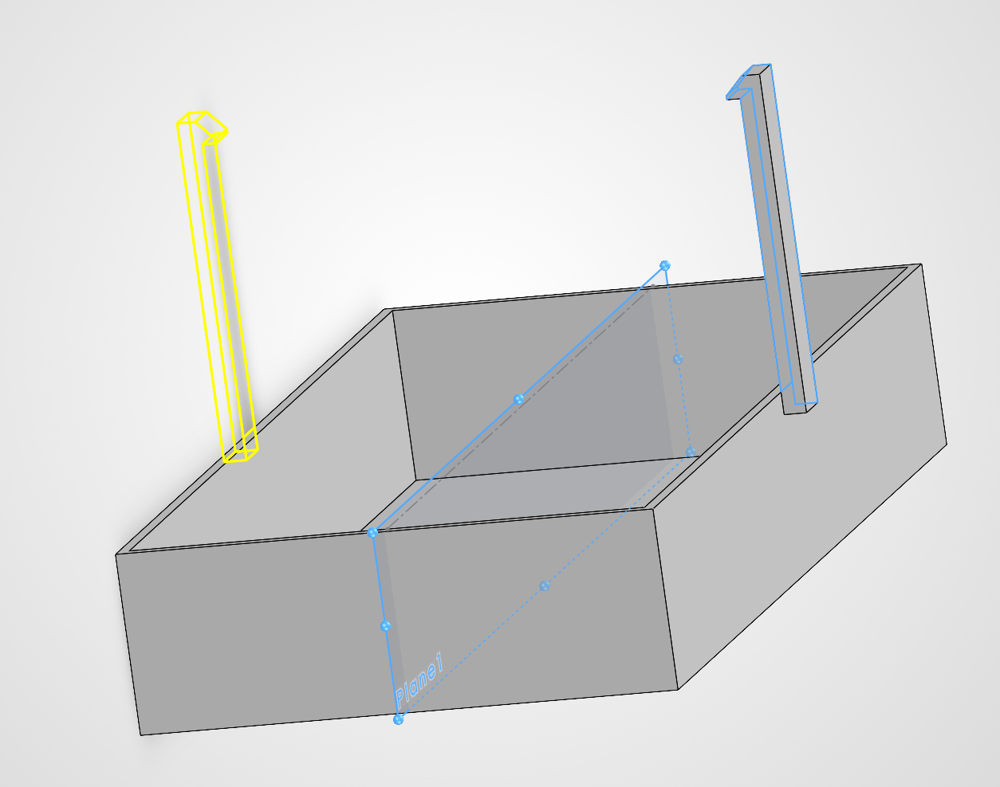
    </td>
    <td style="width:40%; padding:28px; vertical-align:middle;"">
      

        My snap clip is now finished. Instead of repeating all of the steps I just did on the other side, I created a plane in the middle of my object so that I could mirror it to the other side with the exact same dimensions. This also makes it so that both clips dimensions will change together if I decide to change them. It also rounds out the design for the top of my part.
      

    </td>
  </tr>
  <tr>
    <td style="width:60%; text-align: center; vertical-align:middle;">
      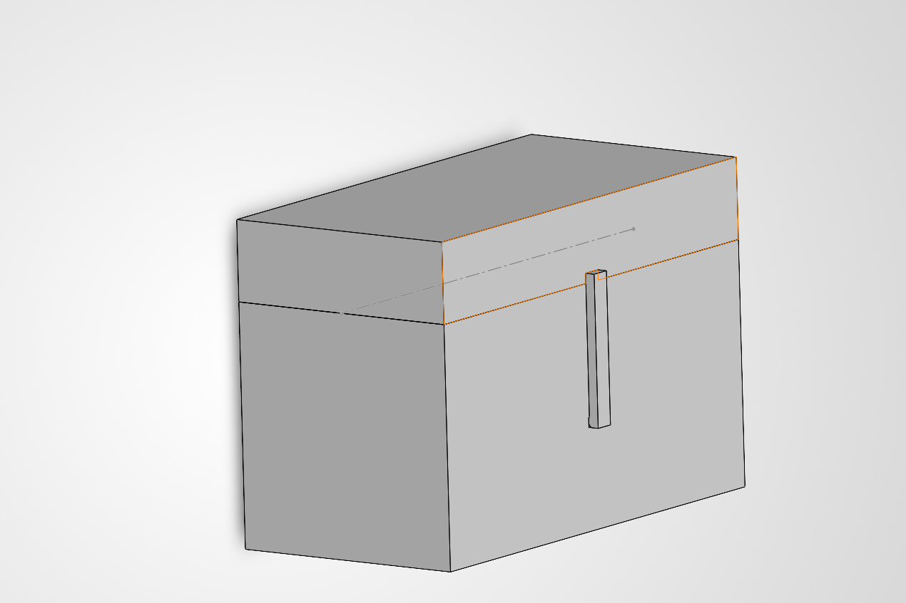
    </td>
    <td style="width:40%; padding:28px; vertical-align:middle;"">
      

        I put both of them in an assembly to get a good idea of what everything will look like together. I made the top of the clip catch coincident with the top of the hole on the base and I made the walls of those two objects coincident to each other. This gave me a picture of what my model would look like all put together.
      

    </td>
  </tr>
</table>

After I 3D modeled my snap fit, I exported my individual part files as stl files to combine in a PrusaSlicer file. Here are my CAD files if you'd like to replicate what I have made: [Body_PART](body.SLDPRT)  |  [Body_STL](body.STL)  |  [Top_PART](top.SLDPRT)  |  [Top_STL](top.STL)  |  [Assembly](final_box.SLDASM)

#### PrusaSlicer

Moving onto PrusaSlicer, I imported my stl files from my two CAD models. When I imported the base, I got a very good understanding how big of a part I was actually designing. It was too large for the bed of the 3D printer, so I scaled down both parts by 50% so that they would both still fit on the bed.

    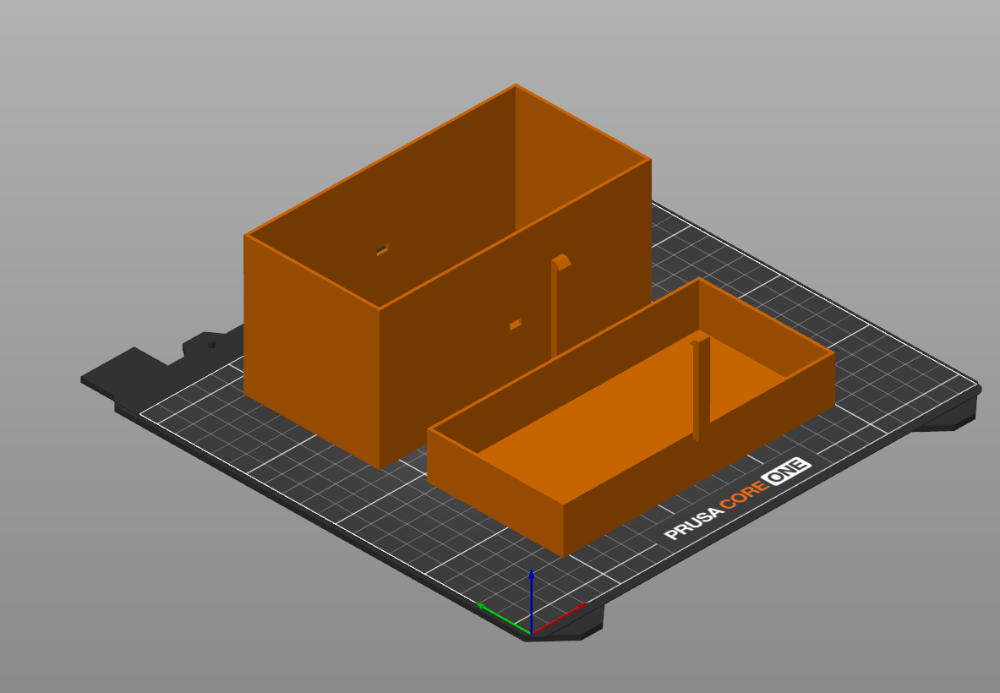

Since I am new to using supports, I used the automatically paint supports feature inside PrusaSlicer. This will identify the parts of my design that needed to be supported and apply supports to them during the 3D print.

    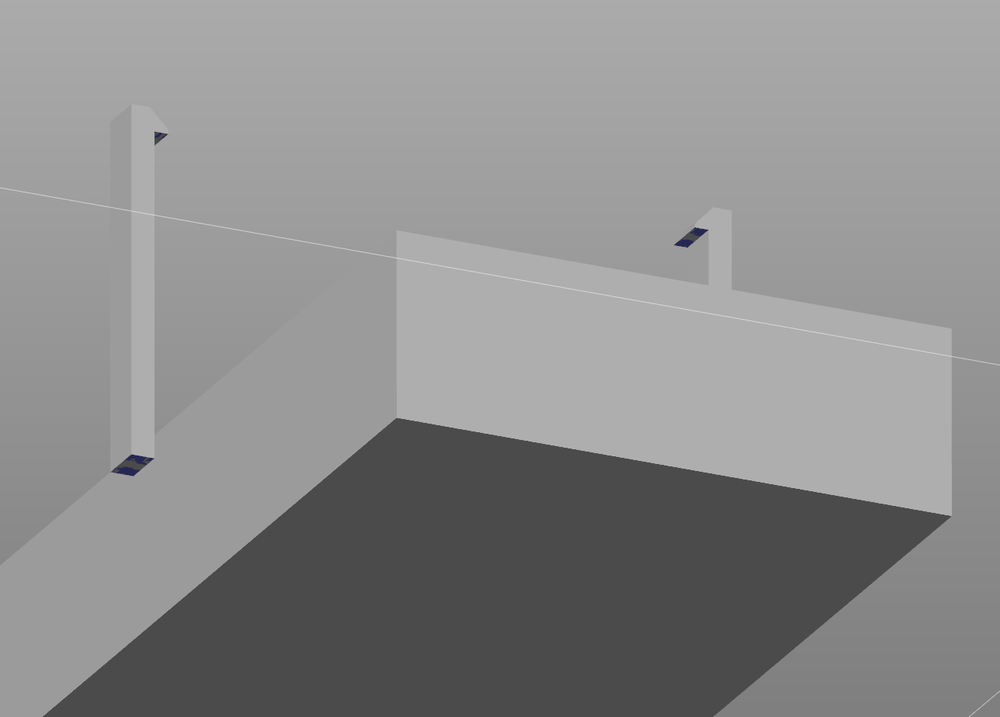

After I painted my supports, I really started to realize how much material I was using just to demonstrate a simple snap fit. I really started to rethink my design choices because I didn't want to spend an unnecessary amount of money just so that I can hold my 3D prints. If I really wanted to hold my 3D prints, I could find any cardboard box that I have lying around to hold them. 

Because of these reasons, I decided to abandon design 1 here at the PrusaSlicer step. I didn't 3D print it for material cost and time. It would about 2 and a half hours to 3D print, which is just an absurd amount of time for such a simple project. I think everything was a little extreme on every scale.

### Design 2

Going into design 2, I really wanted to limit the material I was going to use in comparison to design 1. It should be very achievable given the size of design 1, but to make sure, I tried to decrease the length of the snap fit. To do this, while staying within the safety factor, I decided to increase the transverse load from 2.5llbf to 5.0lbf, switch the base and width values, and make the max deflection a smaller value.

#### Paper Calculations

The point of the increased transverse load was to create a bigger denominator for the length calculation. Since transverse load is on the bottom, it should decrease the length of the snap fit. I switched the base and width values not for the snap length, but to keep my design within the safety factor. If I kept them the way they were, my design would've failed. I know this because I changed the values inside of my equation sheet from design 1, and calculated it. Making the max deflection a smaller value is to make the numerator for the length equation smaller, making the length smaller.

    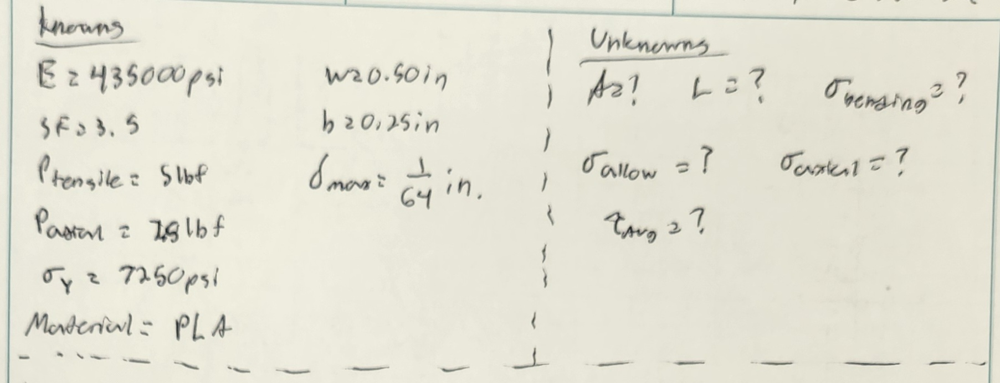

All of the other values stayed the same because they either had to, young's modulus and yield strength, or they had little to no affect on the physical capabilities of my design, axial load.

##### Length

    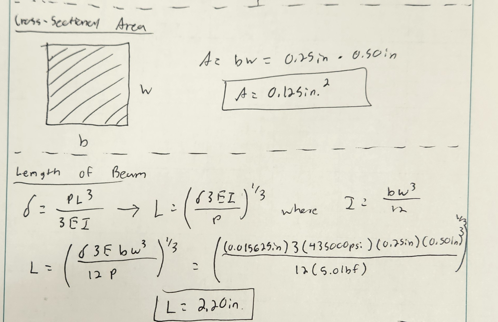

My calculations for length are very similar to design 1. I used the exact same equation, and did the exact same algebra as before but I substituted my new values into the equation. My new values lowered the length of my snap by about a full inch, so I think the new numbers are working well.

##### Free-Body-Diagrams

As I did in design 1, I created free-body-diagrams for the different components apart of my design. I created two FBDs for the two clips that will be attaching and the connection point for them. The FBDs are mirrored for the clips since they are the exact same dimensions and forces but on opposite sides of each other. The connection FBD is the same as design 1, where I just have the axial load applied to it. The moments from the clips shouldn't affect the connection point at all since everything should cancel out.

    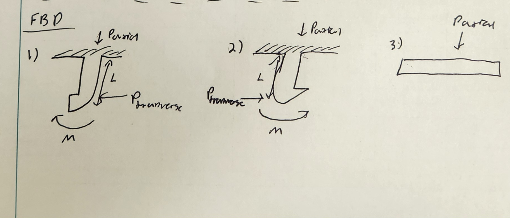

Once I had my free-body-diagrams, I drew an isometric drawing for what I was thinking. It is a little zoomed in, as the length isn't very proportional on the isometric view. If it were proportional, there would be a lot of wasted material.

    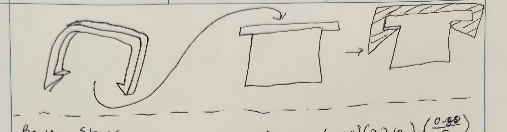

##### Bending and Axial Stress

I used the same equation from design 1 for the same reasons, but with different numbers. Since my transverse load is higher, my bending stress will also be higher, but after calculations, I was still under the safety factor by over 1000psi. I think it is mostly because of the reduced length, and the switched width and base values in the denominator.

    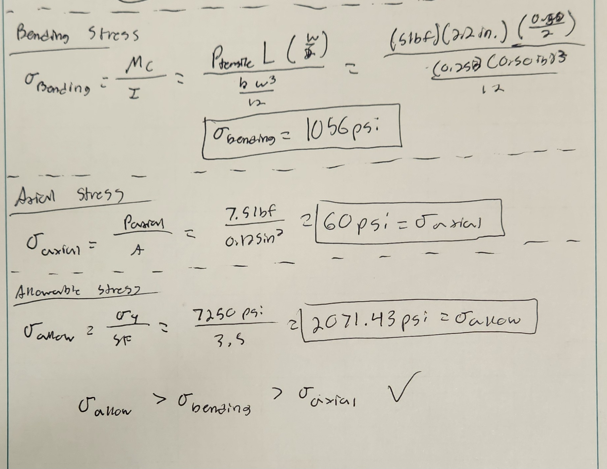

My allowable stress and axial stress were still the exact same as design because I didn't change any of the values for those two calculations. This means my design meets all of the design requirements, and I am ready to 3D model again.

### CAD Modeling

<table style="width:100%;">
  <tr>
    <td style="width:60%; text-align: center; vertical-align:middle;">
      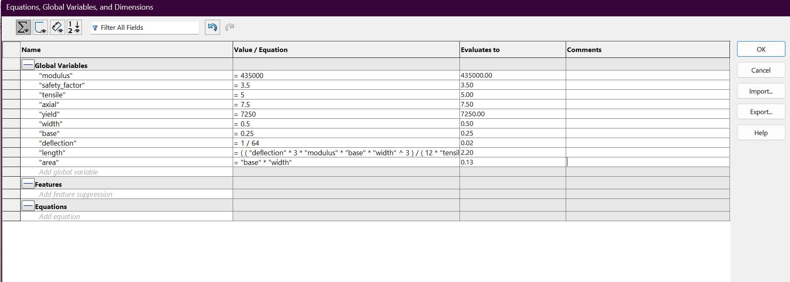
    </td>
    <td style="width:40%; padding:28px; vertical-align:middle;"">
      

        The first thing I did was fill out the global variables and equations that I will be using to design my snap fit. I put in every single known variable that would be useful while designing. 
      

    </td>
  </tr>
  <tr>
    <td style="width:60%; text-align: center; vertical-align:middle;">
      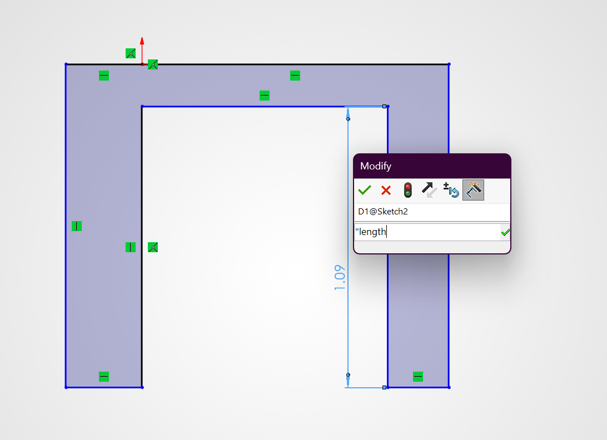
    </td>
    <td style="width:40%; padding:28px; vertical-align:middle;"">
      

        I decided to 3D model the clip first this time. I made a rough outline for what I wanted the clip to look like. The first dimension I assigned was the length of the clip. I made it equal to the global variable that I set.
      

    </td>
  </tr>
  <tr>
    <td style="width:60%; text-align: center; vertical-align:middle;">
      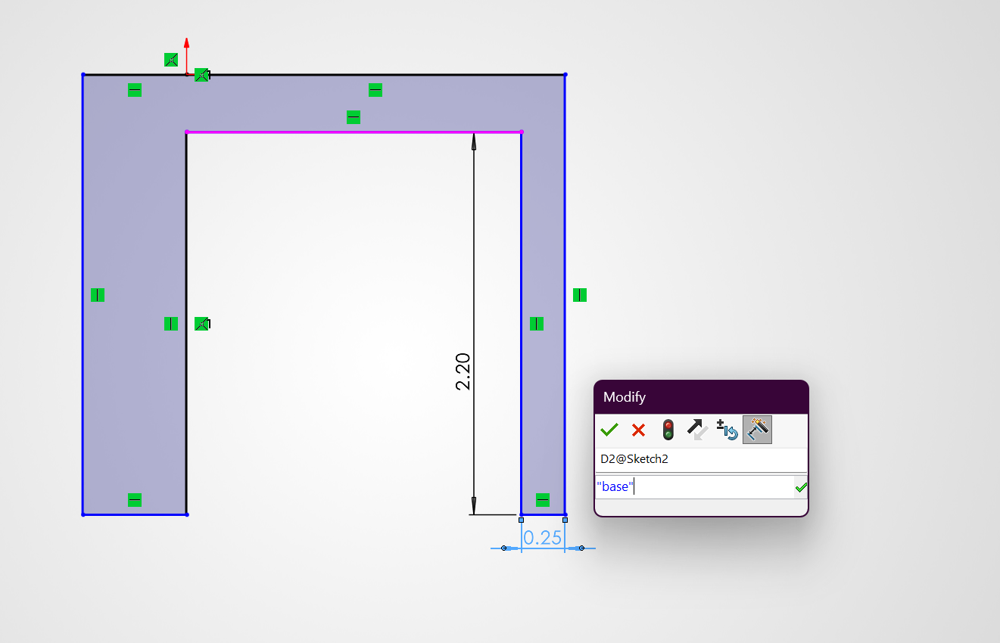
    </td>
    <td style="width:40%; padding:28px; vertical-align:middle;"">
      

        I then made sure that the widths of each clip were correct. I assigned each value with the width global variable. I made sure to assign the same values to the left side as I did for the right side.
      

    </td>
  </tr>
  <tr>
    <td style="width:60%; text-align: center; vertical-align:middle;">
      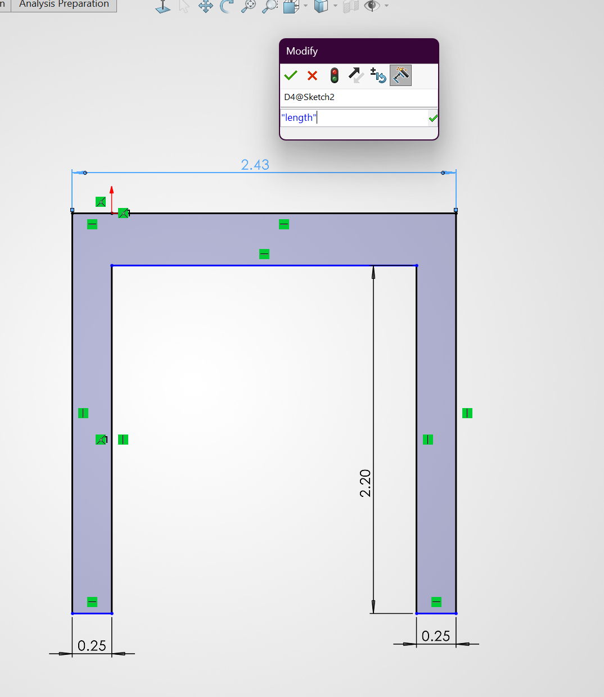
    </td>
    <td style="width:40%; padding:28px; vertical-align:middle;"">
      

        I adjusted the length of the beam attaching the two clips together. I decided to just make the length equal to the length variable for simplicity and consistency.
      

    </td>
  </tr>
  <tr>
    <td style="width:60%; text-align: center; vertical-align:middle;">
      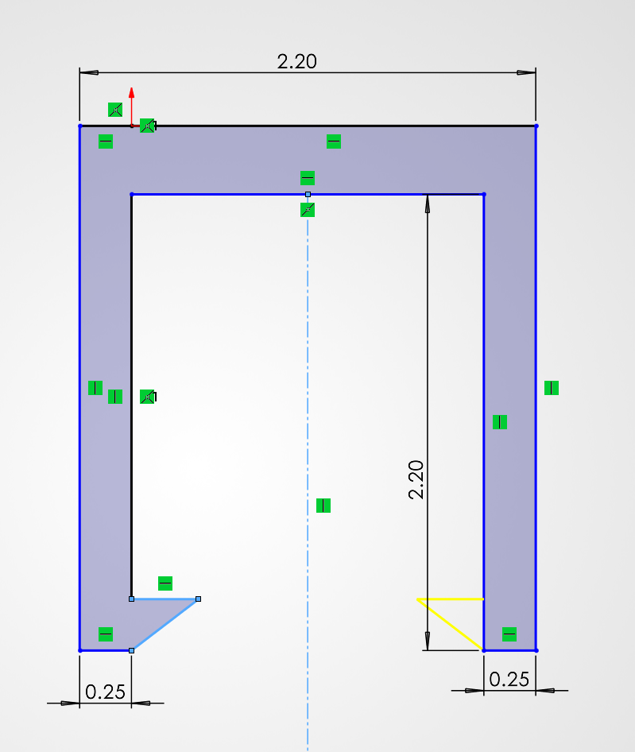
    </td>
    <td style="width:40%; padding:28px; vertical-align:middle;"">
      

        The next thing I did was design the catchers that are on the clip. I just drew a rough triangle shape. I didn't measure them initially, but I later assigned them the base value. I used a centerline to mirror the exact shape across the middle.
      

    </td>
  </tr>
  <tr>
    <td style="width:60%; text-align: center; vertical-align:middle;">
      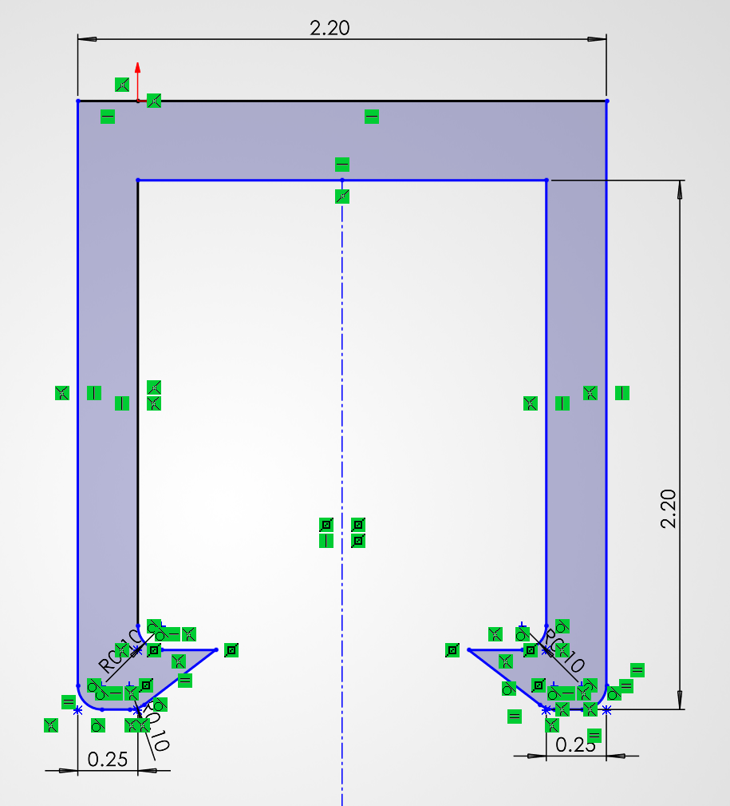
    </td>
    <td style="width:40%; padding:28px; vertical-align:middle;"">
      

        After, I applied fillets to the rough corners of the design. I thought it would make the design look better and perform better under higher stresses.
      

    </td>
  </tr>
  <tr>
    <td style="width:60%; text-align: center; vertical-align:middle;">
      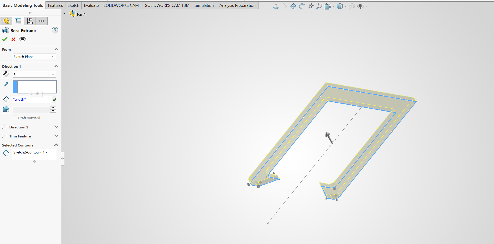
    </td>
    <td style="width:40%; padding:28px; vertical-align:middle;"">
      

        Once the fillets were finished, the clip was completed and ready to be extruded. I extruded the clip to the width value. 
      

    </td>
  </tr>
  <tr>
    <td style="width:60%; text-align: center; vertical-align:middle;">
      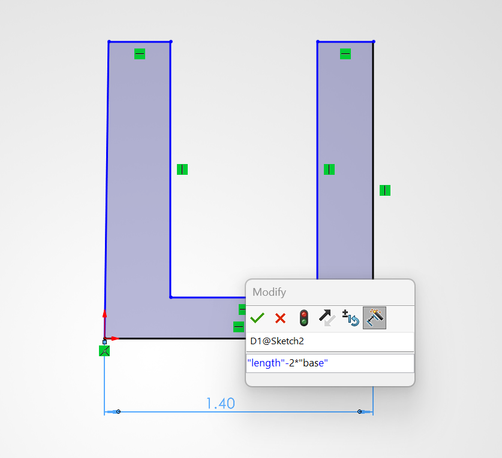
    </td>
    <td style="width:40%; padding:28px; vertical-align:middle;"">
      

        Now that the snap clip is completed, I had to design the object it was going to snap to. I started very similarly to how I designed the clip. I made a rough U shape, and assigned the long part on the bottom with the length - 2*base. I did this so that my clip would fit perfectly over my connection and everything would be snug. 
      

    </td>
  </tr>
  <tr>
    <td style="width:60%; text-align: center; vertical-align:middle;">
      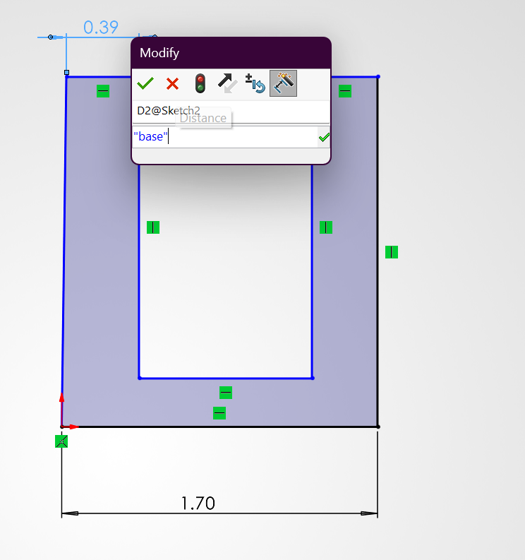
    </td>
    <td style="width:40%; padding:28px; vertical-align:middle;"">
      

        Next, I gave values to the long prongs on the sides. Since the width of my prongs on the clip were equal to the base variable, I made these equal to the base variable. This will make everything snug.
      

    </td>
  </tr>
  <tr>
    <td style="width:60%; text-align: center; vertical-align:middle;">
      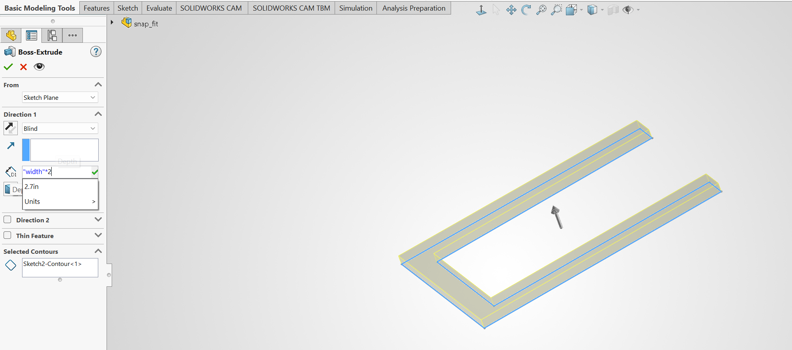
    </td>
    <td style="width:40%; padding:28px; vertical-align:middle;"">
      

        Once all of these dimensions were defined, I extruded the object. I made this equal to the width * 2 so that I could put the snap fit in the middle of my attachment and not be worried about anything breaking. This should give me enough material to connect the snap fit while being structurally sound.
      

    </td>
  </tr>
  <tr>
    <td style="width:60%; text-align: center; vertical-align:middle;">
      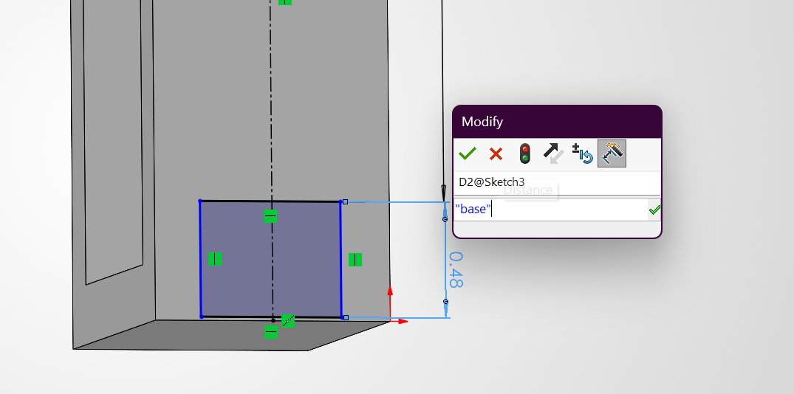
    </td>
    <td style="width:40%; padding:28px; vertical-align:middle;"">
      

        After extruding, I worked on the hole the clip will connect though. I made a box, and defined the height of the box to the base variable.
      

    </td>
  </tr>
  <tr>
    <td style="width:60%; text-align: center; vertical-align:middle;">
      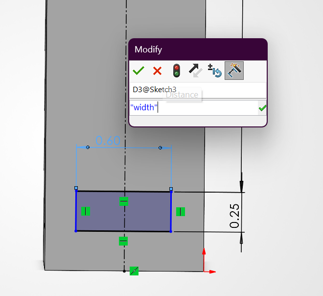
    </td>
    <td style="width:40%; padding:28px; vertical-align:middle;"">
      

        After I made the width of the hole equal to the width variable and centered the sketch. The clip should perfectly fit inside these dimensions.
      

    </td>
  </tr>
  <tr>
    <td style="width:60%; text-align: center; vertical-align:middle;">
      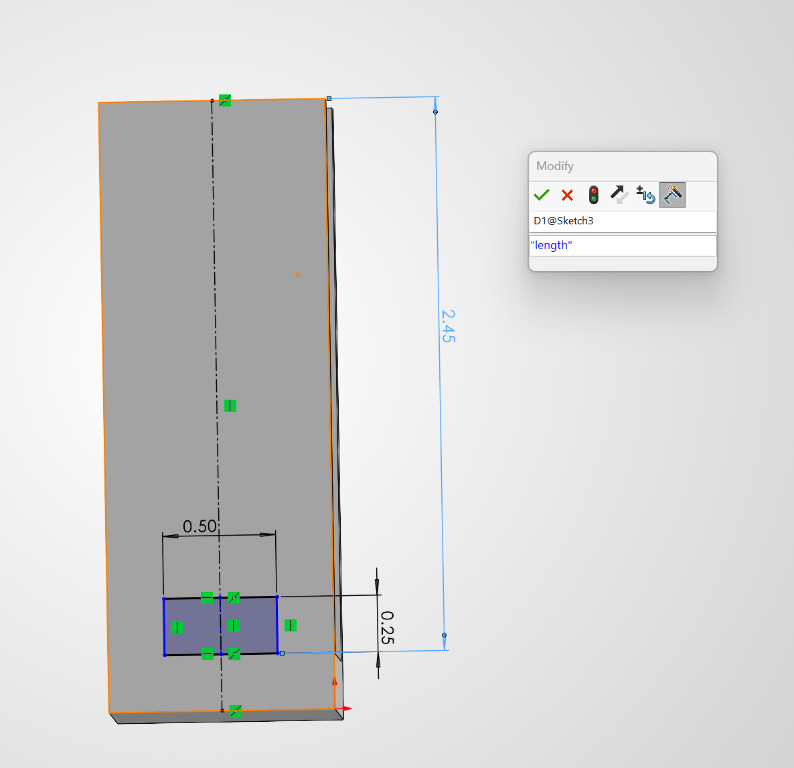
    </td>
    <td style="width:40%; padding:28px; vertical-align:middle;"">
      

        To finish the dimensions on the hole, I made sure that the bottom of the sketch was the same as the length of the prongs on the clip. If everything is correct, the clip will snap in perfectly.
      

    </td>
  </tr>
  <tr>
    <td style="width:60%; text-align: center; vertical-align:middle;">
      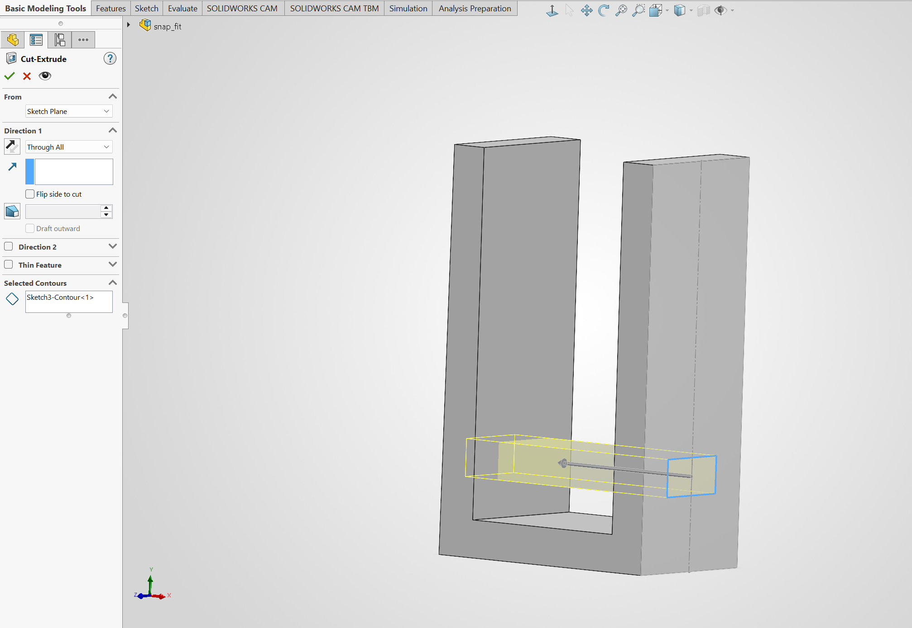
    </td>
    <td style="width:40%; padding:28px; vertical-align:middle;"">
      

        Once I thought the dimensions were perfect, I extruded the hole across the whole object. This made the dimensions equal on both sides and made it so I didn't have to redo my work on the left side. Doing so completed the attachment for the clip on my snap fit.
      

    </td>
  </tr>
  <tr>
    <td style="width:60%; text-align: center; vertical-align:middle;">
      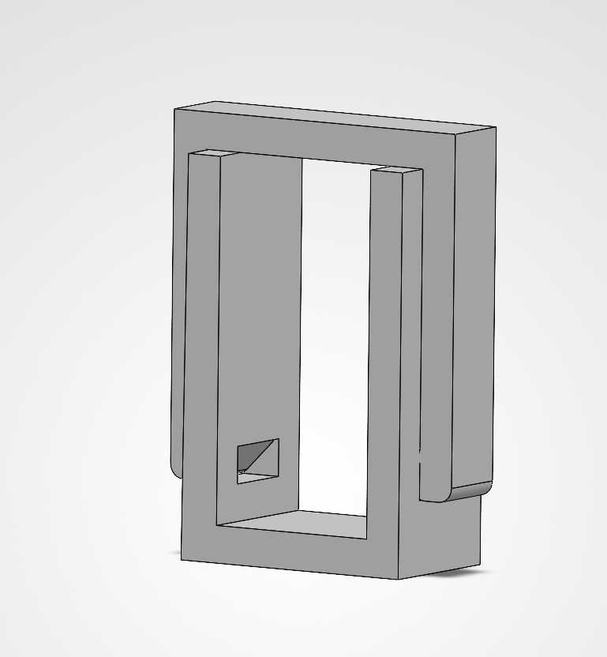
    </td>
    <td style="width:40%; padding:28px; vertical-align:middle;"">
      

        After completing both objects, I made an assembly to get a view of what the real life product will look like. Based on the results, it looks like it fits perfectly!
      

    </td>
  </tr>
</table>

After I 3D modeled my snap fit, I exported both files as an STL file so that I could work with them in PrusaSlicer. If you are interested in my CAD files here they are: [clip_CAD](clip.SLDPRT)  |  [clip_STL](clip.STL)  |  [attachment_CAD](snap_fit.SLDPRT)  |  [attachment_STL](snap_fit.STL)  |  [Assembly](final_assembly.SLDASM)

These values are modified from what I designed here, and I will talk about why after I 3D print my design.

### PrusaSlicer

Moving into PrusaSlicer, I imported my two STL files from before. These objects were much better on size. I didn't have to re-scale either of them. I mostly kept the default orientation, since I didn't really have a reason to change it. I think if I were to change something, I probably should've decreased the wall thickness so that my part could flex a little more, but it shouldn't be that noticeable.

    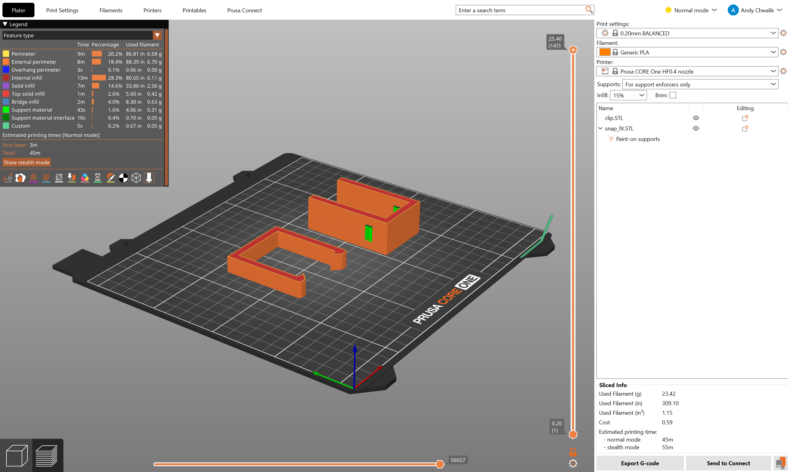

I was slightly nervous about the hole in the attachment part so I went to go paint on supports for it. I used the automatic painting tool, but it didn't paint anything on my part. I think that means that it doesn't think that it is necessary to add a support to this part, but I decided to paint a little area for support anyway. I would rather be safe than sorry.

    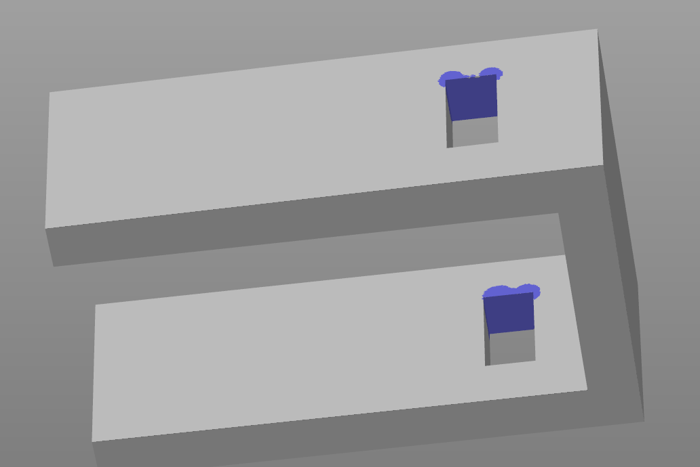

This print would take a decent amount of time, 45 minutes, but it isn't nearly as long as design 1. The printing time is actually really similar to design 2 from L04. This design also saves a ton on filament, which was my goal.

    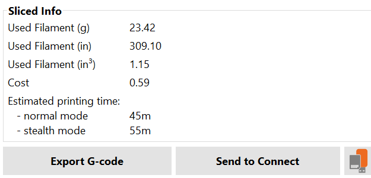

### 3D Printing

3D printing went pretty smoothly. I used PC-10 because it was the first 3D printer I saw that had PLA filament in it and wasn't being used. I didn't check if the filament was tangled before 3D printing, but it didn't cause any issues. I was untangling it as it printed. Here is what the 3D print looked like around 40% completed.

    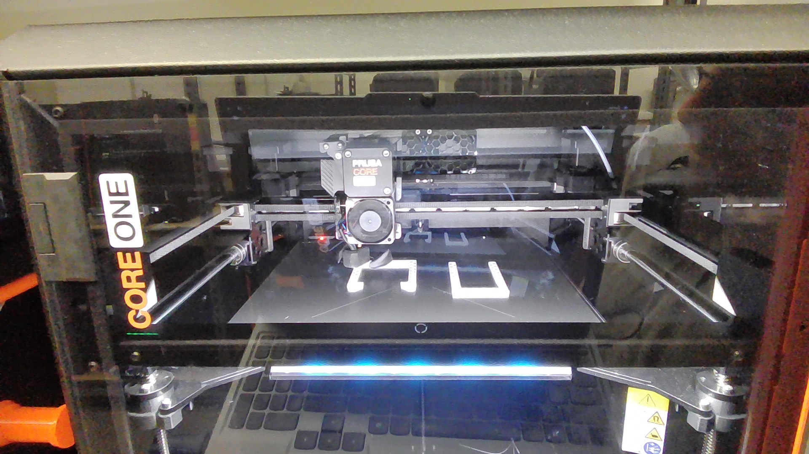

It is kind of hard to see, due to the white filament, but this is where the supports were being made. It was interesting to see the difference between the infill pattern vs the support pattern. Here is a video of the machine 3D printing around the same percentage.

[video]

The 3D print took about as long as the estimated amount of time. If anything, it finished slightly faster, but only by a minute. My completed 3D print looked really promising on the bed. I didn't see any printing flaws, and the dimensions looked perfect.

    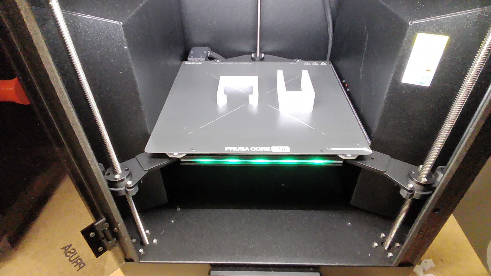

It was super easy to get the objects off the printing bed as well. I was able to just grab the part and peel it off with very little force. I didn't have to use a scrapper like I did for the previous labs. I thought it was super cool to see the supports on my design. I have never used supports before, so it was something new. Here is what my attachment looks like with the supports still in vs the supports removed.

    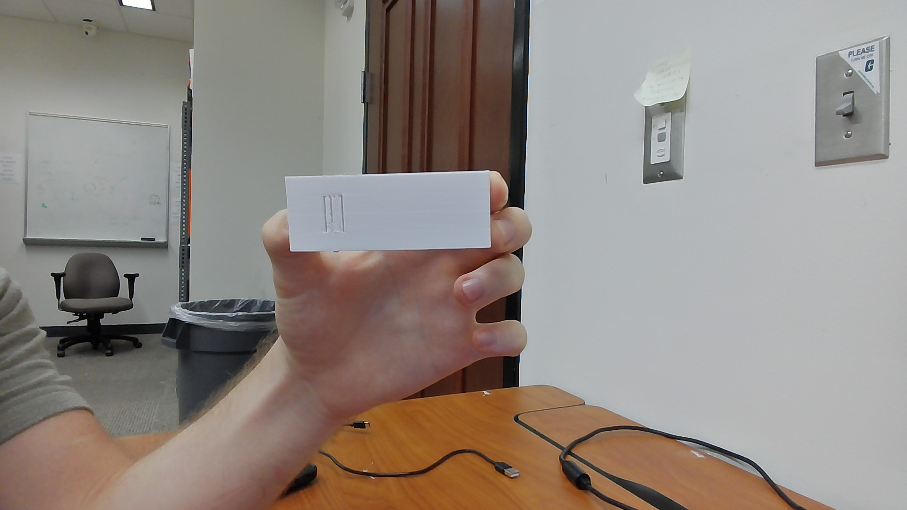

    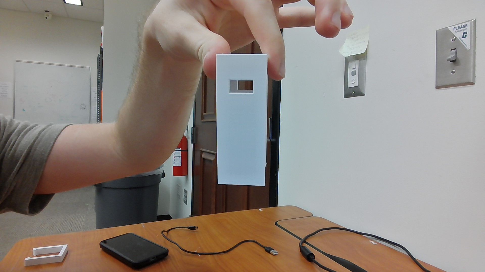

### Testing

Once the supports were broken off, I tried out my design, and I ran into some issues. My measurements were so exact while designing, that it was really hard to actually detach the clip from the snap fit. To get the clip to detach, I had to use a flat-head screwdriver to pry it away from the attachment. It was still pretty difficult to seperate them. Here is a video of me demonstrating.

[video]

Struggling so much to detach my snap fit from each other, I decided to change the attachment part of my design. Since I made the dimensions so exact, it made it hard to separate the two objects. That is why I was thinking of giving more tolerance to the attachment piece so there is more wiggle room. This is also the reason why my CAD files and STL files have different dimensions from what I designed previously.

#### Modifications

##### CAD

<table style="width:100%;">
  <tr>
    <td style="width:60%; text-align: center; vertical-align:middle;">
      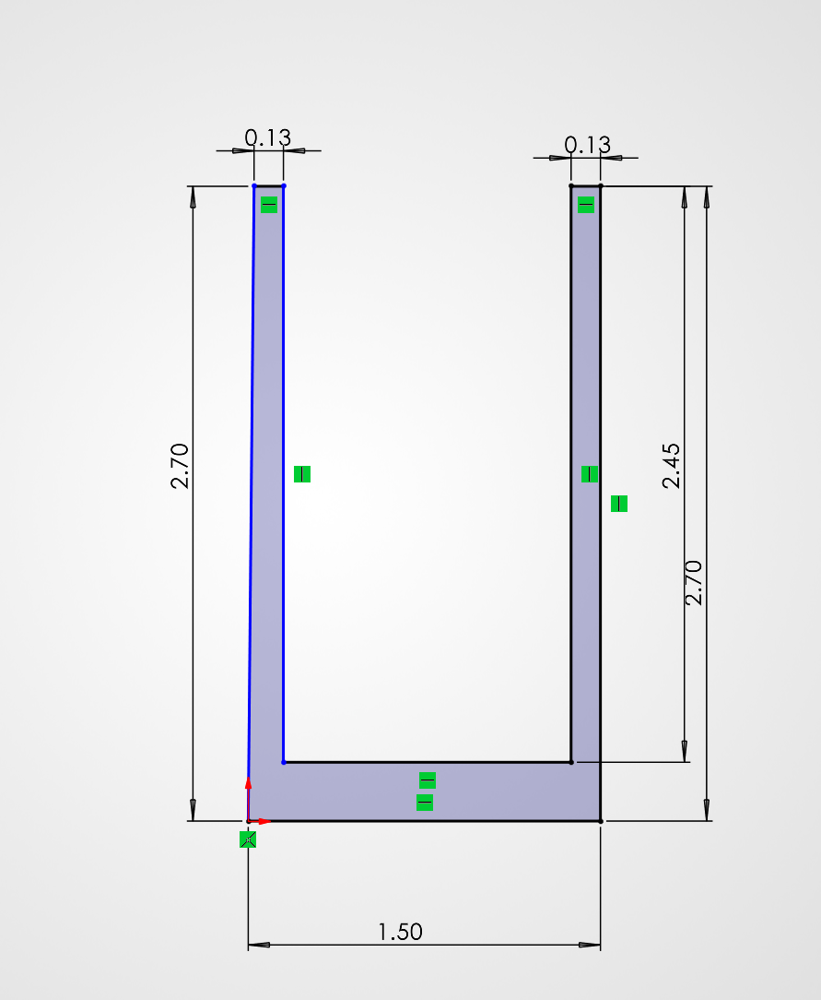
    </td>
    <td style="width:40%; padding:28px; vertical-align:middle;"">
      

        The first thing I changed was the width of the prongs. I thought if I made them thinner, I would have more room to pull the clip out, making it easier to detach the two objects. I decided to halve it just because it was easy to write since I already had them assigned to the base value.
      

    </td>
  </tr>
  <tr>
    <td style="width:60%; text-align: center; vertical-align:middle;">
      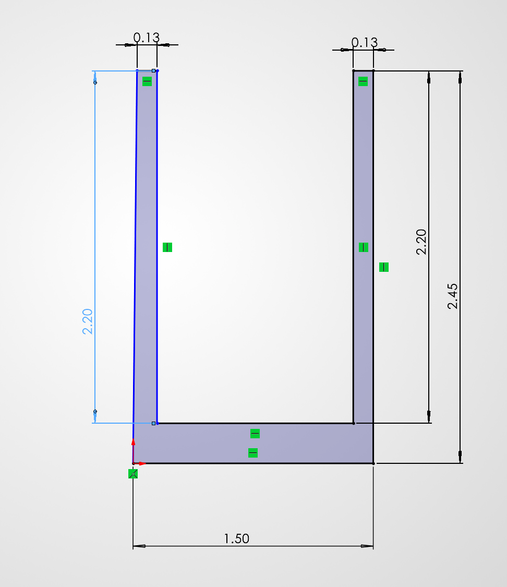
    </td>
    <td style="width:40%; padding:28px; vertical-align:middle;"">
      

        Next, I made the width of the entire object smaller. It is the same theory for why I made the prongs thinner. I also made the prongs shorter so that there was more room for the clip to move. This will make the prong lose, but it should stay attached until I put pressure on it.
      

    </td>
  </tr>
  <tr>
    <td style="width:60%; text-align: center; vertical-align:middle;">
      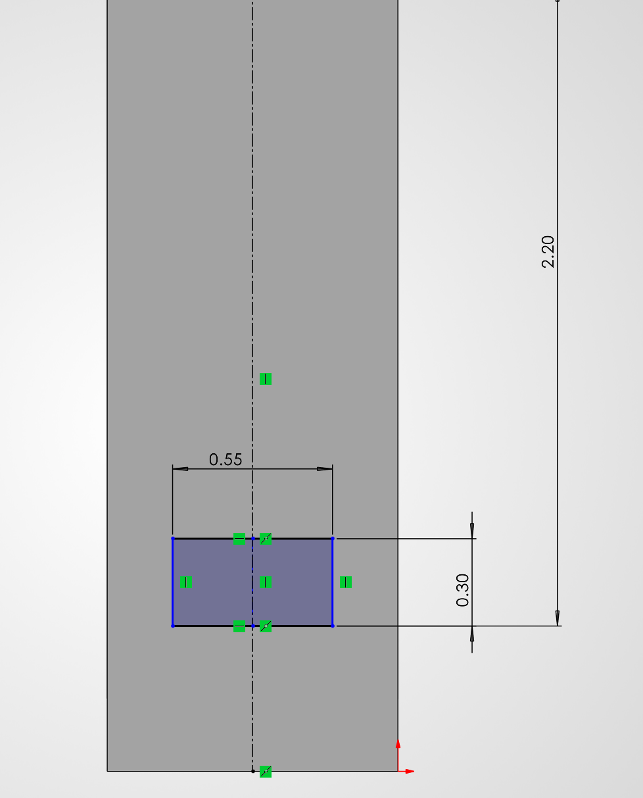
    </td>
    <td style="width:40%; padding:28px; vertical-align:middle;"">
      

        I also decided to add 0.05in to both dimensions for the hole. It has the same theory behind it as the previous changes. I am worried that this may make it too lose, but it was kind of hard to get the clip to clip all the way in, so I think it is necessary.
      

    </td>
  </tr>
  <tr>
    <td style="width:60%; text-align: center; vertical-align:middle;">
      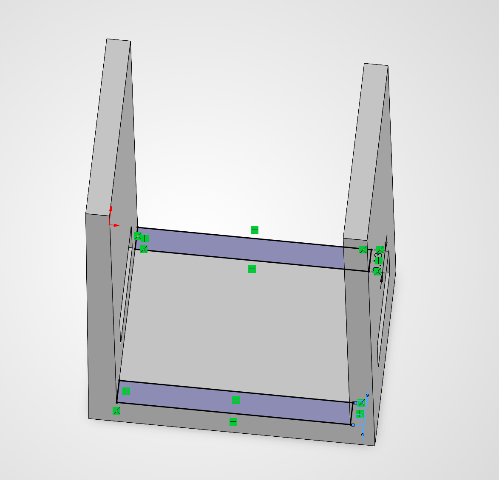
    </td>
    <td style="width:40%; padding:28px; vertical-align:middle;"">
      

        The final thing I decided to add was two extra walls, making the entire attachment a box. This was to stop the walls from flexing as much as the clip. Since they were made with similar dimensions, I found that they both flexed similar amounts to connect. I didn't like that, so I created those two extra walls to stop that from happening.
      

    </td>
  </tr>
  <tr>
    <td style="width:60%; text-align: center; vertical-align:middle;">
      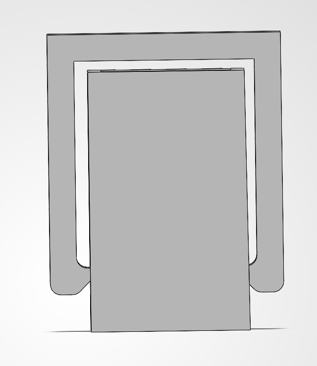
    </td>
    <td style="width:40%; padding:28px; vertical-align:middle;"">
      

        Here is what my final design should look like. It looks a little loose in the assembly, but it should still work as intended.
      

    </td>
  </tr>
</table>

##### PrusaSlicer

This really changed two things for my PrusaSlicer file: Supports and the time it takes to print. Now that I have an entire box, I have to think about supports. I decided not to avoid the supports by aligning upright because it would make it structurally worse, and I wanted to explore supports. To see which supports I needed, I used the automatically paint supports button, and it created this line down the middle. I am excited to see what it looks like printed out.

    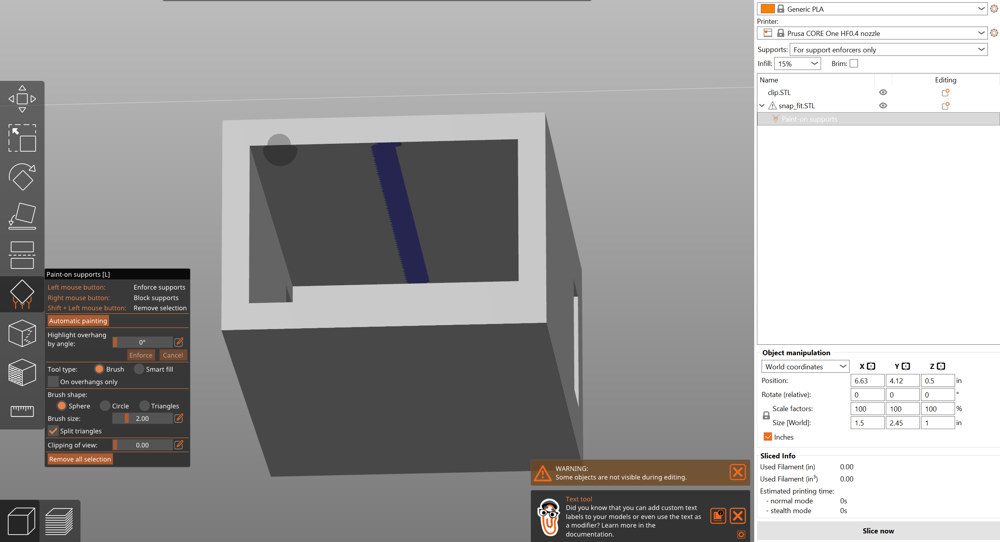

With my new supports, here is what my file should look like about half of the way through printing.

    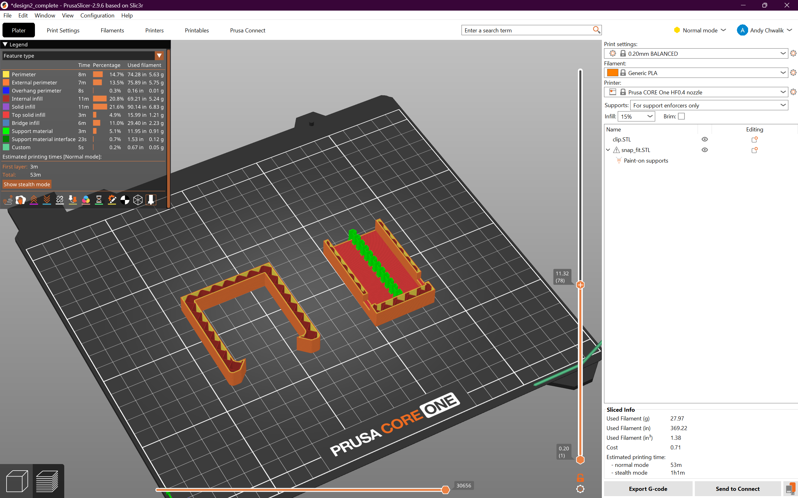

Overall, I think these modifications should fix the design even though the print will take slightly longer than previously.

    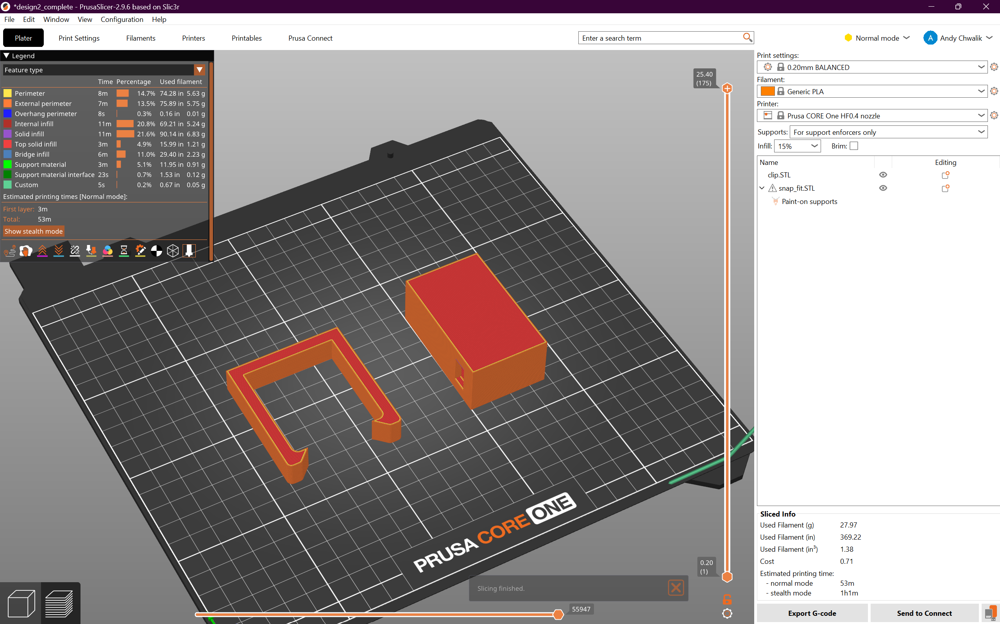

##### 3D Printing

I used the same printer as before because I nobody is using it. I also made my modifications pretty quickly. The printing process went just as smooth as before. I made sure to untangle all of the filament this time so I don't have to micromanage the filament. I thought it was really cool seeing the support being made in the middle while printing. It is much more noticeable on this print because it is more isolated than before. That is probably why the last print didn't necessarily need it.

    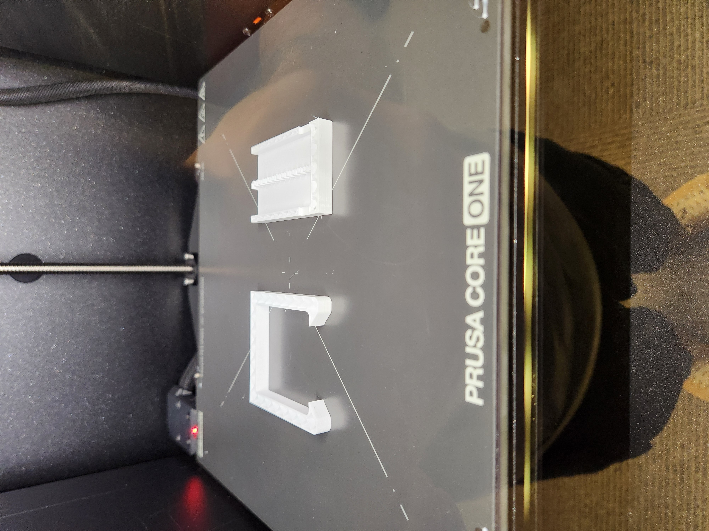

Here is the process of my modified object being 3D printed.

[video]

I think the final product turned out really well. Even though the fit isn't that tight, the snap fit does it's job. Pulling on the snap fit, it feels like it can hold a lot of weight. I also made sure that the snap fit can't slide off due to my modifications. It looks close, but it can't unless you put in a some effort. 

    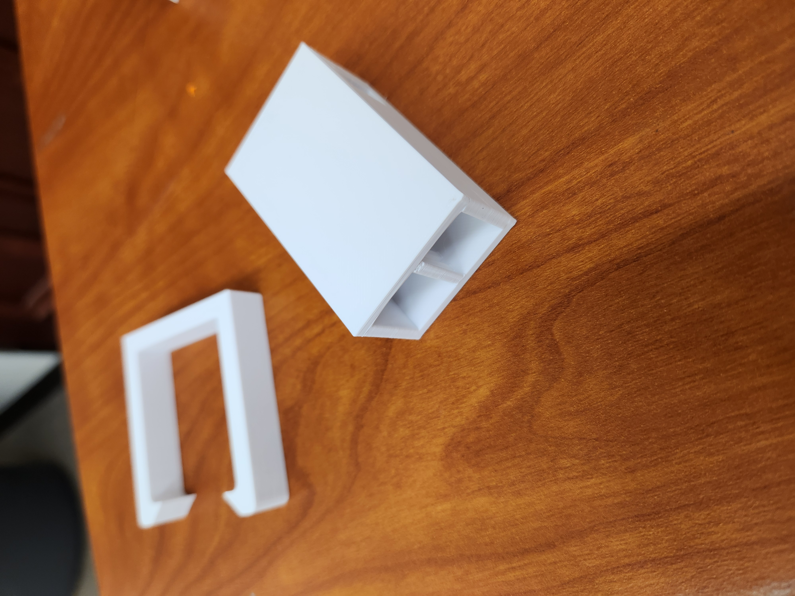

Here is a video of me playing around with it. This design actually has that snapping sound, which I am assuming is how the snap fit got its name.

[video]

## Lessons Learned
