# L06 - Design Fits for an Artifact

## Objective

The goal of lab 6 is to create a snap fit design for an artifact. The artifact was picked from a pile of leftover electronics that were given out during the lab period. There were all types of components such as motors and circuit boards. When I went up, I was left with a University of South Carolina motor circuit board. Here is what it looks like.

  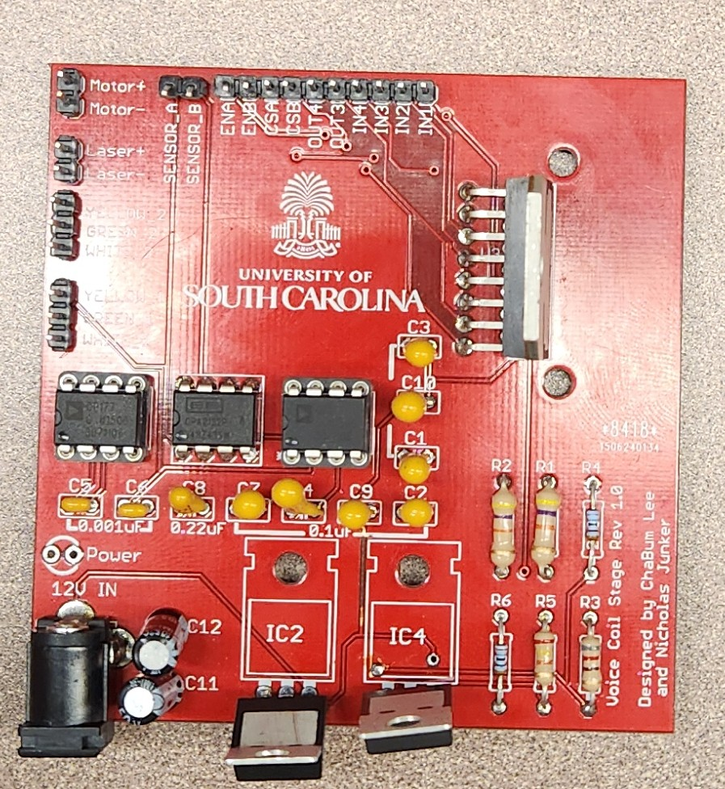

### Initial Design

When I was first thinking of snap fits that I could put on this circuit board, I originally thought of an electrical box (a box where you keep all of your electronics). I didn't want the board to moving around a whole bunch while in the electrical box, so I also wanted to add these little supports through the holes in the circuit board. To make this a reality, I was given a pair of calipers to measure the different dimensions of the circuit board. The important dimensions I measured were the length, width, height, location of holes, and the hole diameters. Unfortunately the hole diameters were different from each other, so I will have to be super careful when designing.

  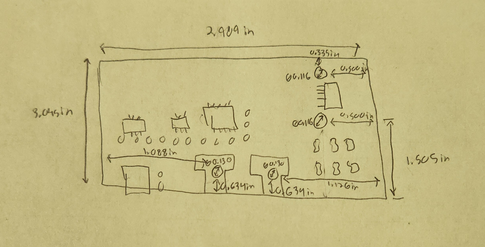
   
  <em>Dimensions measured with calipers</em>

  
  <em>Original design</em>

### Final Design

When I was designing the electrical box, I wanted to first design the base. Since I had so many more dimensions for the supports I was putting through the holes, I thought it would've been important to get a template for this part of my design. However, through designing, I realized that this would take way longer than I expected. There was a lot of trial and error when printing just the base of the electrical box. This is why I changed my design from an electrical box to just a platform that the circuit board will snap onto. I decided to make the snap points on the supports for the holes because they took me the longest to validate the dimensions. 

  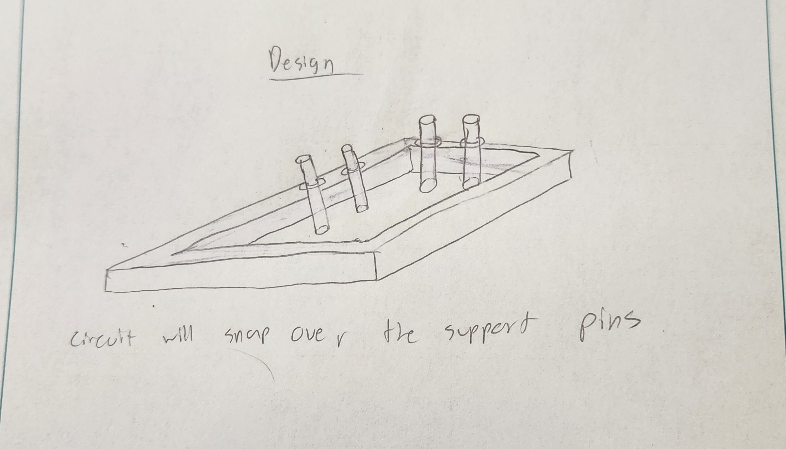
  <em>Final design idea</em>

I also had to take new dimensions from those original ones because the supports didn't line up correctly with the holes. I had to validate all of my dimensions once again, and they ended up being more accurate than previously.

  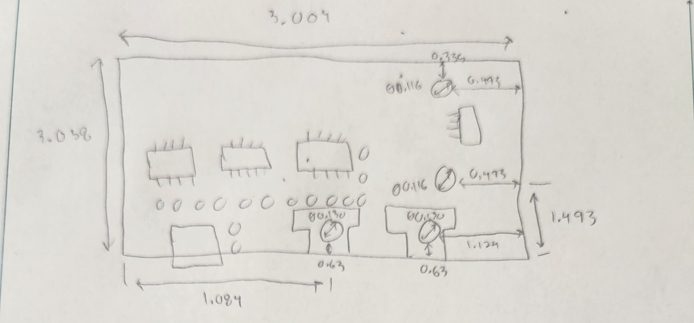
  <em>Final measured dimensions</em>

#### 3D Modeling

<table style="width:100%;">
  <tr>
    <td style="width:60%; text-align: center; vertical-align:middle;">
      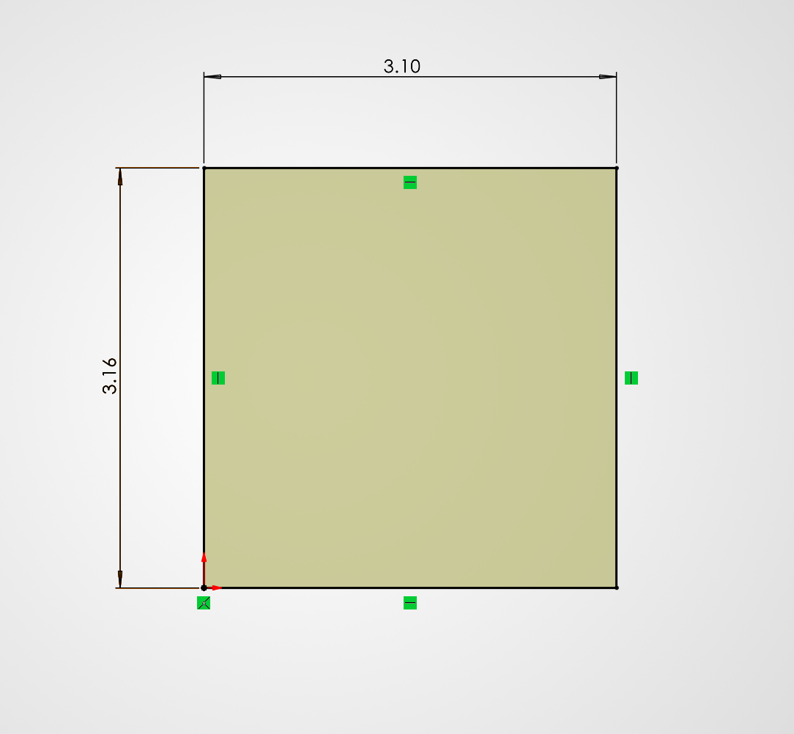
    </td>
    <td style="width:40%; padding:28px; vertical-align:middle;"">
      

        The first step I took in creating the base was by making a sketch for the box. I just took the length and width dimensions of my measurements, and inserted it into the box. Also, so it is not impossible to get on, I added an extra 100 thousandths of an inch. This will give my circuit board breathing room. I also noticed that one of the edges of the circuit board sticks out a little bit on the corners, so it will make up for that.
      

    </td>
  </tr>
  <tr>
    <td style="width:60%; text-align: center; vertical-align:middle;">
      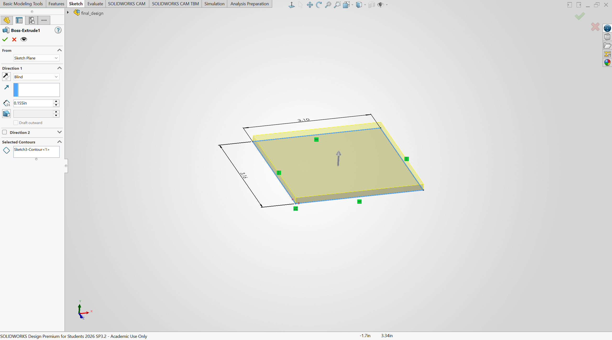
    </td>
    <td style="width:40%; padding:28px; vertical-align:middle;"">
      

        After, I extruded the base to the height of my measurement. I didn't parametrically design these first two steps because it was only one measurement and would've taken about the same amount of time to change the values either way. 
      

    </td>
  </tr>
  <tr>
    <td style="width:60%; text-align: center; vertical-align:middle;">
      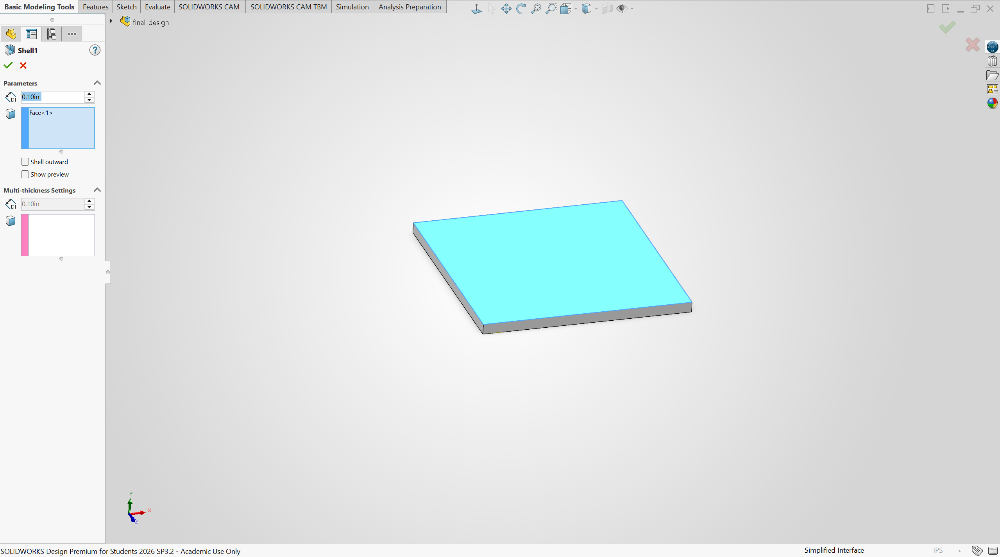
    </td>
    <td style="width:40%; padding:28px; vertical-align:middle;"">
      

        I then created a shell that is the same thickness as the extra dimensions I added to the base (0.1in). I know I said that I was doing it to make room for the circuit board, but my base is hollow enough to where just the wires on the bottom of the circuit board will be touching the base. The actual board will sit on top of the walls.
      

    </td>
  </tr>
  <tr>
    <td style="width:60%; text-align: center; vertical-align:middle;">
      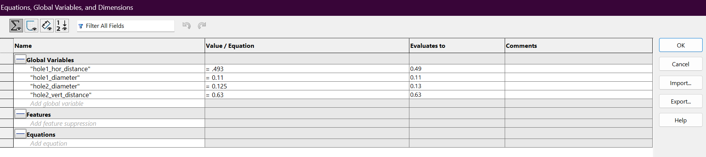
    </td>
    <td style="width:40%; padding:28px; vertical-align:middle;"">
      

        After that was completed, I could move onto dimensioning the supports for the holes of the circuit board. To do this, I created global variables for the smaller hole diameters, the distance the smaller holes are from the right wall, the bigger hole diameters, and the distance the bigger holes are from the bottom wall. 
      

    </td>
  </tr>
  <tr>
    <td style="width:60%; text-align: center; vertical-align:middle;">
      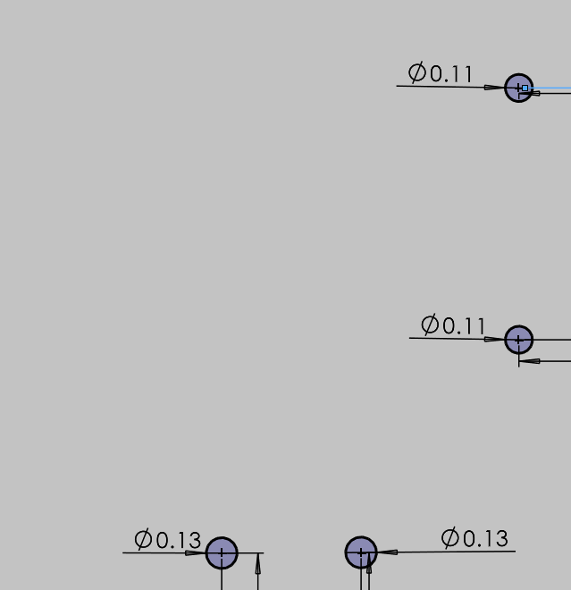
    </td>
    <td style="width:40%; padding:28px; vertical-align:middle;"">
      

        I assigned the respective diameter variables to the respective holes initially. My design did round the values to 2 significant figures, but I am pretty sure the true value is still shown if you click on the dimension. It could be cleared up in a drawing sheet.
      

    </td>
  </tr>
  <tr>
    <td style="width:60%; text-align: center; vertical-align:middle;">
      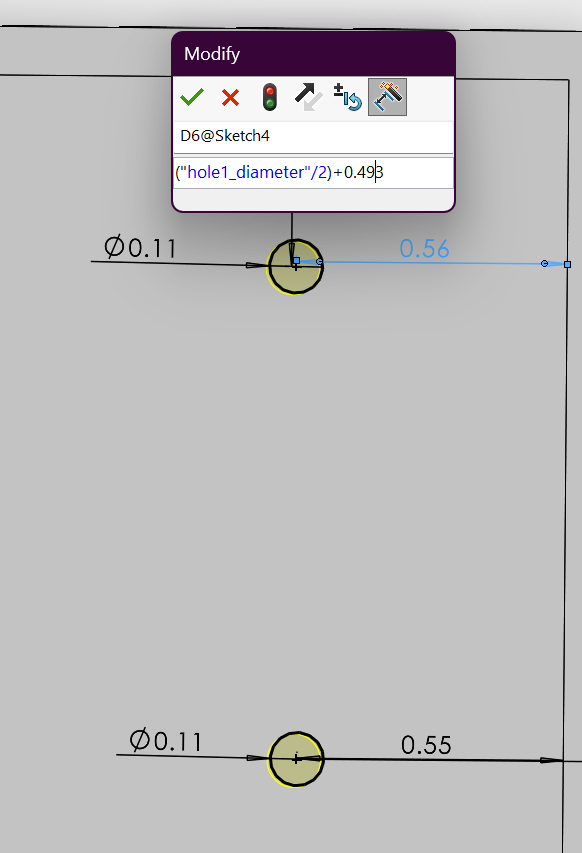
    </td>
    <td style="width:40%; padding:28px; vertical-align:middle;"">
      

        I started by dimensioning the smaller holes first. I noticed that my measurements were taken from the edge of the holes to the wall; however, SolidWorks takes the dimension from the middle of the circle. To get around this, I added the radius of the circle of the dimension I measured, by using my global variables form earlier. I applied this technique to the horizontal distances of the smaller holes first.
      

    </td>
  </tr>
  <tr>
    <td style="width:60%; text-align: center; vertical-align:middle;">
      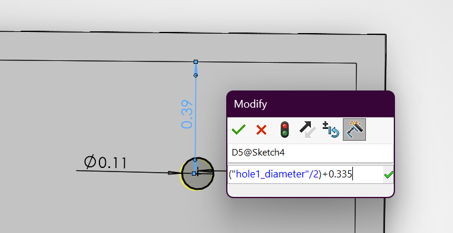
      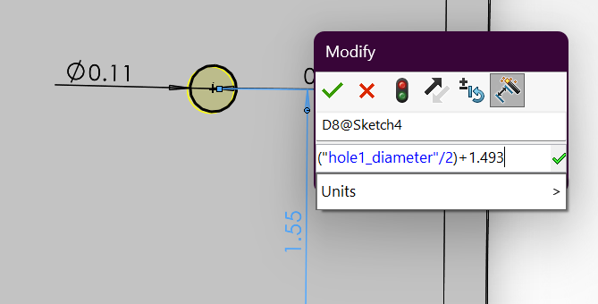
    </td>
    <td style="width:40%; padding:28px; vertical-align:middle;"">
      

        I then applied this technique to the vertical distances of the smaller holes. 
      

    </td>
  </tr>
  <tr>
    <td style="width:60%; text-align: center; vertical-align:middle;">
      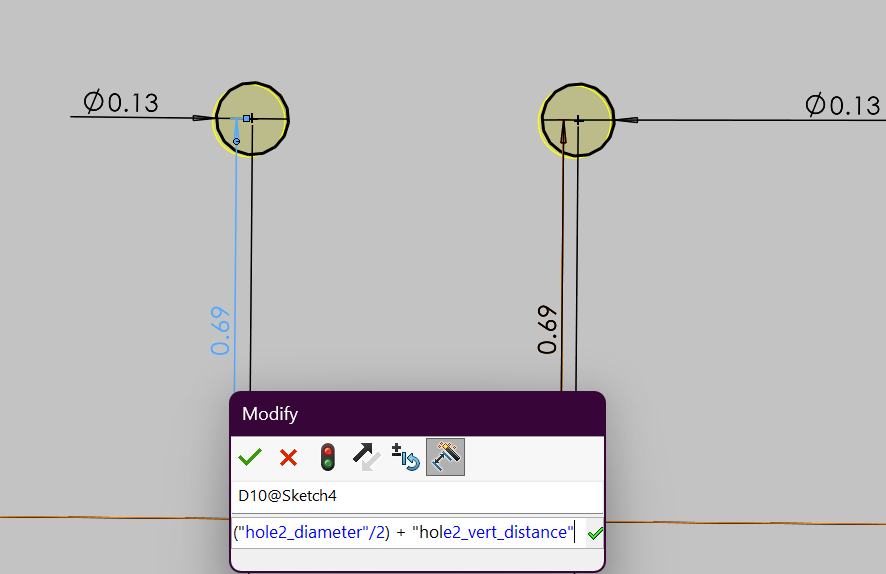
    </td>
    <td style="width:40%; padding:28px; vertical-align:middle;"">
      

        I did a very similar process for the larger holes. They were the same distance from the bottom wall, so I decided to line them up with the same dimensions before inputting their distances from the side walls.
      

    </td>
  </tr>
  <tr>
    <td style="width:60%; text-align: center; vertical-align:middle;">
      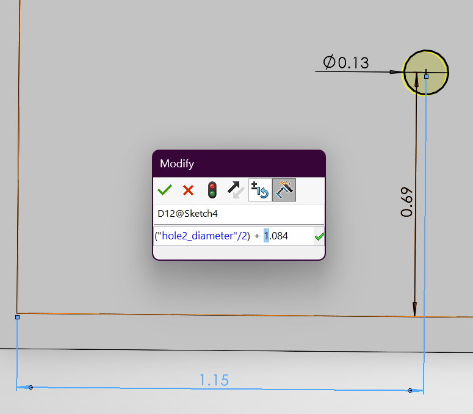
       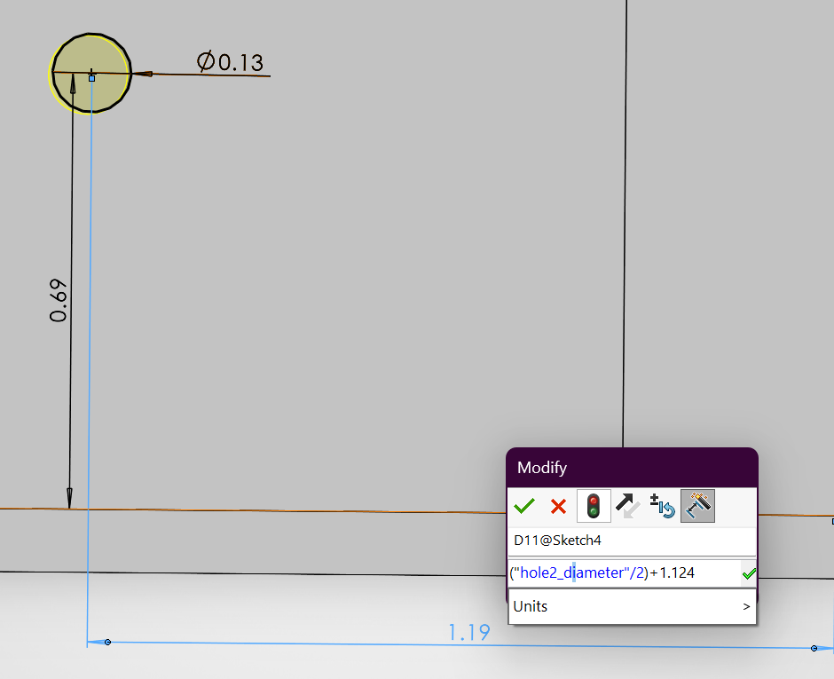
    </td>
    <td style="width:40%; padding:28px; vertical-align:middle;"">
      

        I then added their distances from the side walls using the same technique I have been using for the dimensioning of the holes.
      

    </td>
  </tr>
  <tr>
    <td style="width:60%; text-align: center; vertical-align:middle;">
      
       
    </td>
    <td style="width:40%; padding:28px; vertical-align:middle;"">
      

        I then added their distances from the side walls using the same technique I have been using for the dimensioning of the holes.
      

    </td>
  </tr>
  <tr>
    <td style="width:60%; text-align: center; vertical-align:middle;">
      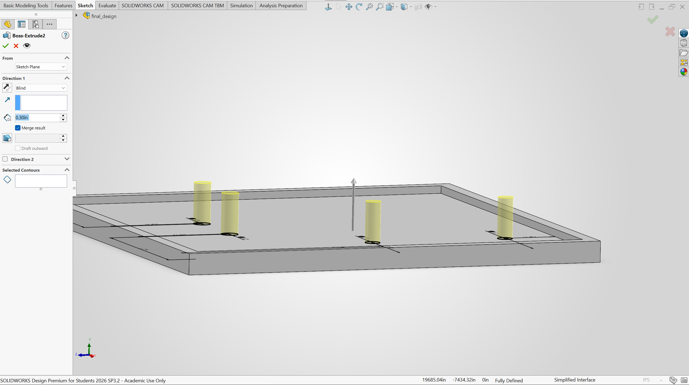
    </td>
    <td style="width:40%; padding:28px; vertical-align:middle;"">
      

        Once all of the holes were dimensioned, I extruded the entire sketch. I already had a measurement of the height of the circuit board, so I made sure to clear the height of the circuit board so that there will be enough room for the snap fits on the board.
      

    </td>
  </tr>
  <tr>
    <td style="width:60%; text-align: center; vertical-align:middle;">
      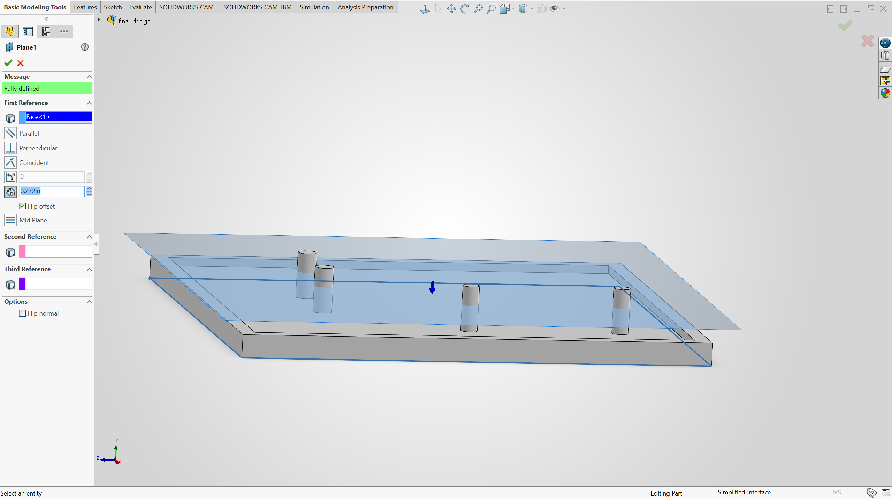
    </td>
    <td style="width:40%; padding:28px; vertical-align:middle;"">
      

        To create the snap points on the design, I had to create a plane that was at the height of the circuit board. To do this, I made a plane coincident with the bottom of my design, and then displaced the plane by the height of the circuit board plus the height of the design.
      

    </td>
  </tr>
  <tr>
    <td style="width:60%; text-align: center; vertical-align:middle;">
      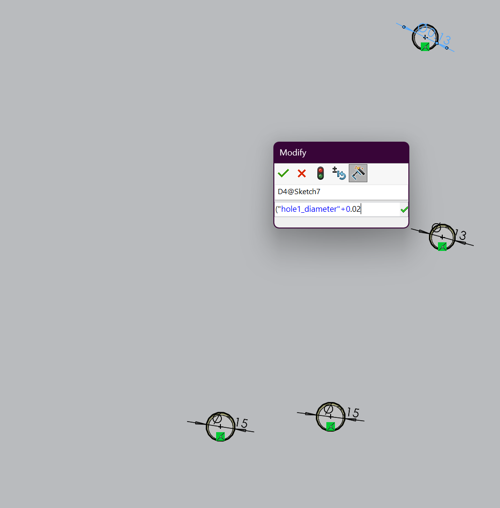
    </td>
    <td style="width:40%; padding:28px; vertical-align:middle;"">
      

        I then used the newly placed plane to create a sketch around the already made supports. The diameter of the snap fits are the original diameters plus 0.02in. I chose a very small value because the fits of the supports were already pretty snug on the circuit board. If I made them too big, only half of the design would snap in.
      

    </td>
  </tr>
  <tr>
    <td style="width:60%; text-align: center; vertical-align:middle;">
      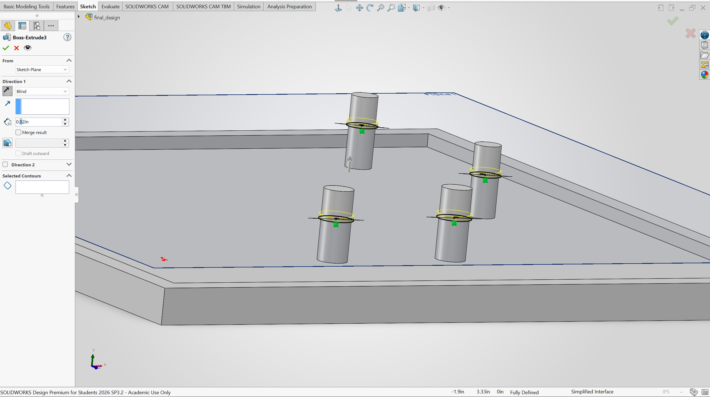
    </td>
    <td style="width:40%; padding:28px; vertical-align:middle;"">
      

        I then extruded the snap fits up, since I created the sketch at what should be the absolute top of the circuit. I extruded them by 0.02in again because I thought this would enough material to hold the design in place.
      

    </td>
  </tr>
  <tr>
    <td style="width:60%; text-align: center; vertical-align:middle;">
      
    </td>
    <td style="width:40%; padding:28px; vertical-align:middle;"">
      

        Finishing the design, I rounded the edges of the snap fits to make it easier to snap on and off. I didn't want my snap fit to lock in my design forever, similar to lab 5, so I this was just an extra precaution. 
      

    </td>
  </tr>
  <tr>
    <td style="width:60%; text-align: center; vertical-align:middle;">
      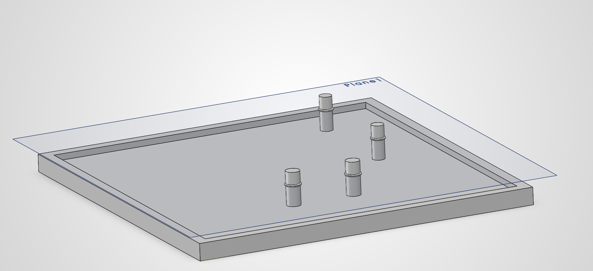
    </td>
    <td style="width:40%; padding:28px; vertical-align:middle;"">
      

        Here is the final model for my design.
      

    </td>
  </tr>

once I had my design fully 3D modeled, I exported the file as an STL file so that I could move onto PrusaSlicer. If you are interested in looking at my CAD file or my STL file, here are the downloads: [CAD file](final_design.SLDPRT)  |  [STL file](final_design.STL)

#### PrusaSlicer

When I imported my design into PrusaSlicer, it came in sideways again, so I had to rotate it by 90 degrees to make it lay flat. I didn't add many settings to the 

## Mistakes Through Design Process

## Lessons Learned

