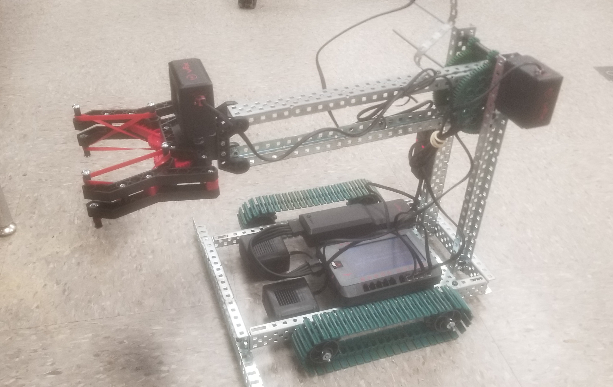
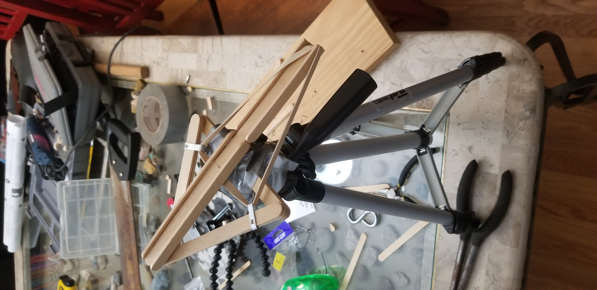

## About Me

Hello, I'm Andy Chwalik. I am a Mechanical Engineering student at UNC Charlotte and considering dual majoring in either Physics or Mathematics.

I originally wanted to go into engineering because I was good at math, and I thought I would be able to keep my head down and do calculations. That idea was quickly shut down once I got to high school and join the PLTW program. It was here where I really started to learn the engineering process and how to collaborate in a team effectively. 

My favorite classes from the PLTW program were Aerospace Engineering and Principles of Engineering. I enjoyed them because they were the most math intensive courses I was involved in, and they had a heavy influence on me taking an interest in fluid dynamics. They weren't only fun because of content, but there were a lot of projects along the way. 

<table>
  <tr>
    <th>My most memorable project for Aerospace Engineering was the rover project. I was in a group of three, and we were tasked with making a mini rover that could pick up samples and drive a specified route autonomously. I found the rover project extremely enjoyable because it was extremely satisfying to build and test.</th>
    <th>My most memorable project for Principles of Engineering was the catapult project. The goal of the project was to launch a marble as far as possible accurately and precisely. I enjoyed this project for similar reasons as the rover project.</th>
  </tr>
  <tr>
    <td style="text-align:center;">
      
    </td>
    <td style="text-align:center;">
      
    </td>
  </tr>
</table>

My most memorable project for Aerospace Engineering was the rover project. I was in a group of three, and we were tasked with making a mini rover that could pick up samples and drive a specified route autonomously. I found the rover project extremely enjoyable because it was extremely satisfying to build and test. 

My most memorable project for Principles of Engineering was the catapult project. The goal of the project was to launch a marble as far as possible accurately and precisely. I enjoyed this project for similar reasons as the rover project.
